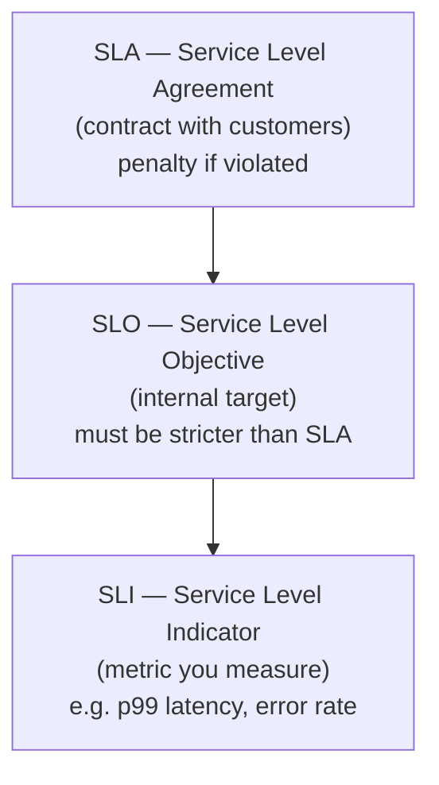
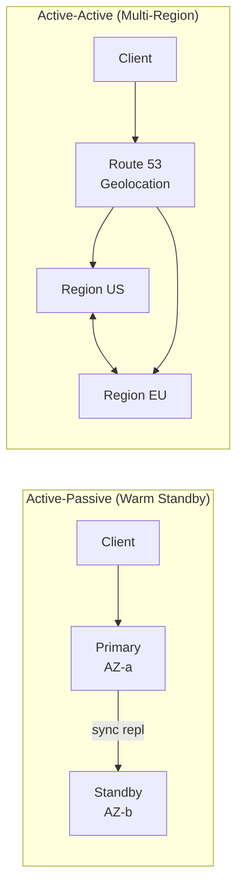

# Availability vs Durability

> **References:** [AWS Well-Architected](https://aws.amazon.com/architecture/well-architected/) | [SRE Book](https://sre.google/sre-book/service-level-objectives/) | [AWS S3 Durability](https://aws.amazon.com/s3/faqs/)

---

## Definitions

| Term | Definition |
|------|-----------|
| **Availability** | % of time the system is operational and serving requests |
| **Durability** | Probability that data is NOT lost over a given time period |
| **Reliability** | Ability to perform intended function correctly and consistently |

**Key insight:** A system can be available but lose data (low durability). A system can have durable data but be unavailable (e.g., during maintenance). These are independent dimensions.

---

## Availability: The Nines

| Availability | Downtime/Year | Downtime/Month | Downtime/Week |
|-------------|--------------|----------------|---------------|
| 90% (1 nine) | 36.5 days | 72 hours | 16.8 hours |
| 99% (2 nines) | 3.65 days | 7.2 hours | 1.68 hours |
| 99.9% (3 nines) | 8.77 hours | 43.8 min | 10.1 min |
| 99.95% | 4.38 hours | 21.9 min | 5 min |
| 99.99% (4 nines) | 52.6 min | 4.38 min | 60.5 sec |
| 99.999% (5 nines) | 5.26 min | 26.3 sec | 6.05 sec |

---

## SLA, SLO, SLI — The Pyramid



**Example:**
- **SLI:** % of requests with status 200 in last 5 minutes
- **SLO:** 99.9% of requests succeed (internal target)
- **SLA:** 99.5% uptime guaranteed to customers (with credits if breached)

---

## Error Budget

```
Error Budget = 100% − SLO

For SLO = 99.9%:
Error Budget = 0.1% = 43.8 min/month

If 30 min of downtime used this month → 13.8 min remaining
→ Slow down feature deployments until next month
```

Error budgets align Dev (ship fast) and Ops (keep stable):
- If error budget is full → deploy freely
- If error budget is exhausted → stop risky deployments

---

## Durability

**S3 Durability Model:**
- 99.999999999% (11 nines) durability
- Stores 3+ copies across ≥3 AZs
- Automatically detects and repairs corruption using checksums
- Expected data loss: 1 object per 100 billion objects per 10,000 years

**RDS Durability:**
- Multi-AZ: synchronous replication to standby replica
- Automated backups to S3
- Point-in-time recovery up to 35 days

---

## AWS Availability & Durability Mapping

| Service | Availability SLA | Durability |
|---------|-----------------|------------|
| S3 Standard | 99.99% | 11 nines |
| S3 One-Zone IA | 99.5% | 11 nines (1 AZ) |
| DynamoDB | 99.99% | Multi-AZ replication |
| RDS Multi-AZ | 99.95% | Sync standby |
| RDS Single-AZ | 99.5% | EBS snapshots |
| Aurora | 99.99% | 6 copies across 3 AZs |
| ElastiCache | 99.99% (Multi-AZ) | In-memory (volatile) |
| EC2 | 99.99% (instance) | Ephemeral (use EBS) |
| Route 53 | 100% (SLA) | Multi-region DNS |

---

## Availability Architecture Patterns



---

## Java Example — Retry with Exponential Backoff

```java
@Service
public class ResilientService {

    private static final int MAX_RETRIES = 3;
    private static final long BASE_DELAY_MS = 100;

    public <T> T executeWithRetry(Supplier<T> operation, String operationName) {
        int attempt = 0;
        Exception lastException = null;

        while (attempt < MAX_RETRIES) {
            try {
                return operation.get();
            } catch (TransientException e) {
                lastException = e;
                attempt++;
                
                if (attempt < MAX_RETRIES) {
                    long delay = BASE_DELAY_MS * (1L << attempt); // exponential: 200ms, 400ms, 800ms
                    long jitter = (long)(Math.random() * delay * 0.1); // ±10% jitter
                    
                    log.warn("Operation {} failed (attempt {}/{}), retrying in {}ms",
                        operationName, attempt, MAX_RETRIES, delay + jitter);
                    
                    try {
                        Thread.sleep(delay + jitter);
                    } catch (InterruptedException ie) {
                        Thread.currentThread().interrupt();
                        throw new RuntimeException("Interrupted during retry", ie);
                    }
                }
            }
        }

        throw new ServiceUnavailableException(
            "Operation " + operationName + " failed after " + MAX_RETRIES + " attempts",
            lastException
        );
    }
}

// Usage
public Order getOrder(String orderId) {
    return resilientService.executeWithRetry(
        () -> orderRepository.findById(orderId),
        "getOrder"
    );
}
```

---

## Calculating Composite Availability

For systems in **series** (all must work): multiply
```
A = A1 × A2 × A3
A = 99.9% × 99.9% × 99.9% = 99.7%
```

For systems in **parallel** (any one can serve): 1 - (all fail)
```
A = 1 - (1-A1) × (1-A2)
A = 1 - (0.001 × 0.001) = 99.9999%
```

---

## When to Sacrifice Availability for Durability

1. **Financial transactions** — never lose a payment record, even if it means returning an error
2. **Medical records** — data correctness over speed
3. **Audit logs** — durability critical; momentary unavailability acceptable

## When to Sacrifice Durability for Availability

1. **Session tokens** — losing a session is acceptable (user re-logs in)
2. **Recommendation caches** — stale or lost cache = degraded UX, not data loss
3. **Rate limit counters** — approximate counting is fine

---

## Interview Q&A

**Q1: What is an error budget and how do you use it?**
> Error budget = 100% - SLO. For 99.9% SLO, you have 43.8 minutes/month to be "broken." If you've used 30 minutes this month, you have 13.8 minutes left. The team's deployment policy: full speed when budget is healthy; freeze risky deploys when nearly exhausted. This aligns developer velocity with reliability.

**Q2: How does S3 achieve 11 nines of durability?**
> S3 stores each object redundantly across ≥3 AZs, uses checksums (CRC32) on every read/write to detect bit rot, and automatically repairs corrupted replicas. The 11-nines figure comes from probability math: probability of losing all 3+ copies before detection and repair is astronomically small.

**Q3: What's the difference between RTO and RPO?**
> **RPO (Recovery Point Objective):** Maximum acceptable data loss measured in time. "We can lose up to 15 minutes of data." Determines backup frequency. **RTO (Recovery Time Objective):** Maximum time to restore service after a disaster. "We must be back up within 1 hour." Determines DR architecture (backup-restore vs warm standby vs active-active).

**Q4: How would you design for 99.99% availability on AWS?**
> Multi-AZ deployment for all stateful services (RDS Multi-AZ, ElastiCache Multi-AZ, ECS tasks across AZs). Auto Scaling groups with minimum 2 instances. Route 53 health checks with failover routing. Circuit breakers to isolate failing dependencies. ALB with cross-zone load balancing. Automated runbooks for common failure modes.
