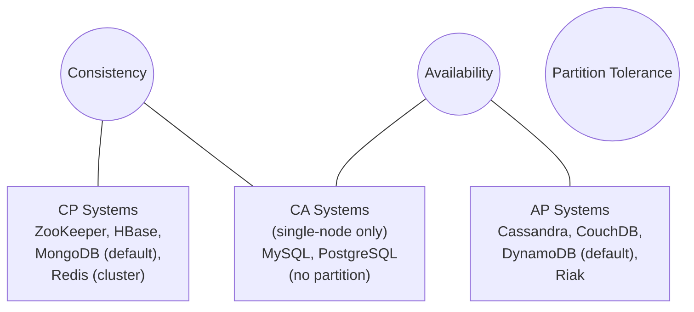
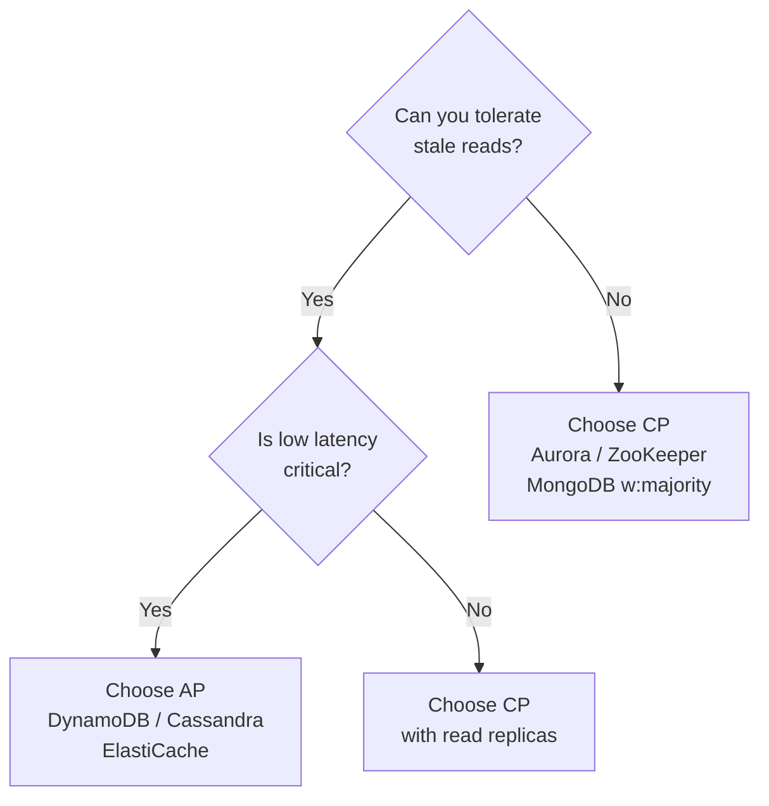

# CAP Theorem — and How to Actually Apply It

> **References:** [Brewer's CAP Theorem (2000)](https://www.cs.berkeley.edu/~brewer/cs262b-2004/PODC-keynote.pdf) | [Kleppmann DDIA Ch 9](https://dataintensive.net/) | [GeeksForGeeks](https://www.geeksforgeeks.org/cap-theorem-in-dbms/)

---

## What Is CAP?

**CAP Theorem** (Brewer, 2000) states that a distributed data store can guarantee at most **two** of three properties simultaneously:

| Property | Definition |
|----------|-----------|
| **C – Consistency** | Every read receives the most recent write or an error (linearizability) |
| **A – Availability** | Every request receives a (non-error) response, but it might not be the most recent write |
| **P – Partition Tolerance** | The system continues to operate despite arbitrary network partitions |

> **Key insight:** In a distributed system, network partitions *will* happen. You **always** have P. So the real choice is **C vs A during a partition**.

---

## CAP Triangle — System Placement



---

## CP vs AP — The Real Trade-off

### CP Systems (Consistency + Partition Tolerance)
- Return an **error or timeout** during a partition rather than serve stale data
- Use cases: financial ledgers, inventory counts, distributed locks, leader election
- Examples: ZooKeeper, etcd, HBase, MongoDB (w:majority), Redis Cluster

### AP Systems (Availability + Partition Tolerance)
- Return the **best available answer** (possibly stale) during a partition
- Use cases: shopping carts, DNS, social feeds, recommendation engines
- Examples: Cassandra, DynamoDB (eventual), CouchDB, Riak

---

## When NOT to Use CAP as Your Mental Model

1. **Single-node systems** — no network partition possible; ACID is the right model
2. **PACELC is more nuanced** — CAP only describes behavior *during* partitions; PACELC adds latency vs consistency trade-off *even without* partitions
3. **Linearizability ≠ Consistency** — many "consistent" systems only offer serializability or causal consistency

---

## PACELC Extension

```
If Partition → choose Availability or Consistency
Else (normal) → choose Latency or Consistency
```

| System | P→? | E→? |
|--------|-----|-----|
| DynamoDB | A | L |
| Aurora | C | C |
| Cassandra | A | L |
| ZooKeeper | C | C |

---

## AWS Service CAP Mapping

| AWS Service | CAP Class | Default Mode | Notes |
|-------------|-----------|-------------|-------|
| DynamoDB | AP | Eventually consistent reads | Use `ConsistentRead=true` for CP |
| Aurora MySQL | CP | Synchronous replication | Strong consistency within region |
| ElastiCache Redis | CP | Depends on topology | Cluster mode = partition-aware |
| S3 | AP | Strong read-after-write (since 2020) | Bucket listing still eventually consistent |
| RDS Multi-AZ | CP | Sync standby replica | Automatic failover |
| DynamoDB Global Tables | AP | Last-write-wins | Cross-region AP |
| Route 53 | AP | DNS TTL-based | Propagation delay = eventual |

---

## Mermaid: Choosing CP vs AP



---

## Java Example — Handling Eventual Consistency in DynamoDB

```java
// CP read: forces consistent read (higher latency, higher cost)
GetItemRequest consistentRead = GetItemRequest.builder()
    .tableName("Orders")
    .key(Map.of("orderId", AttributeValue.builder().s(orderId).build()))
    .consistentRead(true)  // CP: linearizable
    .build();

// AP read: eventual consistency (default, cheaper, faster)
GetItemRequest eventualRead = GetItemRequest.builder()
    .tableName("Orders")
    .key(Map.of("orderId", AttributeValue.builder().s(orderId).build()))
    .consistentRead(false)  // AP: may return stale data
    .build();

// Strategy: use consistent reads only for critical paths
// (e.g., checkout confirmation), eventual for display feeds
public Order getOrder(String orderId, boolean isCriticalPath) {
    var request = GetItemRequest.builder()
        .tableName("Orders")
        .key(Map.of("orderId", AttributeValue.builder().s(orderId).build()))
        .consistentRead(isCriticalPath)
        .build();
    return mapper.map(dynamoDb.getItem(request).item());
}
```

---

## Tradeoffs Table

| Dimension | CP | AP |
|-----------|----|----|
| During partition | Returns error | Returns stale data |
| Latency | Higher (consensus round-trips) | Lower |
| Availability | Lower | Higher |
| Data freshness | Always fresh | Possibly stale |
| Failure mode | Unavailable | Inconsistent |
| Use case | Payments, locks, counts | Feeds, DNS, carts |

---

## Interview Q&A

**Q1: Can you give me an example of a CP and an AP system and why?**
> ZooKeeper is CP — it uses Zab consensus protocol; a minority partition refuses to serve requests to prevent split-brain. DynamoDB is AP by default — it will serve reads from any replica even if the replica is lagging, ensuring availability over consistency.

**Q2: How does DynamoDB handle the CAP trade-off?**
> DynamoDB is AP by default. Reads go to any of the three replicas (eventual consistency). With `ConsistentRead=true`, it routes to the leader replica (CP), but at 2× cost and higher latency. Global Tables use last-write-wins for conflict resolution — firmly AP.

**Q3: When would you sacrifice consistency for availability?**
> Shopping cart: Amazon famously chose AP for carts — a user adding an item to cart should never fail due to a partition. Worst case: merge conflicts are resolved by combining cart contents. The revenue loss from unavailability >> cost of showing an extra item briefly.

**Q4: What is split-brain and how do CP systems prevent it?**
> Split-brain occurs when two nodes both believe they're the leader and accept conflicting writes. CP systems prevent it via quorum: a write only succeeds if a majority (⌊N/2⌋+1) of nodes acknowledge it. A minority partition cannot form a quorum, so it refuses writes.

**Q5: How does PACELC extend CAP?**
> CAP only models behavior *during* partitions. PACELC adds: even when the network is healthy (Else), there's a trade-off between Latency and Consistency. Cassandra, for example, chooses low latency (AP+L) while Aurora chooses strong consistency (CP+C) even without partitions.
