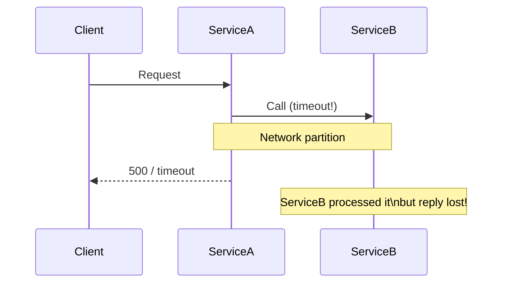
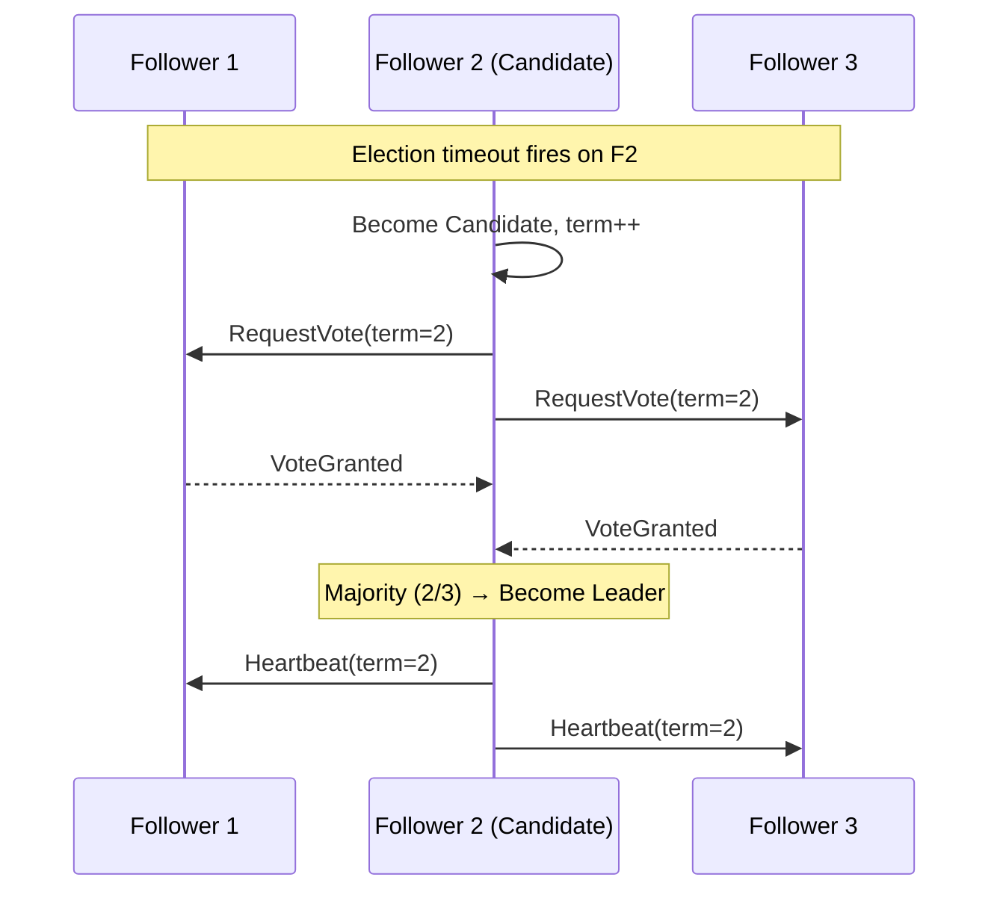
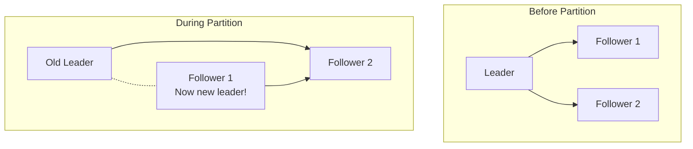

# Distributed Systems Challenges

> **References:** [DDIA Ch 8](https://dataintensive.net/) | [Fallacies of Distributed Computing](https://en.wikipedia.org/wiki/Fallacies_of_distributed_computing) | [Raft Paper](https://raft.github.io/)

---

## The 8 Fallacies of Distributed Computing

Peter Deutsch's famous list of assumptions that *always* break in production:

| # | Fallacy | Reality |
|---|---------|---------|
| 1 | The network is reliable | Packets are dropped, duplicated, reordered |
| 2 | Latency is zero | Cross-AZ = 1ms; cross-region = 70ms+ |
| 3 | Bandwidth is infinite | Shared links; backpressure is real |
| 4 | The network is secure | Assume breach; mTLS everywhere |
| 5 | Topology doesn't change | Auto-scaling adds/removes nodes constantly |
| 6 | There is one administrator | Multi-team, multi-account deployments |
| 7 | Transport cost is zero | Data transfer costs real money (AWS egress) |
| 8 | The network is homogeneous | Mixed gRPC, REST, Kafka, WebSockets |

---

## Challenge 1 — Network Partitions & Partial Failures



**Key problem:** You don't know if a request **failed** or just the **response was lost** — this is why idempotency is critical.

---

## Challenge 2 — Clock Skew

Distributed nodes have independent clocks that drift apart (NTP sync = ±100ms, not zero).

**Problems caused by clock skew:**
- "Last write wins" based on timestamp can silently discard newer data
- Log correlation across services becomes difficult
- Lease expiry calculated incorrectly

### Lamport Clocks

```java
public class LamportClock {
    private final AtomicLong counter = new AtomicLong(0);

    // Increment before sending an event
    public long tick() {
        return counter.incrementAndGet();
    }

    // Sync on receive: take the max + 1
    public long update(long receivedTimestamp) {
        return counter.updateAndGet(current ->
            Math.max(current, receivedTimestamp) + 1
        );
    }

    public long get() { return counter.get(); }
}
```

**Lamport clocks give causality ordering** — if A → B, then L(A) < L(B). But they don't give total ordering for concurrent events.

### Vector Clocks

```java
public class VectorClock {
    private final Map<String, Long> clock;
    private final String nodeId;

    public VectorClock(String nodeId, List<String> allNodes) {
        this.nodeId = nodeId;
        this.clock = new HashMap<>();
        allNodes.forEach(n -> clock.put(n, 0L));
    }

    public void increment() {
        clock.merge(nodeId, 1L, Long::sum);
    }

    public void merge(Map<String, Long> other) {
        other.forEach((node, ts) ->
            clock.merge(node, ts, Math::max)
        );
        increment();
    }

    // Returns true if this clock "happened before" other
    public boolean happenedBefore(VectorClock other) {
        return clock.entrySet().stream()
            .allMatch(e -> e.getValue() <= other.clock.getOrDefault(e.getKey(), 0L))
            && !clock.equals(other.clock);
    }
}
```

---

## Challenge 3 — Consensus

Getting distributed nodes to agree on a single value despite failures.

### Why Consensus Is Hard
- **FLP Impossibility:** In a fully asynchronous system with even one crash failure, no deterministic consensus algorithm can always terminate.
- **Practical solution:** Use partial synchrony assumptions (Paxos, Raft)

### Raft Leader Election Flow



---

## Challenge 4 — Idempotency & Exactly-Once Semantics

| Delivery Guarantee | Description | Example |
|-------------------|-------------|---------|
| At-most-once | Message may be lost | UDP, fire-and-forget |
| At-least-once | Message duplicated possible | SQS standard queues |
| Exactly-once | No loss, no duplicate | SQS FIFO + dedup, Kafka transactions |

### Idempotency Key Pattern (Java)

```java
@Service
public class PaymentService {

    private final DynamoDbClient dynamoDb;
    private static final String IDEMPOTENCY_TABLE = "IdempotencyKeys";

    public PaymentResult processPayment(PaymentRequest request) {
        String idempotencyKey = request.getIdempotencyKey();
        
        // 1. Check if we've already processed this request
        Optional<PaymentResult> existing = checkIdempotencyStore(idempotencyKey);
        if (existing.isPresent()) {
            return existing.get(); // Return cached result
        }
        
        // 2. Atomically claim the idempotency key (conditional write)
        try {
            claimIdempotencyKey(idempotencyKey);
        } catch (ConditionalCheckFailedException e) {
            // Another instance claimed it — wait and retry lookup
            return waitAndGetResult(idempotencyKey);
        }
        
        // 3. Process the payment
        PaymentResult result = chargeCard(request);
        
        // 4. Store result against idempotency key
        storeResult(idempotencyKey, result);
        
        return result;
    }

    private void claimIdempotencyKey(String key) {
        PutItemRequest request = PutItemRequest.builder()
            .tableName(IDEMPOTENCY_TABLE)
            .item(Map.of(
                "idempotencyKey", AttributeValue.builder().s(key).build(),
                "status", AttributeValue.builder().s("IN_PROGRESS").build(),
                "ttl", AttributeValue.builder().n(
                    String.valueOf(Instant.now().plusSeconds(3600).getEpochSecond())
                ).build()
            ))
            .conditionExpression("attribute_not_exists(idempotencyKey)")
            .build();
        dynamoDb.putItem(request);
    }
}
```

---

## Challenge 5 — Split Brain

When a network partition causes two nodes to both think they're the leader.



**Prevention:**
- Fencing tokens (monotonically increasing number given by ZooKeeper)
- STONITH (Shoot The Other Node In The Head) — force-terminate the minority partition
- Quorum-based writes (only majority partition can write)

---

## Challenge 6 — The Two Generals Problem & Distributed Transactions

Two generals must coordinate an attack but can only communicate via potentially unreliable messengers.

**In practice:** You cannot guarantee exactly-once message delivery over an unreliable channel. Solutions:
- **2PC (Two-Phase Commit)** — coordinator can fail, blocking all participants
- **Saga Pattern** — compensating transactions for eventual consistency
- **Outbox Pattern** — atomically write event to local DB, relay to message broker

### Outbox Pattern (Java)

```java
@Transactional
public void placeOrder(Order order) {
    // 1. Write order to DB
    orderRepository.save(order);
    
    // 2. Write event to outbox table in SAME transaction
    OutboxEvent event = new OutboxEvent(
        UUID.randomUUID().toString(),
        "ORDER_PLACED",
        objectMapper.writeValueAsString(order),
        Instant.now()
    );
    outboxRepository.save(event);
    // Both writes are atomic — no distributed transaction needed!
}

// Separate relay process polls outbox and publishes to Kafka
@Scheduled(fixedDelay = 1000)
public void relayOutboxEvents() {
    List<OutboxEvent> pending = outboxRepository.findUnpublished();
    for (OutboxEvent event : pending) {
        kafkaTemplate.send("orders", event.getPayload());
        outboxRepository.markPublished(event.getId());
    }
}
```

---

## AWS Mapping for Distributed Challenges

| Challenge | AWS Service / Solution |
|-----------|----------------------|
| Network partition resilience | Multi-AZ deployment, Route 53 health checks |
| Consensus / leader election | Amazon ZooKeeper (MSK), DynamoDB conditional writes |
| Idempotency store | DynamoDB with TTL |
| Exactly-once processing | SQS FIFO + message deduplication ID |
| Distributed locking | ElastiCache Redis SETNX, DynamoDB conditional write |
| Clock synchronization | Amazon Time Sync Service (NTP, PHC) |
| Split brain prevention | DynamoDB conditional writes + fencing tokens |

---

## Interview Q&A

**Q1: How do you prevent duplicate processing in a distributed system?**
> Use idempotency keys. Client generates a UUID per logical operation. Server checks a DynamoDB table with a conditional write — if key exists, return cached result. Set TTL to expire old keys. This pattern ensures at-most-once processing even with retries.

**Q2: What is the difference between at-least-once and exactly-once delivery?**
> At-least-once: messages are never lost but may be duplicated (SQS standard). Exactly-once: no loss, no duplicate. True exactly-once requires coordination (SQS FIFO with dedup ID, Kafka transactions). In practice, most systems use at-least-once + idempotent consumers.

**Q3: How do vector clocks help with conflict resolution?**
> Vector clocks track causality — each node's counter represents how many events it knows about from each other node. If VC(A) < VC(B) for all dimensions, A happened-before B. If neither dominates, the events are concurrent = conflict. Systems like Riak use this to detect conflicts and present them for application-level resolution (e.g., merge shopping carts).

**Q4: Why is 2PC problematic in microservices?**
> The coordinator is a single point of failure. If the coordinator crashes after Phase 1 (participants voted yes) but before Phase 2 (commit/abort), all participants are blocked waiting forever. Alternatives: Saga (compensating transactions), TCC (Try-Confirm-Cancel), or Outbox pattern with eventual consistency.
