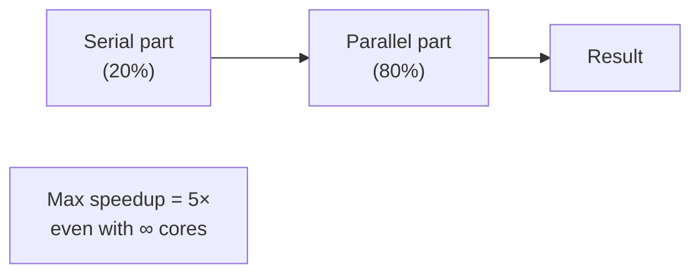
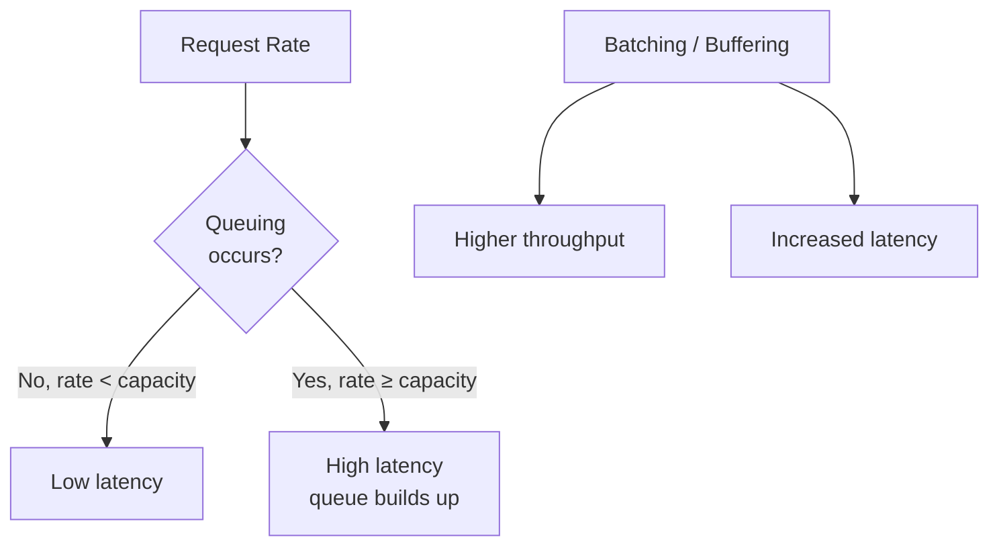

# Latency vs Throughput

> **References:** [Little's Law](https://en.wikipedia.org/wiki/Little%27s_law) | [Latency Numbers Every Programmer Should Know](https://gist.github.com/jboner/2841832) | [High Performance Browser Networking](https://hpbn.co/)

---

## Key Definitions

| Term | Definition |
|------|-----------|
| **Latency** | Time for one request to complete (ms) |
| **Throughput** | Requests processed per second (RPS/QPS) |
| **p50** | Median latency — 50% of requests finish within this time |
| **p95** | 95th percentile — 95% of requests finish within this time |
| **p99** | 99th percentile — the "tail latency" most teams target |
| **p999** | 99.9th percentile — worst 1-in-1000 requests |

> **Senior tip:** Always talk about p99, not average. Averages hide the worst user experiences.

---

## Latency Numbers Every Engineer Should Know

| Operation | Latency |
|-----------|---------|
| L1 cache reference | 0.5 ns |
| L2 cache reference | 7 ns |
| RAM access | 100 ns |
| SSD sequential read (1MB) | 1 ms |
| Same-datacenter network | 0.5 ms |
| Cross-AZ (same region) | 1–2 ms |
| Cross-region (US→EU) | 70–80 ms |
| HDD seek | 10 ms |
| Packet: US→Asia | 150 ms |

---

## Little's Law

```
L = λ × W
```

- **L** = average number of requests in the system (queue + processing)
- **λ** = average arrival rate (RPS)
- **W** = average time a request spends in system (latency)

### Capacity Planning with Little's Law

```
Example:
- Target latency: 100ms (W = 0.1 sec)
- Expected RPS: 10,000 (λ = 10,000)
- Concurrent requests needed: L = 10,000 × 0.1 = 1,000

You need infrastructure that can hold 1,000 concurrent requests.
If each server handles 100 concurrent requests → need 10 servers.
```

---

## Amdahl's Law — Limits of Parallelism

```
Speedup(N) = 1 / (S + (1-S)/N)
```
- **S** = serial fraction of work (can't be parallelized)
- **N** = number of parallel workers
- If 20% of work is serial → max speedup = 1/0.2 = 5× regardless of how many cores



---

## Throughput vs Latency Trade-off



**The fundamental tension:**
- **Batching** increases throughput (process 1000 items together) but adds latency (wait for batch to fill)
- **Individual processing** reduces latency but reduces throughput (overhead per request)

---

## AWS Service Latency Profile

| Service | Typical p99 Latency | Throughput |
|---------|--------------------|-----------:|
| ElastiCache Redis | < 1ms | 1M+ ops/sec |
| DynamoDB (single-digit ms SLA) | 5–10ms | Unlimited (autoscale) |
| Aurora MySQL | 2–5ms read, 5–10ms write | 100K+ QPS |
| S3 GetObject | 10–50ms first byte | High |
| Lambda (warm) | 1–5ms overhead | Scales to 10K concurrent |
| API Gateway | 10ms overhead | 10K RPS default |
| SQS | 1–5ms enqueue | Near-unlimited |

---

## Java Example — Async Batching for Throughput

```java
@Service
public class BatchWriteService {

    private final DynamoDbClient dynamoDb;
    private final BlockingQueue<WriteRequest> buffer = new LinkedBlockingQueue<>(10000);

    @PostConstruct
    public void startBatchFlusher() {
        // Background thread flushes buffer every 50ms or when full
        Thread.startVirtualThread(() -> {
            while (!Thread.currentThread().isInterrupted()) {
                try {
                    List<WriteRequest> batch = new ArrayList<>(25);
                    // Block up to 50ms waiting for first item
                    WriteRequest first = buffer.poll(50, TimeUnit.MILLISECONDS);
                    if (first != null) {
                        batch.add(first);
                        buffer.drainTo(batch, 24); // DynamoDB max batch = 25
                        flushBatch(batch);
                    }
                } catch (InterruptedException e) {
                    Thread.currentThread().interrupt();
                }
            }
        });
    }

    // High-throughput: non-blocking write (async)
    public CompletableFuture<Void> write(String tableName, Map<String, AttributeValue> item) {
        WriteRequest writeRequest = WriteRequest.builder()
            .putRequest(PutRequest.builder().item(item).build())
            .build();
        
        return CompletableFuture.runAsync(() -> {
            boolean offered = buffer.offer(writeRequest);
            if (!offered) {
                throw new RuntimeException("Write buffer full — backpressure");
            }
        });
    }

    private void flushBatch(List<WriteRequest> batch) {
        // DynamoDB batch write: up to 25 items in one call
        dynamoDb.batchWriteItem(BatchWriteItemRequest.builder()
            .requestItems(Map.of("MyTable", batch))
            .build());
    }
}
```

---

## Java Example — Measuring p99 Latency

```java
@Component
public class LatencyTracker {
    
    private final Timer requestTimer;
    
    public LatencyTracker(MeterRegistry registry) {
        this.requestTimer = Timer.builder("http.request.duration")
            .publishPercentiles(0.5, 0.95, 0.99, 0.999)
            .publishPercentileHistogram()
            .register(registry);
    }
    
    public <T> T trackLatency(Supplier<T> operation) {
        return requestTimer.record(operation);
    }
}

// Usage in service
public OrderResponse getOrder(String orderId) {
    return latencyTracker.trackLatency(() -> {
        return orderRepository.findById(orderId);
    });
}
```

---

## Capacity Math Example

```
Scenario: Design a system handling 1M DAU for a social feed
- Each user opens app 5 times/day
- Each open fetches 20 posts
- Peak hour = 10% of daily traffic in 1 hour

Reads/day   = 1M × 5 × 20 = 100M reads/day
Reads/sec   = 100M / 86400 ≈ 1,200 reads/sec (average)
Peak RPS    = 1,200 × 10 = 12,000 reads/sec

Target p99 latency = 100ms
Cache hit ratio needed = 95%

DB reads/sec = 12,000 × 0.05 = 600 reads/sec (manageable)
Cache reads/sec = 12,000 × 0.95 = 11,400 reads/sec

ElastiCache: 1 node handles ~100K ops/sec → 1 node sufficient
Aurora: 600 reads/sec → single instance handles 10K+ QPS → fine
```

---

## When to Optimize for Latency vs Throughput

| Optimize for | Use case | Techniques |
|-------------|---------|-----------|
| **Latency** | Interactive UI, payments, real-time chat | Caching, CDN, connection pooling, async I/O |
| **Throughput** | Batch processing, log ingestion, ETL | Batching, parallel workers, streaming |
| **Both** | High-frequency trading, gaming | In-memory compute, kernel bypass (DPDK) |

---

## When NOT to Optimize Prematurely

> "Premature optimization is the root of all evil." — Knuth

1. Build for correctness first
2. Measure with production traffic patterns
3. Identify the actual bottleneck (DB? Network? CPU?)
4. Optimize the bottleneck — not what feels slow

---

## Interview Q&A

**Q1: What is p99 latency and why do you care about it more than average?**
> p99 means 99% of requests complete within that time. Average hides outliers — if 1% of your users experience 10-second timeouts, that's 10,000 users in a 1M DAU app having terrible experiences. p99 directly correlates to user-visible tail latency. Google found that 1-second increase in search latency reduces revenue by 20%.

**Q2: How would you reduce p99 latency for a payment service?**
> (1) Cache frequently-accessed data (account balances for pre-auth) in Redis. (2) Connection pooling to avoid TCP handshake per request. (3) Async I/O — don't block threads on I/O, use reactive/virtual threads. (4) Reduce serialization overhead — use protobuf instead of JSON. (5) Co-locate service and DB in same AZ to avoid cross-AZ latency.

**Q3: Explain the throughput-latency tradeoff with an example.**
> Kafka consumer batching: consuming 1 message at a time = low latency (process immediately) but high per-message overhead. Consuming 1000 messages in a batch = higher throughput (single poll call amortized) but 50ms+ latency for the first message in the batch. You tune `max.poll.records` and `fetch.min.bytes` based on your SLA.
