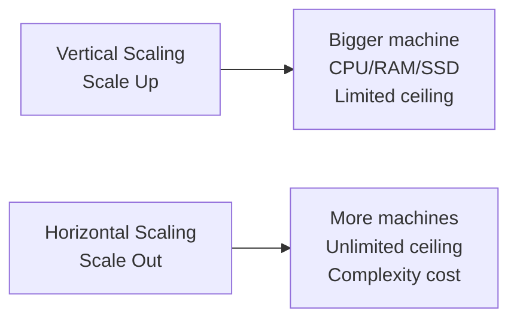
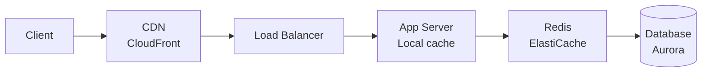
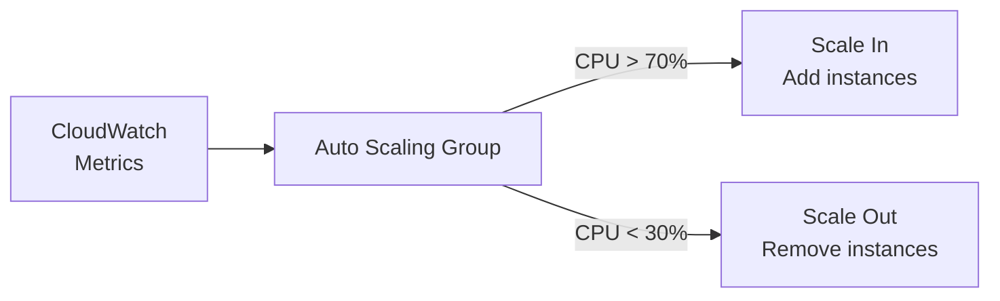

# Scalability Principles

> **References:** [System Design Primer](https://github.com/donnemartin/system-design-primer) | [AWS Auto Scaling](https://aws.amazon.com/autoscaling/) | [High Scalability Blog](http://highscalability.com/)

---

## What Is Scalability?

The ability of a system to handle increased load by adding resources, without requiring architectural changes.



---

## Vertical vs Horizontal Scaling

| Dimension | Vertical (Scale Up) | Horizontal (Scale Out) |
|-----------|--------------------|-----------------------|
| Method | Bigger instance | More instances |
| Cost | Expensive per unit | Cheaper per unit at scale |
| Ceiling | Hard ceiling (largest instance) | Virtually unlimited |
| Complexity | Simple | Load balancing, state management |
| Downtime | Required for resize | Zero downtime |
| AWS example | RDS instance size | Auto Scaling Group, DynamoDB |
| When to use | Early stages, DB engines | Stateless services, web tier |

---

## The 12 Scalability Principles

### 1. Stateless Design
```java
// ❌ BAD — session state in-memory (can't scale horizontally)
@RestController
public class CartController {
    private Map<String, Cart> sessionCarts = new HashMap<>(); // STATEFUL!
    
    @GetMapping("/cart")
    public Cart getCart(HttpSession session) {
        return sessionCarts.get(session.getId());
    }
}

// ✅ GOOD — state externalized to Redis
@RestController
public class CartController {
    private final RedisTemplate<String, Cart> redis;
    
    @GetMapping("/cart/{userId}")
    public Cart getCart(@PathVariable String userId) {
        return redis.opsForValue().get("cart:" + userId); // State in Redis
    }
}
```

### 2. Horizontal Partitioning (Sharding)
Distribute data across multiple nodes based on a partition key. Covered in depth in [Sharding Pattern](../03-System-Design-Patterns/Sharding-Pattern.md).

### 3. Caching Layers



### 4. Async Processing

```java
// Sync: client waits for heavy processing
// ❌ API blocks for 30s while generating report
@PostMapping("/reports")
public Report generateReport(ReportRequest request) {
    return heavyReportGenerator.generate(request); // 30 second operation!
}

// ✅ Async: enqueue job, return immediately with job ID
@PostMapping("/reports")
public ReportJobResponse startReport(ReportRequest request) {
    String jobId = UUID.randomUUID().toString();
    sqsClient.sendMessage(SendMessageRequest.builder()
        .queueUrl(REPORT_QUEUE_URL)
        .messageBody(objectMapper.writeValueAsString(request))
        .messageGroupId(jobId)
        .build());
    return new ReportJobResponse(jobId, "QUEUED");
}

@GetMapping("/reports/{jobId}")
public ReportStatus getStatus(@PathVariable String jobId) {
    return jobStatusRepository.find(jobId); // Client polls
}
```

### 5. Read Replicas
Route read traffic (often 80-95% of all DB traffic) to read replicas, saving write master for writes only.

### 6. Content Delivery Networks (CDN)
Serve static assets (images, JS, CSS) from edge locations close to users.
- AWS: CloudFront with S3 origin
- Reduces origin load by 90%+

### 7. Database Connection Pooling

```java
// Without pool: new connection per request = 50ms overhead
// With HikariCP pool: connection reused = <1ms overhead

@Configuration
public class DataSourceConfig {
    @Bean
    public DataSource dataSource() {
        HikariConfig config = new HikariConfig();
        config.setJdbcUrl("jdbc:postgresql://db:5432/myapp");
        config.setMaximumPoolSize(20);       // Max connections to DB
        config.setMinimumIdle(5);            // Always-warm connections
        config.setConnectionTimeout(3000);   // Fail fast: 3s max wait
        config.setIdleTimeout(600000);       // 10 min idle timeout
        config.setMaxLifetime(1800000);      // 30 min max connection age
        return new HikariDataSource(config);
    }
}
```

### 8. Message Queues (Decoupling)
Producers and consumers scale independently.
- AWS: SQS for task queues, Kinesis for streaming, SNS for pub/sub

### 9. Circuit Breaking
Prevent cascading failures when a dependency is slow. See [Circuit Breaker Pattern](../03-System-Design-Patterns/Circuit-Breaker-Pattern.md).

### 10. Rate Limiting
Protect services from overload. See [Rate Limiter LLD](../04-Low-Level-Design/Rate-Limiter-LLD.md).

### 11. Database Indexing
The cheapest way to scale read performance is proper indexing.

### 12. Monitoring & Auto-Scaling



---

## AWS Scalability Mapping

| Layer | AWS Service | Scaling Mechanism |
|-------|------------|------------------|
| DNS | Route 53 | Anycast, global |
| CDN | CloudFront | 450+ edge locations |
| Load Balancer | ALB / NLB | Auto-scales (no management) |
| Web/App Tier | ECS, EKS, EC2 ASG | Target tracking, step scaling |
| Cache | ElastiCache | Cluster mode, read replicas |
| Database reads | Aurora read replicas | Manual / Aurora Auto Scaling |
| Database writes | Aurora Serverless v2 | ACU auto-scaling |
| Queue | SQS | Unlimited throughput |
| Object Storage | S3 | Unlimited, auto-partitions at 3,500 PUT/s per prefix |
| Compute (async) | Lambda | Concurrency 10K (adjustable) |

---

## Scalability Anti-Patterns

| Anti-Pattern | Problem | Fix |
|-------------|---------|-----|
| Sticky sessions | Can't distribute traffic | Externalize session to Redis |
| Fat monolith | One slow function blocks all | Async + microservices |
| SELECT * queries | Full table scan at scale | Proper indexes + projections |
| N+1 queries | DB calls grow with data | JOIN or batch fetch |
| Synchronous cross-service calls | Latency chain multiplies | Async messaging or saga |
| Chatty microservices | Too many round trips | BFF or API aggregation |

---

## Capacity Planning Formula

```
Daily requests = DAU × requests/user/day
Peak RPS = (Daily requests / 86400) × peak_factor

Storage/day = daily_requests × avg_item_size
Storage/year = Storage/day × 365

Bandwidth = Peak RPS × avg_response_size
```

---

## Interview Q&A

**Q1: How would you scale a web service from 1,000 to 1,000,000 users?**
> Step-by-step: (1) Add load balancer + auto-scaling group for web tier. (2) Move session to Redis for stateless web servers. (3) Add read replicas for DB. (4) Add Redis caching layer for hot data. (5) Add CDN for static assets. (6) Move background jobs to SQS + Lambda. (7) Shard database when single primary can't keep up. (8) Add multi-region if global user base.

**Q2: What's the difference between scaling vertically and horizontally for a database?**
> Vertical: larger RDS instance — simple but limited (largest db.r8g.48xlarge = 192 vCPUs, 1.5TB RAM). Horizontal: read replicas for reads (up to 15 for Aurora), sharding for writes. For most RDBMS, you scale vertically first, then add read replicas, then finally shard or migrate to DynamoDB which scales horizontally automatically.

**Q3: When would you NOT scale horizontally?**
> (1) When the bottleneck is in sequential code (Amdahl's Law — more servers won't help). (2) When state is hard to distribute (e.g., a graph traversal that needs all data). (3) Early stage product — premature distributed complexity destroys engineering velocity. Start vertical, optimize later.
