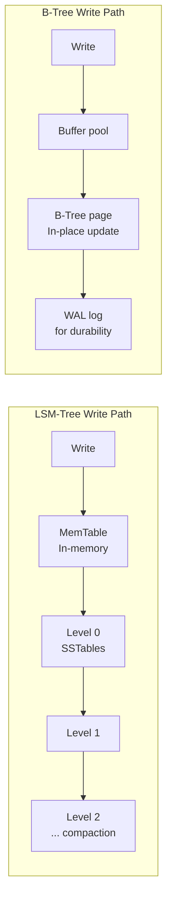

# Database Tradeoffs

> **References:** [Use The Index, Luke](https://use-the-index-luke.com/) | [DDIA Ch 3](https://dataintensive.net/) | [AWS Performance Insights](https://aws.amazon.com/rds/performance-insights/)

---

## ACID vs BASE Trade-offs

| Property | ACID | BASE |
|----------|------|------|
| Consistency | Strong (all constraints) | Eventual |
| Availability | Lower (waits for commit) | Higher |
| Throughput | Lower (locking, WAL) | Higher |
| Complexity | Simpler for dev | More complex (conflict handling) |
| AWS | Aurora, RDS | DynamoDB, Keyspaces |

---

## Normalization vs Denormalization

| Approach | Normalized | Denormalized |
|---------|-----------|-------------|
| Storage | Minimal (no duplication) | More (data duplicated) |
| Write performance | Better (update once) | Worse (update all copies) |
| Read performance | Requires JOINs (slower) | Pre-joined (faster) |
| Consistency | Always consistent | Can drift (eventual) |
| Use case | OLTP, frequent writes | Read-heavy, OLAP, NoSQL |

```java
// ❌ Normalized — requires JOIN for every product display
// products(id, name, category_id)
// categories(id, name, description)
SELECT p.name, c.name as category 
FROM products p JOIN categories c ON p.category_id = c.id; // SLOW at scale

// ✅ Denormalized — no JOIN needed for display
// products(id, name, category_id, category_name, category_description)
// Write: update category_name in ALL products when category changes
// Read: single table scan, no JOIN
```

---

## Indexes: Types, Costs, When to Use

### B-Tree Index (Default)
```sql
-- Efficient for: equality, range, order by, prefix match
CREATE INDEX idx_users_email ON users(email);           -- equality
CREATE INDEX idx_orders_date ON orders(created_at);     -- range
CREATE INDEX idx_name ON users(last_name, first_name);  -- composite
```

### Hash Index
```sql
-- Efficient for: equality only (NOT range)
-- PostgreSQL only (not MySQL InnoDB)
CREATE INDEX idx_hash ON sessions USING HASH (session_token);
```

### Covering Index (Index-Only Scan)
```sql
-- Include all needed columns in index to avoid table lookups
CREATE INDEX idx_covering ON orders(user_id, created_at)
    INCLUDE (status, total_amount);
-- Query below can be answered from index alone (no heap fetch)
SELECT status, total_amount FROM orders 
WHERE user_id = 123 AND created_at > '2024-01-01';
```

### When NOT to Add an Index
- Tables with < 1000 rows (full scan is faster)
- Columns with low cardinality (e.g., boolean, gender) — index selectivity is poor
- Write-heavy tables (each index = extra write + storage)
- When you already have a covering index that includes the column

---

## Write Amplification: LSM-Tree vs B-Tree

| Storage Engine | Structure | Write Amplification | Read Amplification | Use Case |
|---------------|-----------|--------------------|--------------------|---------|
| B-Tree (MySQL InnoDB, PostgreSQL) | In-place updates | Low | Low | Balanced reads/writes |
| LSM-Tree (RocksDB, Cassandra, DynamoDB) | Append-only + compaction | High (compaction) | Medium (bloom filters) | Write-heavy |



---

## Connection Pooling

```java
// Without pool: new TCP connection per request = 50ms overhead + DB resource cost
// With pool: reuse existing connections = <1ms

@Configuration
public class DatabaseConfig {

    @Bean
    public DataSource dataSource() {
        HikariConfig config = new HikariConfig();
        config.setJdbcUrl(System.getenv("DB_URL"));
        
        // Pool sizing: (core_count × 2) + effective_spindle_count
        // For 4 vCPU with SSD: (4 × 2) + 1 = 9, round to 10
        config.setMaximumPoolSize(10);
        config.setMinimumIdle(3);
        
        // Timeouts: fail fast is better than long queues
        config.setConnectionTimeout(3000);   // Wait max 3s for pool slot
        config.setValidationTimeout(1000);   // Health check timeout
        config.setIdleTimeout(300000);       // Remove idle connections after 5min
        config.setMaxLifetime(600000);       // Recycle connections every 10min
        
        // Connection validation
        config.setConnectionTestQuery("SELECT 1");
        
        return new HikariDataSource(config);
    }
}
```

---

## N+1 Query Problem

```java
// ❌ N+1: 1 query for list + N queries for each child
@Transactional(readOnly = true)
public List<OrderDto> getOrders() {
    List<Order> orders = orderRepository.findAll(); // 1 query
    return orders.stream()
        .map(order -> {
            List<Item> items = itemRepository.findByOrderId(order.getId()); // N queries!
            return new OrderDto(order, items);
        })
        .toList();
}

// ✅ Fix 1: JOIN FETCH in JPQL
@Query("SELECT o FROM Order o JOIN FETCH o.items WHERE o.userId = :userId")
List<Order> findByUserIdWithItems(@Param("userId") Long userId);

// ✅ Fix 2: EntityGraph
@EntityGraph(attributePaths = {"items", "items.product"})
List<Order> findByUserId(Long userId);

// ✅ Fix 3: Batch loading with IN clause (for large sets)
@Query("SELECT i FROM Item i WHERE i.orderId IN :orderIds")
List<Item> findByOrderIds(@Param("orderIds") List<Long> orderIds);

public List<OrderDto> getOrdersBatched() {
    List<Order> orders = orderRepository.findAll();
    List<Long> orderIds = orders.stream().map(Order::getId).toList();
    Map<Long, List<Item>> itemsByOrder = itemRepository.findByOrderIds(orderIds)
        .stream().collect(Collectors.groupingBy(Item::getOrderId));
    return orders.stream()
        .map(o -> new OrderDto(o, itemsByOrder.getOrDefault(o.getId(), List.of())))
        .toList();
}
```

---

## Read vs Write Optimization Strategies

| Scenario | Strategy | AWS Service |
|---------|---------|------------|
| High read volume | Add read replicas, caching | Aurora replicas, ElastiCache |
| High write volume | Shard or use LSM-based DB | DynamoDB, Keyspaces |
| Heavy analytics | Separate OLAP from OLTP | Redshift, Athena |
| Mixed workload | HTAP (hybrid) | Aurora + zero-ETL to Redshift |
| Slow queries | Add covering indexes | RDS Performance Insights |
| ORM N+1 | Batch/eager loading | Spring Data `@EntityGraph` |

---

## Interview Q&A

**Q1: How would you find and fix slow queries in production?**
> (1) Enable slow query log (MySQL: `slow_query_log=ON`, `long_query_time=1`). (2) Use RDS Performance Insights to identify top SQL by wait time. (3) Run EXPLAIN ANALYZE on the slow query — look for full table scans (type=ALL), missing indexes, sort operations. (4) Add appropriate index — covering index if multiple columns accessed. (5) Rewrite query to avoid N+1 patterns. (6) Consider denormalization if JOIN is unavoidable.

**Q2: When would you choose DynamoDB over Aurora?**
> DynamoDB: (1) Known access patterns (always query by user_id, never ad-hoc). (2) Extreme write throughput (>10K writes/sec). (3) Horizontal scale needed from day 1. (4) Schema-less / evolving data model. Aurora: (1) Complex queries with JOINs. (2) ACID transactions across entities. (3) Reporting / analytics. (4) Existing SQL expertise. (5) Unknown/varied query patterns.

**Q3: What is write amplification in LSM-tree stores and why does it matter?**
> Write amplification = ratio of bytes written to storage vs bytes the application wrote. LSM-tree databases (Cassandra, RocksDB) use compaction — data is rewritten during background merges as it moves from Level 0 to Level N. This can amplify writes 10-30×. It matters because: (1) SSDs have finite write endurance; (2) Compaction competes with application I/O; (3) At high write rates, compaction can't keep up, causing read performance degradation (too many SSTables to scan).
