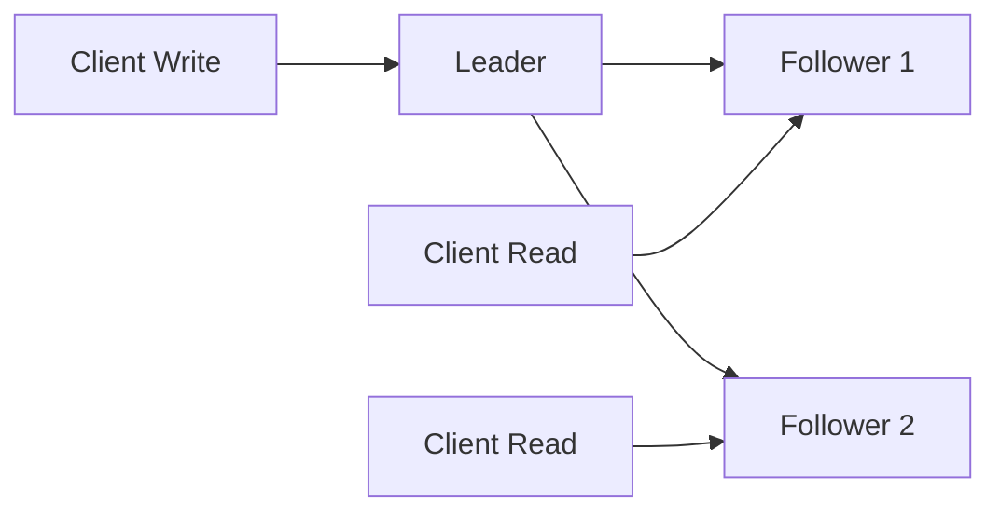
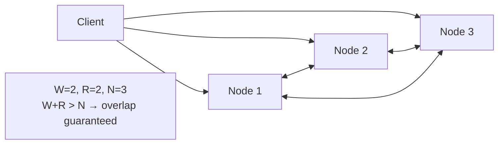
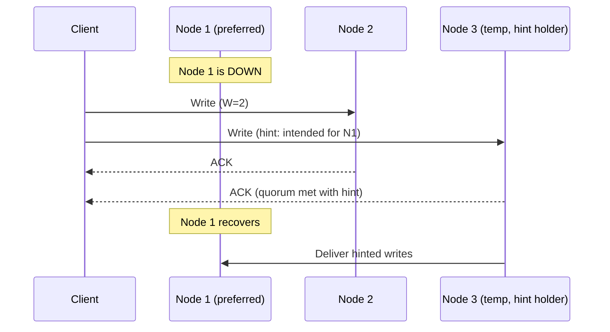
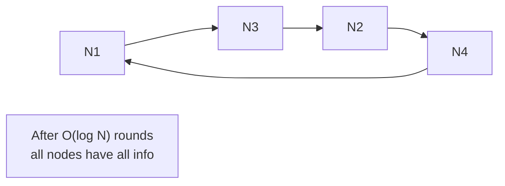

# Leader-Follower vs Leaderless Replication

> **References:** [DDIA Ch 5](https://dataintensive.net/) | [Dynamo Paper](https://www.allthingsdistributed.com/files/amazon-dynamo-sosp2007.pdf) | [Cassandra Architecture](https://cassandra.apache.org/doc/latest/cassandra/architecture/overview.html)

---

## Leader-Based Replication

One node (leader/primary) accepts all writes. Others (followers/replicas) replicate from leader.



### Types
1. **Single-Leader:** One leader per shard, all writes go there (PostgreSQL, MySQL, RDS)
2. **Multi-Leader:** Multiple leaders, useful for multi-datacenter (MySQL Group Replication, CockroachDB)

### Failover Process
1. Leader health check fails (heartbeat timeout)
2. Election algorithm picks new leader (Raft, Paxos, or external coordinator like ZooKeeper)
3. Old leader's clients redirected to new leader
4. Old leader, if it recovers, must rejoin as follower

### Problems with Leader-Based
- **Leader bottleneck:** All writes must go through one node
- **Failover latency:** 30s–2 min for automatic failover
- **Split-brain:** Old leader still accepts writes after new leader elected

---

## Leaderless Replication (Dynamo-Style)

Any node can accept reads and writes. Coordination via quorum.



Used by: **Cassandra**, **Riak**, **DynamoDB** (under the hood), **Voldemort**

---

## Quorum Consensus

**Formula:** W + R > N guarantees at least one node in the read set saw the latest write.

| N | W | R | Guarantees |
|---|---|---|------------|
| 3 | 2 | 2 | Strong (always overlap) |
| 3 | 1 | 3 | Strong read, fast write |
| 3 | 3 | 1 | Strong write, fast read |
| 3 | 1 | 1 | Eventual (no overlap guarantee) |

```
N=3 nodes, W=2, R=2:
Write: must be acknowledged by 2 nodes
Read: must contact 2 nodes and take latest version
Overlap: at least 1 node is in both W set and R set
→ Always reads the latest write
```

### Java — Simulating Quorum Write

```java
@Service
public class QuorumStorageService {

    private final List<StorageNode> nodes;
    private final int replicationFactor; // N
    private final int writeQuorum;       // W
    private final int readQuorum;        // R

    public QuorumStorageService(List<StorageNode> nodes, int n, int w, int r) {
        this.nodes = nodes;
        this.replicationFactor = n;
        this.writeQuorum = w;
        this.readQuorum = r;
    }

    public void write(String key, String value) {
        List<StorageNode> targetNodes = selectNodes(key, replicationFactor);
        
        // Write to all N nodes in parallel
        List<CompletableFuture<Boolean>> futures = targetNodes.stream()
            .map(node -> CompletableFuture.supplyAsync(() -> {
                try {
                    node.put(key, value, System.currentTimeMillis());
                    return true;
                } catch (Exception e) {
                    return false;
                }
            }))
            .toList();
        
        // Wait for W acknowledgments
        long successCount = futures.stream()
            .map(f -> {
                try { return f.get(1, TimeUnit.SECONDS); }
                catch (Exception e) { return false; }
            })
            .filter(Boolean::booleanValue)
            .count();
        
        if (successCount < writeQuorum) {
            throw new QuorumNotMetException("Write quorum not met: " + successCount + "/" + writeQuorum);
        }
    }

    public String read(String key) {
        List<StorageNode> targetNodes = selectNodes(key, replicationFactor);
        
        // Read from R nodes, take the version with highest timestamp
        List<VersionedValue> values = targetNodes.stream()
            .limit(readQuorum)
            .map(node -> node.get(key))
            .filter(Objects::nonNull)
            .toList();
        
        if (values.size() < readQuorum) {
            throw new QuorumNotMetException("Read quorum not met");
        }
        
        return values.stream()
            .max(Comparator.comparingLong(VersionedValue::getTimestamp))
            .map(VersionedValue::getValue)
            .orElseThrow();
    }
}
```

---

## Sloppy Quorums & Hinted Handoff

**Sloppy Quorum:** If some preferred nodes are unavailable, write to other available nodes temporarily ("hints").

**Hinted Handoff:** When the preferred node recovers, the temporary node sends it the "hinted" writes.



---

## Anti-Entropy with Merkle Trees

How do replicas sync when they fall behind? Use Merkle trees for efficient difference detection.

```
Merkle tree: hash tree where leaf nodes = hashes of data blocks
                    root
                  /      \
              h(A+B)    h(C+D)
              /    \    /    \
            h(A)  h(B) h(C)  h(D)

Two nodes compare root hashes → if equal, in sync
If different, compare children → narrow down to differing blocks
→ Only transfer the differing data (not entire dataset)
```

---

## Gossip Protocol

Nodes spread information like a rumor — each node periodically exchanges state with random peers.



Used by: Cassandra (membership), DynamoDB (failure detection), Redis Cluster

---

## Leader vs Leaderless Comparison

| Dimension | Leader-Based | Leaderless |
|-----------|-------------|------------|
| Write bottleneck | Yes (single leader) | No (any node) |
| Read performance | Can route to replicas | Any node |
| Consistency | Strong (sync) or eventual (async) | Quorum-based |
| Conflict handling | No conflict (serial writes) | Possible (concurrent writes) |
| Failover | Requires leader election | No failover needed |
| Complexity | Lower | Higher (quorum, anti-entropy) |
| AWS example | Aurora, RDS | DynamoDB, Keyspaces |
| Use case | SQL, ACID needs | High availability, high write throughput |

---

## Interview Q&A

**Q1: What happens in Cassandra when a node is temporarily down during a write?**
> With sloppy quorum, Cassandra writes to available nodes (including non-preferred ones if needed to meet W). A "hint" is stored on the coordinator node indicating the write was intended for the offline node. When the offline node recovers, the hint is replayed to bring it back in sync. This ensures availability during transient failures.

**Q2: How does Cassandra achieve high availability without a leader?**
> Every node is equal — any node can accept reads or writes (called the coordinator). The coordinator routes requests to the correct replica nodes based on consistent hashing. With quorum (W+R>N), at least one node in every read set has the latest write. No leader means no single point of failure and no failover delay.

**Q3: What is the trade-off between W=1 and W=3 in a 3-replica system?**
> W=1: Fastest writes (only 1 node ACKs), but data is vulnerable — if that node fails before async replication, write is lost. W=3: Slowest writes (must wait for all 3 ACKs), but maximum durability — survive 2 node failures and still have the data. W=2 (quorum) is the common middle ground: tolerates 1 failure, faster than W=3.
