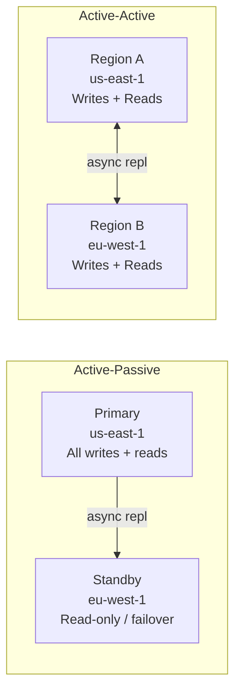
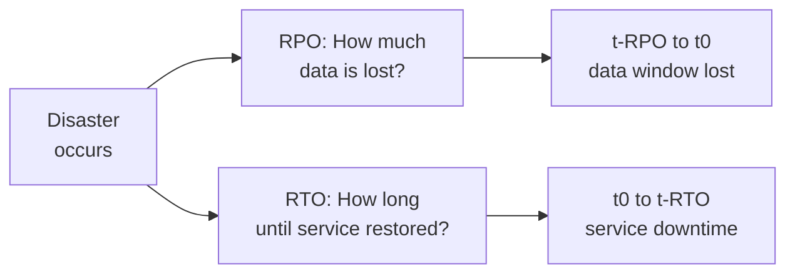
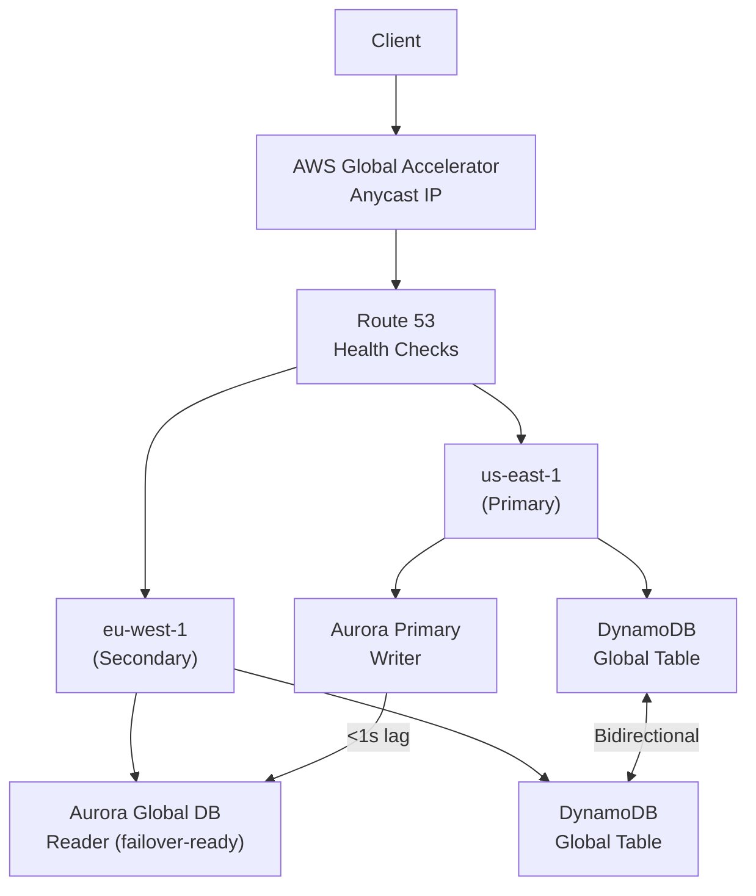

# Multi-Region Replication

> **References:** [Aurora Global Database](https://aws.amazon.com/rds/aurora/global-database/) | [DynamoDB Global Tables](https://aws.amazon.com/dynamodb/global-tables/) | [DDIA Ch 5](https://dataintensive.net/)

---

## Why Multi-Region?

| Goal | Description |
|------|------------|
| **Disaster Recovery** | Survive total regional failure (rare but catastrophic) |
| **Low Latency** | Serve users from nearby region |
| **Data Residency** | EU data stays in EU (GDPR) |
| **Business Continuity** | Meet RPO < 1s, RTO < 1 min SLAs |

---

## Active-Passive vs Active-Active



| Dimension | Active-Passive | Active-Active |
|-----------|---------------|--------------|
| Complexity | Low | High (conflict resolution) |
| Read scaling | One region | Both regions |
| Write latency | Normal | May need cross-region coordination |
| Conflict risk | None | Yes — concurrent writes |
| Failover time | 1–5 min (DNS TTL) | Instant (already active) |
| Cost | Lower | Higher |
| Use case | DR, compliance | Global products, zero-downtime |

---

## Conflict Resolution Strategies

When two regions accept writes to the same record simultaneously, conflicts occur.

### 1. Last-Write-Wins (LWW)
```java
// Record with timestamp — highest timestamp wins
public class VersionedRecord {
    private String key;
    private String value;
    private long timestamp; // wall clock (risk: clock skew!)
    
    public VersionedRecord merge(VersionedRecord other) {
        return this.timestamp >= other.timestamp ? this : other;
    }
}
```
⚠️ **Risk:** Clock skew can cause "newer" write to lose.

### 2. Vector Clocks
```java
// Track causality per region
public class MultiRegionRecord {
    private String key;
    private String value;
    private Map<String, Long> vectorClock; // {us-east-1: 5, eu-west-1: 3}
    
    // Returns true if this record causally precedes other
    public boolean happensBefore(MultiRegionRecord other) {
        return vectorClock.entrySet().stream()
            .allMatch(e -> e.getValue() <= other.vectorClock.getOrDefault(e.getKey(), 0L));
    }
    
    // If neither happens-before the other → concurrent conflict
    public boolean isConflict(MultiRegionRecord other) {
        return !happensBefore(other) && !other.happensBefore(this);
    }
}
```

### 3. CRDTs (Conflict-free Replicated Data Types)
Data structures that can be merged without conflicts — no coordination needed.

```java
// G-Counter CRDT: each region increments its own counter
// Merge = max of each region's count
public class GCounter {
    private final String nodeId;
    private final Map<String, Long> counts = new ConcurrentHashMap<>();
    
    public void increment() {
        counts.merge(nodeId, 1L, Long::sum);
    }
    
    public long value() {
        return counts.values().stream().mapToLong(Long::longValue).sum();
    }
    
    public GCounter merge(GCounter other) {
        GCounter merged = new GCounter(nodeId);
        merged.counts.putAll(this.counts);
        other.counts.forEach((node, count) ->
            merged.counts.merge(node, count, Math::max)
        );
        return merged;
    }
}
```

---

## RPO and RTO

| Term | Definition | Typical SLA |
|------|-----------|------------|
| **RPO** (Recovery Point Objective) | Maximum acceptable data loss in time | 0–15 min |
| **RTO** (Recovery Time Objective) | Maximum time to restore service | 1 min–4 hours |



---

## AWS Multi-Region Services

| Service | Replication Type | RPO | RTO |
|---------|-----------------|-----|-----|
| Aurora Global Database | Async, < 1s lag | < 1s | < 1 min (managed failover) |
| DynamoDB Global Tables | Async, < 1s lag | < 1s | Seconds (auto failover) |
| S3 CRR | Async, minutes | Minutes | Immediate (Route 53 failover) |
| RDS Cross-Region Replica | Async | Minutes | Minutes (manual promotion) |
| Route 53 + Health Checks | DNS failover | N/A | 60–300s (TTL dependent) |
| Global Accelerator | Anycast routing | N/A | < 30s |

---

## Multi-Region Architecture



---

## Data Residency & Compliance

```java
// Route writes to region based on user's country
@Service
public class RegionRouter {
    
    private static final Map<String, String> COUNTRY_TO_REGION = Map.of(
        "DE", "eu-central-1",  // GDPR: EU data stays in EU
        "FR", "eu-west-3",
        "US", "us-east-1",
        "AU", "ap-southeast-2"
    );
    
    public String getRegionForUser(String countryCode) {
        return COUNTRY_TO_REGION.getOrDefault(countryCode, "us-east-1");
    }
    
    public <T> T routeWrite(String countryCode, Supplier<T> operation) {
        String region = getRegionForUser(countryCode);
        // Use thread-local or request context to set target region
        RegionContext.set(region);
        try {
            return operation.get();
        } finally {
            RegionContext.clear();
        }
    }
}
```

---

## When NOT to Do Multi-Region

1. **Cost:** Multi-region is 2-3× more expensive (data replicated, cross-region transfer costs)
2. **Complexity:** Conflict resolution, failover testing, DNS propagation delays
3. **Most services don't need it:** 99.99% availability is achievable with Multi-AZ alone
4. **Write latency penalty:** Active-active requires cross-region coordination for consistency

---

## Interview Q&A

**Q1: How would you design a zero-downtime database failover across regions?**
> Use Aurora Global Database: primary writer in us-east-1, read replica in eu-west-1 with < 1s lag. Configure Route 53 health checks on the primary endpoint. When primary fails, run managed failover to promote the EU secondary — takes < 1 minute. Combined with AWS Global Accelerator for instant IP-level rerouting, clients experience ~30s disruption. For applications: use connection retry with exponential backoff.

**Q2: How does DynamoDB Global Tables handle write conflicts?**
> DynamoDB Global Tables uses "last-writer-wins" based on the item's timestamp at write time. If two regions write to the same item within the same second, one write will silently overwrite the other. For conflict-sensitive data, application-level logic is needed: use conditional writes with version numbers, or use optimistic locking with a version attribute.

**Q3: What is the difference between RPO and RTO? How do they influence your DR design?**
> RPO = how much data loss is acceptable (lower = more synchronous replication). RTO = how long can the service be down (lower = more automated failover). RPO drives your replication strategy: RPO=0 needs synchronous replication; RPO=5min needs async. RTO drives your standby strategy: RTO=1min needs hot standby; RTO=1hr can use pilot light; RTO=4hr can use backup/restore.
