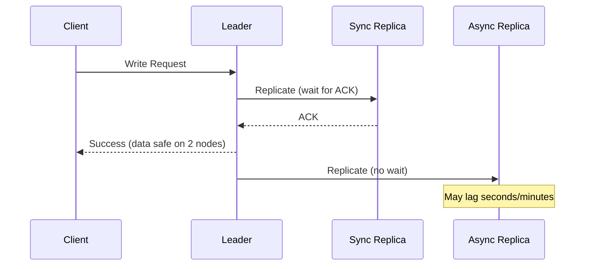
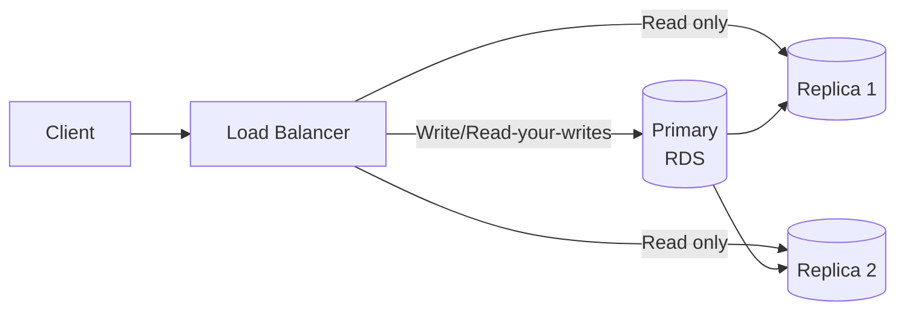
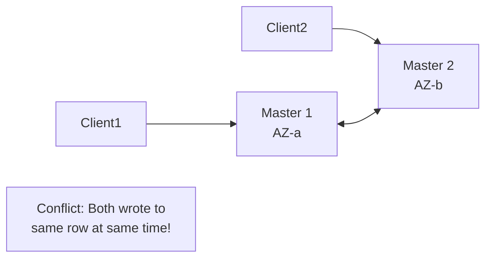

# Replication Strategies

> **References:** [DDIA Ch 5](https://dataintensive.net/) | [Aurora Replication](https://docs.aws.amazon.com/AmazonRDS/latest/AuroraUserGuide/Aurora.Replication.html) | [MySQL Replication](https://dev.mysql.com/doc/refman/8.0/en/replication.html)

---

## Why Replicate?

1. **High Availability** — if leader fails, promote replica
2. **Read Scaling** — route reads to replicas, free up leader for writes
3. **Geo-proximity** — replicas near users reduce read latency
4. **Disaster Recovery** — cross-region replica for catastrophic failures

---

## Synchronous vs Asynchronous Replication



| Dimension | Synchronous | Asynchronous |
|-----------|-------------|-------------|
| Durability | High (data on 2+ nodes before ACK) | Risk of data loss if leader fails |
| Latency | Higher (waits for replica ACK) | Lower (return immediately) |
| Throughput | Lower | Higher |
| AWS example | RDS Multi-AZ standby | RDS Read Replicas |
| Use case | Financial data, critical records | Analytics reads, secondary indexes |

---

## Replication Methods

### Statement-Based Replication
- Leader logs each SQL statement; replicas re-execute
- **Problem:** Non-deterministic functions (NOW(), UUID()) give different results on replicas
- **MySQL default** before 5.7.7 with `binlog_format=STATEMENT`

### Row-Based Replication
- Leader logs actual row changes (before/after images)
- Deterministic — replicas always get same result
- **MySQL default** since 5.7.7 with `binlog_format=ROW`
- More data in binlog but safer

### Logical / WAL-Based Replication
- PostgreSQL: Write-Ahead Log (WAL) shipping
- Aurora: Log-structured storage, only redo log shipped (not full rows)

---

## Read Replica Pattern



### Java — Routing Reads to Replicas with Spring

```java
@Configuration
public class RoutingDataSourceConfig {

    @Bean
    @ConfigurationProperties("spring.datasource.primary")
    public DataSource primaryDataSource() {
        return DataSourceBuilder.create().build();
    }

    @Bean
    @ConfigurationProperties("spring.datasource.replica")
    public DataSource replicaDataSource() {
        return DataSourceBuilder.create().build();
    }

    @Bean
    public DataSource routingDataSource(
            @Qualifier("primaryDataSource") DataSource primary,
            @Qualifier("replicaDataSource") DataSource replica) {
        
        AbstractRoutingDataSource routing = new AbstractRoutingDataSource() {
            @Override
            protected Object determineCurrentLookupKey() {
                return TransactionSynchronizationManager.isCurrentTransactionReadOnly()
                    ? "replica" : "primary";
            }
        };
        routing.setTargetDataSources(Map.of("primary", primary, "replica", replica));
        routing.setDefaultTargetDataSource(primary);
        return routing;
    }
}

// Usage — mark read transactions for routing to replica
@Service
public class ProductService {

    @Transactional(readOnly = true)  // → routes to replica
    public List<Product> getProducts() {
        return productRepository.findAll();
    }

    @Transactional  // → routes to primary
    public Product createProduct(CreateProductRequest req) {
        return productRepository.save(mapper.map(req));
    }
}
```

---

## Replication Lag

**Replication lag** = time between leader writing a change and replica applying it.

**Problems caused by lag:**
1. User updates profile → immediately reads from replica → sees old data
2. Read-your-writes violation
3. Analytics query on replica sees stale counts

**Mitigation strategies:**
```java
// Strategy 1: Always read own writes from primary (for 1 minute after write)
public User getUser(String userId, String sessionUserId) {
    boolean recentlyWritten = recentWriteTracker.wasRecentlyWritten(userId, sessionUserId);
    return recentlyWritten
        ? primaryRepo.findById(userId)    // Force primary read
        : replicaRepo.findById(userId);   // Allow stale replica read
}

// Strategy 2: Track replication position
// After write, record binlog position
// On read, ensure replica has applied at least that position
```

---

## Multi-Master Replication

Multiple nodes can accept writes. Writes replicated to all others.



**Conflict resolution strategies:**
1. **Last-write-wins (LWW):** highest timestamp wins — can lose data
2. **Version vectors:** track causality, detect true conflicts
3. **CRDT:** data structures that merge without conflicts (counters, sets)
4. **Application-level merge:** present conflict to application to resolve

**AWS: Aurora Global Database** — single writer per region (avoids multi-master conflicts), read replicas globally.

---

## AWS Replication Services

| Service | Type | RPO | RTO |
|---------|------|-----|-----|
| RDS Multi-AZ | Sync standby | ~0 | 60–120s |
| RDS Read Replica | Async | Minutes | Manual promotion |
| Aurora Multi-AZ | Quorum (3 AZs, 6 copies) | ~0 | <30s |
| Aurora Global DB | Async cross-region | <1s | <1 min |
| DynamoDB Global Tables | Async multi-region | <1s | Seconds |
| S3 CRR (Cross-Region Replication) | Async | Minutes | N/A (S3) |

---

## Interview Q&A

**Q1: What is replication lag and how do you handle it in a read-heavy system?**
> Replication lag is the time between the leader writing a change and the replica applying it. Common causes: heavy write load, slow replica hardware, network congestion. Handling: (1) Read-your-writes: route a user's reads to primary for a short time after their write. (2) Track binlog/WAL position and only route to replicas that have applied the user's write. (3) Accept eventual consistency for non-critical reads (product listings).

**Q2: When would you use synchronous vs asynchronous replication?**
> Synchronous: when durability is critical — financial transactions, user authentication (can't lose this data). The leader waits for replica ACK before confirming write. Tradeoff: higher latency. Asynchronous: read scaling, analytics replicas, cross-region disaster recovery where some data loss is acceptable. Lower latency but risks losing the last few seconds of writes if primary crashes.

**Q3: How does Aurora achieve high availability with replication?**
> Aurora uses a quorum-based storage system with 6 copies across 3 AZs. A write only needs 4/6 acknowledgments to succeed (quorum). The storage layer is decoupled from the compute layer — only redo log records are shipped to storage nodes, not full pages. Read replicas share the same storage volume (no data copying needed), enabling read scaling with near-zero replica lag.
