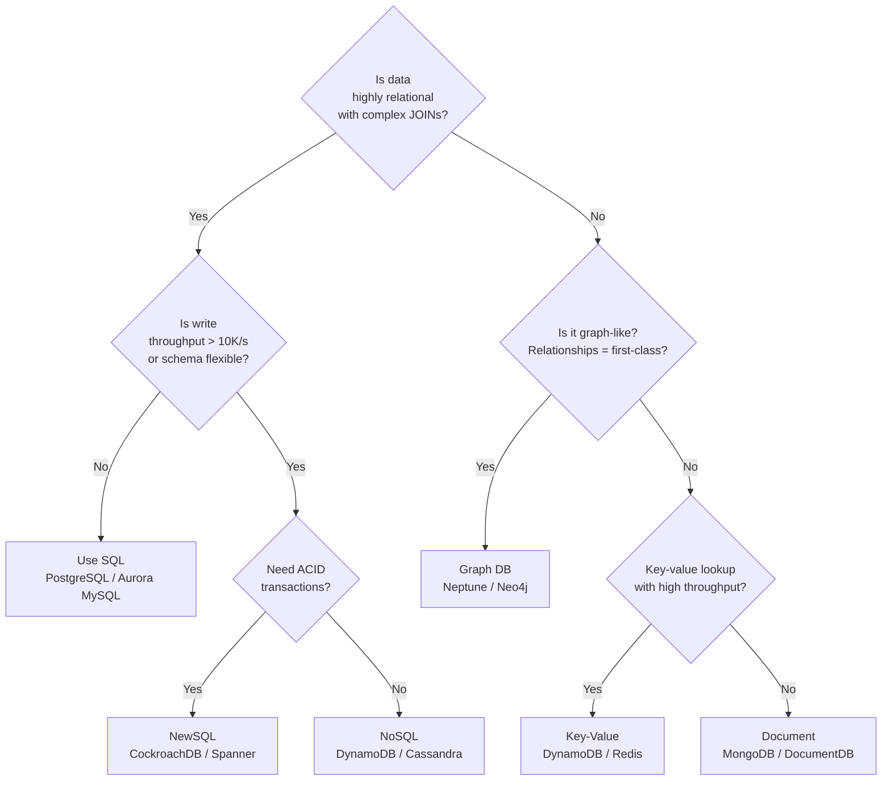

# SQL vs NoSQL vs Graph Databases

> **References:** [AWS Database Selection Guide](https://aws.amazon.com/products/databases/) | [MongoDB vs PostgreSQL](https://www.mongodb.com/compare/mongodb-postgresql) | [GeeksForGeeks](https://www.geeksforgeeks.org/sql-vs-nosql-which-one-is-better-to-use/)

---

## Decision Framework



---

## Relational Databases (SQL)

### Strengths
- **ACID transactions** — guaranteed atomicity, consistency, isolation, durability
- **Flexible querying** — any ad-hoc query with JOINs, aggregations, window functions
- **Schema enforcement** — catches data quality issues at write time
- **Mature ecosystem** — decades of tooling, ORMs, migrations

### Weaknesses
- Horizontal scaling is hard (sharding requires application logic)
- Schema changes in production can be painful at scale
- Performance degrades with JOINs across very large tables

### Best For
- Financial systems (transactions critical)
- ERP/CRM (complex relationships)
- Reporting and analytics (ad-hoc queries)
- Any use case where data model is well-defined

### AWS Options
| Service | Use Case |
|---------|---------|
| Amazon RDS (PostgreSQL/MySQL) | General-purpose relational |
| Amazon Aurora MySQL | High-throughput MySQL-compatible |
| Amazon Aurora PostgreSQL | High-throughput Postgres-compatible |
| Amazon RDS Oracle/SQL Server | Enterprise migration lift-and-shift |

---

## NoSQL Databases

### Document Databases
Store data as JSON-like documents. Good for hierarchical data.

```java
// MongoDB document — no JOIN needed, all data embedded
{
  "_id": "order_123",
  "customer": {"name": "Alice", "email": "alice@example.com"},
  "items": [
    {"productId": "p1", "name": "Laptop", "price": 999, "qty": 1},
    {"productId": "p2", "name": "Mouse", "price": 29, "qty": 2}
  ],
  "total": 1057,
  "status": "SHIPPED"
}
```

**AWS:** Amazon DocumentDB (MongoDB-compatible)

### Key-Value Databases
Ultra-fast simple lookups by key. No querying by value.

**AWS:** DynamoDB (key-value + document), ElastiCache Redis

### Wide-Column Databases
Column families optimized for time-series and write-heavy workloads.

```
// Cassandra: rows partitioned by user_id, sorted by timestamp
CREATE TABLE events (
    user_id UUID,
    event_time TIMESTAMP,
    event_type TEXT,
    payload TEXT,
    PRIMARY KEY (user_id, event_time)
) WITH CLUSTERING ORDER BY (event_time DESC);
```

**AWS:** Amazon Keyspaces (Cassandra-compatible)

### NoSQL Best For
- High write throughput (millions/sec)
- Flexible/evolving schema
- Simple access patterns (lookup by primary key)
- Horizontal scale from day 1

### AWS DynamoDB — The Go-To NoSQL

```java
@Service
public class UserRepository {

    private final DynamoDbClient dynamoDb;

    // Efficient: single-key lookup (partition + sort key)
    public User getUser(String userId) {
        GetItemResponse response = dynamoDb.getItem(GetItemRequest.builder()
            .tableName("Users")
            .key(Map.of(
                "PK", AttributeValue.builder().s("USER#" + userId).build(),
                "SK", AttributeValue.builder().s("PROFILE").build()
            ))
            .build());
        return mapper.map(response.item(), User.class);
    }

    // Query pattern: get all orders for a user (1-to-many)
    public List<Order> getUserOrders(String userId) {
        QueryResponse response = dynamoDb.query(QueryRequest.builder()
            .tableName("Users")
            .keyConditionExpression("PK = :pk AND begins_with(SK, :skPrefix)")
            .expressionAttributeValues(Map.of(
                ":pk", AttributeValue.builder().s("USER#" + userId).build(),
                ":skPrefix", AttributeValue.builder().s("ORDER#").build()
            ))
            .build());
        return response.items().stream().map(i -> mapper.map(i, Order.class)).toList();
    }
}
```

---

## Graph Databases

Store data as **nodes** (entities) and **edges** (relationships). Traversal is O(1) per hop regardless of dataset size (vs JOIN which is O(n×m)).

### Best For
- Social networks (friends-of-friends)
- Fraud detection (transaction graph patterns)
- Recommendation engines (user → product → similar users)
- Knowledge graphs
- Network topology

### Performance Advantage

```
Finding friends-of-friends-of-friends:
SQL:  JOIN users → JOIN friendships → JOIN friendships → JOIN users
      → scans millions of rows, slow
Graph: 3 hops from a node → directly follows edge pointers
      → milliseconds regardless of graph size
```

### AWS Neptune — Gremlin Query Example

```java
// Find all users who purchased the same products as user "alice"
// and haven't been recommended yet
String gremlinQuery = """
    g.V().has('user', 'id', 'alice')
     .out('purchased')
     .in('purchased')
     .where(__.not(__.out('recommended_to').has('id', 'alice')))
     .groupCount()
     .order(local).by(values, desc)
     .limit(local, 10)
     .unfold()
     .select(keys)
    """;
```

---

## Comparison Table

| Dimension | SQL | Document | Key-Value | Wide-Column | Graph |
|-----------|-----|----------|-----------|-------------|-------|
| Data model | Tables/rows | JSON docs | Key → value | Rows/columns | Nodes/edges |
| Schema | Rigid | Flexible | None | Semi-flexible | Flexible |
| Query power | Full SQL | Limited | Key-only | CQL | Graph traversal |
| Transactions | ACID | Limited | No | No (Cassandra) | Limited |
| Horizontal scale | Hard | Yes | Yes | Yes | Limited |
| Relationships | JOINs (slow at scale) | Embedded | No | No | Native (fast) |
| AWS service | Aurora/RDS | DocumentDB | DynamoDB/Redis | Keyspaces | Neptune |
| Use case | Finance, ERP | CMS, catalogs | Caching, sessions | Time-series, IoT | Social, fraud |

---

## When NOT to Use NoSQL

1. **Complex transactions across multiple entities** — e.g., bank transfer (debit A, credit B atomically)
2. **Ad-hoc reporting** — NoSQL requires pre-defined access patterns; SQL allows any query
3. **Small teams / early stage** — SQL is simpler to reason about; NoSQL's access pattern design is an upfront cost
4. **Relational integrity requirements** — foreign keys, cascading deletes are built into SQL

---

## Interview Q&A

**Q1: How would you choose between DynamoDB and Aurora for a new service?**
> Key questions: (1) Access patterns — if you always query by known keys, DynamoDB; if you need ad-hoc queries or JOINs, Aurora. (2) Scale — DynamoDB auto-scales to any throughput; Aurora scales to ~500K reads/sec with replicas. (3) Transactions — Aurora has full ACID; DynamoDB has limited transactions. (4) Schema — DynamoDB is schema-less, good for evolving data models.

**Q2: When would you use a graph database over a relational one?**
> When relationships are first-class data and you need to traverse them. Example: fraud detection querying "find all accounts within 3 hops of a known fraudster." In SQL this requires recursive CTEs or multiple JOINs that get exponentially slower. Neptune/Neo4j can do this in milliseconds by following edge pointers.

**Q3: What is the N+1 query problem in SQL and how do you fix it?**
> N+1: fetching N parent objects, then making 1 query per parent to fetch children = N+1 total queries. Fix: use JOIN (single query) or batch fetch (IN clause). In Spring Data JPA: `@EntityGraph` or `@Query` with JOIN FETCH. In DynamoDB: batch operations or single-table design where related items share the same partition key.
