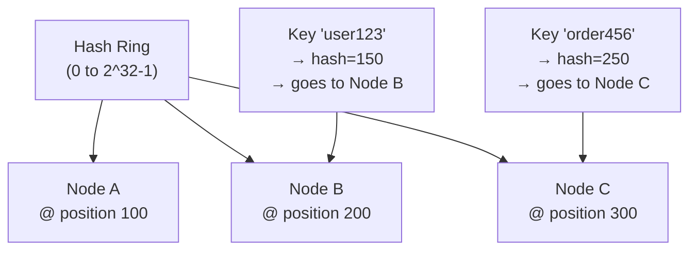

# Sharding and Partitioning

> **References:** [DDIA Ch 6](https://dataintensive.net/) | [DynamoDB Partitioning](https://docs.aws.amazon.com/amazondynamodb/latest/developerguide/HowItWorks.Partitions.html) | [Consistent Hashing](https://www.geeksforgeeks.org/consistent-hashing/)

---

## What Is Sharding?

**Sharding** (horizontal partitioning) splits a large dataset across multiple nodes, each owning a subset. Each node (shard) holds data for a range of partition keys.

**Why shard?**
- Single node storage limit reached (e.g., >10TB)
- Write throughput exceeds single node capacity
- Need geographic data locality

---

## Sharding Strategies

### 1. Hash-Based Sharding
```
shard_id = hash(key) % num_shards
```
- **Pros:** Even distribution (no hotspots for uniform key space)
- **Cons:** Can't do range scans; resharding requires rebalancing all keys

### 2. Range-Based Sharding
```
Shard 0: user_id 0–999,999
Shard 1: user_id 1,000,000–1,999,999
Shard 2: user_id 2,000,000+
```
- **Pros:** Efficient range scans (e.g., all orders from Jan)
- **Cons:** Hotspots if traffic concentrates on a range (e.g., all new users hit shard 2)

### 3. Directory-Based Sharding
A lookup table maps keys to shards. Flexible — can move any key to any shard.
- **Pros:** Maximum flexibility, easy rebalancing
- **Cons:** Lookup table is a single point of failure and bottleneck

### 4. Geo-Based Sharding
Users in US → US shard, EU users → EU shard.
- **Pros:** Data residency compliance, low latency
- **Cons:** Uneven distribution if user base is geographically skewed

---

## Consistent Hashing

Hash-based sharding has a problem: adding or removing a shard requires remapping ALL keys. Consistent hashing solves this.



**Rule:** Each key is assigned to the next node clockwise on the ring.
**Adding a node:** Only the keys between the new node and its predecessor are remapped (~1/N of all keys).
**Removing a node:** Only that node's keys are reassigned to the next node.

### Virtual Nodes (Vnodes)
Each physical node gets multiple positions on the ring (e.g., 150 virtual nodes per physical node). This ensures:
- Even data distribution even with heterogeneous nodes
- Faster rebalancing when adding/removing nodes

### Java Implementation

```java
public class ConsistentHashRing<T> {

    private final TreeMap<Long, T> ring = new TreeMap<>();
    private final int virtualNodes;
    private final MessageDigest md;

    public ConsistentHashRing(int virtualNodes) throws NoSuchAlgorithmException {
        this.virtualNodes = virtualNodes;
        this.md = MessageDigest.getInstance("MD5");
    }

    public void addNode(T node) {
        for (int i = 0; i < virtualNodes; i++) {
            long hash = hash(node.toString() + "#" + i);
            ring.put(hash, node);
        }
    }

    public void removeNode(T node) {
        for (int i = 0; i < virtualNodes; i++) {
            long hash = hash(node.toString() + "#" + i);
            ring.remove(hash);
        }
    }

    public T getNode(String key) {
        if (ring.isEmpty()) throw new IllegalStateException("Ring is empty");
        long hash = hash(key);
        // Find the first node clockwise from the hash
        Map.Entry<Long, T> entry = ring.ceilingEntry(hash);
        if (entry == null) entry = ring.firstEntry(); // wrap around
        return entry.getValue();
    }

    // Get N replicas for key (for replication)
    public List<T> getNodes(String key, int n) {
        List<T> nodes = new ArrayList<>();
        Set<T> seen = new HashSet<>();
        long hash = hash(key);

        NavigableMap<Long, T> tailMap = ring.tailMap(hash);
        Iterator<T> it = tailMap.values().iterator();
        while (nodes.size() < n && it.hasNext()) {
            T node = it.next();
            if (seen.add(node)) nodes.add(node);
        }
        // Wrap around
        if (nodes.size() < n) {
            for (T node : ring.values()) {
                if (nodes.size() >= n) break;
                if (seen.add(node)) nodes.add(node);
            }
        }
        return nodes;
    }

    private long hash(String key) {
        byte[] digest = md.digest(key.getBytes(StandardCharsets.UTF_8));
        return ((long)(digest[3] & 0xFF) << 24) |
               ((long)(digest[2] & 0xFF) << 16) |
               ((long)(digest[1] & 0xFF) << 8)  |
               ((long)(digest[0] & 0xFF));
    }
}
```

---

## Hotspot Problem

Even with consistent hashing, certain keys can become hot:
- Celebrity user with millions of followers
- Black Friday product that everyone queries

### Solutions

```java
// 1. Key salting — split hot key across multiple partitions
public String getSaltedKey(String hotKey) {
    int salt = ThreadLocalRandom.current().nextInt(10); // 10 sub-keys
    return hotKey + "_" + salt;
}

// 2. Read from multiple salted keys and aggregate
public List<Item> getHotItems(String hotKey) {
    return IntStream.range(0, 10)
        .parallel()
        .mapToObj(i -> cache.get(hotKey + "_" + i))
        .filter(Objects::nonNull)
        .flatMap(Collection::stream)
        .toList();
}
```

---

## Resharding

When you need to change the number of shards:
1. **Double sharding:** Add as many shards as you have (2→4, 4→8) — with consistent hashing, each shard only migrates to its new neighbor
2. **Phased migration:** New writes go to new shards; backfill old data asynchronously
3. **Online rehashing:** DynamoDB does this automatically

---

## AWS Sharding Mapping

| Service | Sharding Mechanism |
|---------|------------------|
| DynamoDB | Auto-partitions by partition key; 10GB/partition, 3K WCU, 12K RCU |
| Aurora | Single writer (vertical scale) or use Aurora Sharding library |
| ElastiCache Redis Cluster | Hash slot sharding (16,384 slots) with consistent hashing |
| Keyspaces | Cassandra-style consistent hashing with vnodes |
| Redshift | Distribution key-based sharding across compute nodes |

---

## When NOT to Shard

1. **Data < 1TB** — single node can handle it; sharding adds massive complexity
2. **OLAP / analytics workloads** — use columnar DB (Redshift, Athena on S3) instead
3. **Complex cross-entity transactions** — sharding breaks multi-table ACID
4. **Early stage product** — premature optimization; add complexity only when forced by data

---

## Interview Q&A

**Q1: How does DynamoDB handle partitioning internally?**
> DynamoDB automatically partitions data by the partition key. Each partition holds up to 10GB and can handle up to 3,000 WCU and 12,000 RCU. When a partition is "hot," DynamoDB automatically splits it (adaptive capacity). The partition key is hashed to determine which physical storage node holds the data.

**Q2: What is a hotspot shard and how do you fix it?**
> A hotspot occurs when a disproportionate amount of traffic hits one shard. Common causes: auto-increment IDs (all new writes go to last shard in range-based), celebrity users (all fans query same partition). Fixes: (1) Add random suffix to distribute writes, aggregate on read. (2) Use write sharding — DynamoDB suffix_XX. (3) Add caching layer in front. (4) Use adaptive capacity (DynamoDB handles this automatically).

**Q3: Why is consistent hashing better than modulo hashing for distributed caches?**
> With modulo hashing: hash(key) % N. Adding/removing 1 node changes the mapping for ALL keys — cache is completely invalidated, causing thundering herd on the database. With consistent hashing: only 1/N of keys are remapped when a node is added/removed. This is critical for cache clusters where you want to minimize database load during scaling events.
