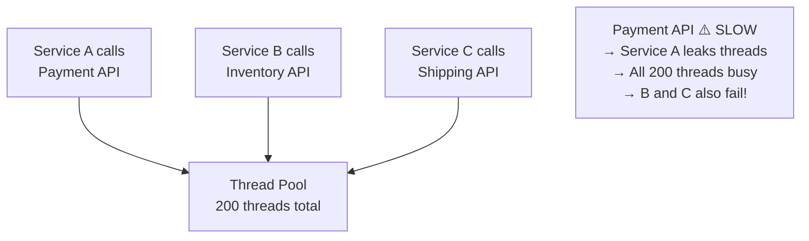

# Bulkhead Pattern

> **References:** [Microsoft - Bulkhead Pattern](https://docs.microsoft.com/en-us/azure/architecture/patterns/bulkhead) | [Resilience4j Bulkhead](https://resilience4j.readme.io/docs/bulkhead) | [Release It! Book](https://pragprog.com/titles/mnee2/release-it-second-edition/)

---

## What Is the Bulkhead Pattern?

Inspired by ship bulkheads — watertight compartments that prevent one flooded section from sinking the whole ship. In software: isolate critical resources so one failing consumer can't exhaust all shared resources.

---

## Problem Without Bulkheads



---

## Bulkhead Types

### 1. Thread Pool Isolation
Each downstream dependency gets its own thread pool.

```java
// Resilience4j Thread Pool Bulkhead
@Configuration
public class BulkheadConfig {

    @Bean
    public ThreadPoolBulkheadRegistry threadPoolBulkheadRegistry() {
        ThreadPoolBulkheadConfig paymentConfig = ThreadPoolBulkheadConfig.custom()
            .maxThreadPoolSize(10)        // Max threads for payment calls
            .coreThreadPoolSize(5)        // Always-warm threads
            .queueCapacity(20)            // Queue size before rejection
            .keepAliveDuration(Duration.ofSeconds(20))
            .build();
        
        ThreadPoolBulkheadConfig inventoryConfig = ThreadPoolBulkheadConfig.custom()
            .maxThreadPoolSize(5)         // Fewer threads for less-critical inventory
            .coreThreadPoolSize(2)
            .queueCapacity(10)
            .build();
        
        Map<String, ThreadPoolBulkheadConfig> configs = new HashMap<>();
        configs.put("paymentService", paymentConfig);
        configs.put("inventoryService", inventoryConfig);
        
        return ThreadPoolBulkheadRegistry.of(configs);
    }
}

@Service
public class OrderService {

    private final ThreadPoolBulkhead paymentBulkhead;
    private final ThreadPoolBulkhead inventoryBulkhead;
    private final PaymentServiceClient paymentClient;
    private final InventoryServiceClient inventoryClient;

    public OrderResult processOrder(Order order) {
        // Payment runs in its own isolated thread pool
        CompletableFuture<PaymentResult> paymentFuture = 
            ThreadPoolBulkhead.executeCompletionStage(
                paymentBulkhead,
                () -> CompletableFuture.supplyAsync(
                    () -> paymentClient.charge(order.getPaymentInfo())
                )
            ).toCompletableFuture();
        
        // Inventory runs in its own isolated thread pool
        CompletableFuture<InventoryResult> inventoryFuture = 
            ThreadPoolBulkhead.executeCompletionStage(
                inventoryBulkhead,
                () -> CompletableFuture.supplyAsync(
                    () -> inventoryClient.reserve(order.getItems())
                )
            ).toCompletableFuture();
        
        try {
            PaymentResult payment = paymentFuture.get(2, TimeUnit.SECONDS);
            InventoryResult inventory = inventoryFuture.get(2, TimeUnit.SECONDS);
            return new OrderResult(payment, inventory);
        } catch (BulkheadFullException e) {
            throw new ServiceOverloadedException("Service bulkhead full: " + e.getMessage());
        }
    }
}
```

### 2. Semaphore Isolation
Limits concurrent calls without a separate thread pool (lower overhead).

```java
@Configuration
public class SemaphoreBulkheadConfig {

    @Bean
    public BulkheadRegistry bulkheadRegistry() {
        io.github.resilience4j.bulkhead.BulkheadConfig config = 
            io.github.resilience4j.bulkhead.BulkheadConfig.custom()
                .maxConcurrentCalls(25)       // Max 25 concurrent calls
                .maxWaitDuration(Duration.ofMillis(100)) // Max wait in queue
                .build();
        
        return BulkheadRegistry.of(config);
    }
}

@Service
public class AnalyticsService {

    private final Bulkhead bulkhead;
    private final MetricsClient metricsClient;

    @Bulkhead(name = "metricsService", fallbackMethod = "metricsFallback")
    public Metrics fetchMetrics(String query) {
        return metricsClient.query(query);
    }

    public Metrics metricsFallback(String query, BulkheadFullException ex) {
        log.warn("Metrics service bulkhead full, returning cached metrics");
        return metricsCache.getOrDefault(query, Metrics.EMPTY);
    }
}
```

---

## Sizing Thread Pools: Little's Law

```
Pool size = (RPS × average_latency_seconds) + safety_buffer

Example:
- Service calls payment API at 100 RPS
- Payment API p99 latency = 200ms
- Concurrent calls = 100 × 0.2 = 20
- Pool size = 20 + 50% buffer = 30 threads
```

---

## AWS Bulkhead Mapping

| Bulkhead Concern | AWS Implementation |
|-----------------|------------------|
| Thread pool per service | Separate ECS services per criticality tier |
| Lambda concurrency isolation | Reserved concurrency per Lambda function |
| SQS queue isolation | Separate SQS queue per service |
| RDS connection pool | RDS Proxy with per-service pool size limits |
| ALB target group | Separate target group per service |

```yaml
# ECS Task Definition — critical service gets reserved resources
CriticalService:
  Type: AWS::ECS::Service
  Properties:
    ServiceName: payment-service
    # Reserved: this service always gets resources
    CapacityProviderStrategy:
      - CapacityProvider: FARGATE    # Dedicated capacity
        Weight: 1

# Lambda reserved concurrency — prevents exhausting account limit
PaymentFunction:
  Type: AWS::Lambda::Function
  Properties:
    ReservedConcurrentExecutions: 100  # Bulkhead: max 100 concurrent
```

---

## Bulkhead vs Circuit Breaker vs Rate Limiter

| Pattern | Protects Against | Mechanism |
|---------|----------------|-----------|
| Bulkhead | Resource exhaustion | Isolate pools |
| Circuit Breaker | Cascading failure | State machine |
| Rate Limiter | Overloading self or downstream | Count-based limiting |
| Timeout | Slow calls blocking threads | Hard time cutoff |

**Use all four together for resilient microservices.**

---

## When NOT to Use Bulkhead

1. **Monolithic applications** — one process, no value in thread pool isolation
2. **Low concurrency** — if max concurrency is <5, overhead isn't worth it
3. **Non-critical background jobs** — best-effort processing doesn't need isolation
4. **Simple async event handling** — SQS consumers naturally isolate via separate queues

---

## Interview Q&A

**Q1: How does thread pool isolation (Bulkhead) differ from semaphore isolation?**
> Thread pool: calls execute in a separate thread pool; if that pool fills up, caller thread is not blocked — it gets rejected immediately. Adds thread overhead but provides true isolation (slow call doesn't block caller thread). Semaphore: limits concurrent calls using a counting semaphore on the calling thread; if semaphore is exhausted, caller blocks up to maxWaitDuration. Lower overhead but caller thread can still be held.

**Q2: Give an example of where a bulkhead saved a production system.**
> Classic Netflix example: if the recommendations service is slow, it should NOT cause the homepage service to fail. By putting recommendations calls in a separate thread pool (Hystrix/Resilience4j), when recommendations are slow, only that pool fills up. The homepage still loads (without recommendations) using the fallback. Without bulkhead, slow recommendations would fill the shared thread pool, bringing down the entire homepage.

**Q3: How do you size a thread pool for a bulkhead?**
> Use Little's Law: concurrent_requests = RPS × average_latency. If a downstream service handles 100 RPS and has 200ms average latency, you need 100 × 0.2 = 20 concurrent threads. Add 30-50% buffer for spikes: 30 threads. Also consider: timeout must be set on each call so threads don't accumulate. If p99 latency is 500ms, set timeout to 600ms.
