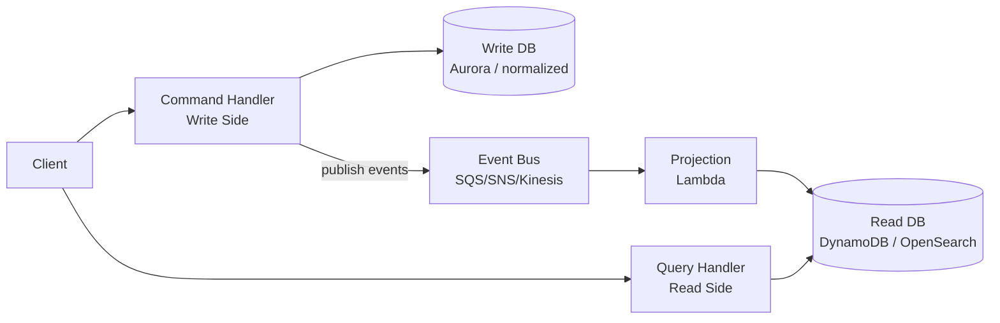
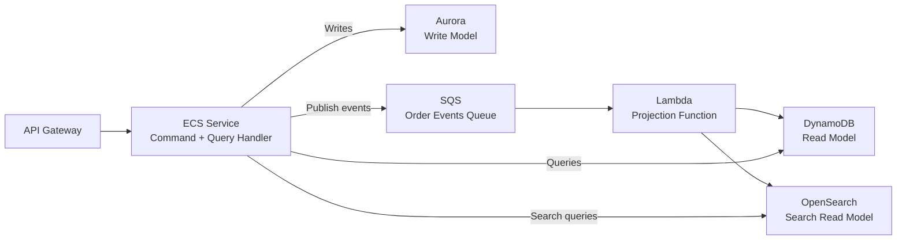

# CQRS Pattern (Command Query Responsibility Segregation)

> **References:** [Martin Fowler - CQRS](https://martinfowler.com/bliki/CQRS.html) | [Greg Young - CQRS](https://cqrs.files.wordpress.com/2010/11/cqrs_documents.pdf) | [Microsoft CQRS Guide](https://docs.microsoft.com/en-us/azure/architecture/patterns/cqrs)

---

## What Is CQRS?

Separate the **write model** (Commands) from the **read model** (Queries). Each side is independently optimized.



---

## Why CQRS?

| Problem | CQRS Solution |
|---------|--------------|
| Complex read queries on normalized write DB | Separate denormalized read store |
| Write-heavy load competing with read-heavy load | Independent scaling of each side |
| Different consistency requirements for reads vs writes | Eventual consistency on read side is acceptable |
| Read model needs different shape than write model | Each side has own data model |

---

## Simple vs Full CQRS

| Level | Description | When to use |
|-------|-------------|-------------|
| Simple CQRS | Separate command/query methods, same DB | Clean code separation; no performance need |
| Separate read DB | Commands write to primary, queries to replica | Read-heavy; replica lag acceptable |
| Full CQRS | Separate stores, event-driven projections | Complex domain, different read/write scale needs |

---

## Java Implementation: Commands

```java
// Command: intent to change state
public record CreateOrderCommand(
    String userId,
    List<OrderItem> items,
    String idempotencyKey
) {}

public record CancelOrderCommand(
    String orderId,
    String reason
) {}

// Command Handler: validates, executes, publishes event
@Service
public class OrderCommandHandler {

    private final OrderRepository orderRepository;
    private final InventoryService inventoryService;
    private final EventPublisher eventPublisher;
    private final IdempotencyStore idempotencyStore;

    @Transactional
    public String handle(CreateOrderCommand command) {
        // Idempotency check
        Optional<String> existing = idempotencyStore.get(command.idempotencyKey());
        if (existing.isPresent()) return existing.get();

        // Validate
        inventoryService.validateAvailability(command.items());

        // Execute
        Order order = Order.create(command.userId(), command.items());
        orderRepository.save(order);
        idempotencyStore.save(command.idempotencyKey(), order.getId());

        // Publish domain event
        eventPublisher.publish(new OrderCreatedEvent(
            order.getId(), order.getUserId(),
            order.getItems(), order.getTotal()
        ));

        return order.getId();
    }

    @Transactional
    public void handle(CancelOrderCommand command) {
        Order order = orderRepository.findById(command.orderId())
            .orElseThrow(() -> new OrderNotFoundException(command.orderId()));
        
        order.cancel(command.reason()); // Domain logic validates state transition
        orderRepository.save(order);
        
        eventPublisher.publish(new OrderCancelledEvent(order.getId(), command.reason()));
    }
}
```

---

## Java Implementation: Queries (Read Model)

```java
// Query: read-only, optimized DTO
public record OrderSummaryQuery(String userId) {}
public record OrderDetailQuery(String orderId) {}

// Read Model — denormalized for fast reads
public record OrderSummaryDto(
    String orderId,
    String status,
    BigDecimal total,
    int itemCount,
    Instant createdAt,
    String shippingStatus  // denormalized from shipping service
) {}

// Query Handler: hits denormalized read store
@Service
public class OrderQueryHandler {

    private final DynamoDbClient dynamoDb;

    public List<OrderSummaryDto> handle(OrderSummaryQuery query) {
        QueryResponse response = dynamoDb.query(QueryRequest.builder()
            .tableName("OrderReadModel")
            .keyConditionExpression("userId = :userId")
            .expressionAttributeValues(Map.of(
                ":userId", AttributeValue.builder().s(query.userId()).build()
            ))
            .scanIndexForward(false) // Newest first
            .limit(20)
            .build());

        return response.items().stream()
            .map(this::toOrderSummary)
            .toList();
    }

    public OrderDetailDto handle(OrderDetailQuery query) {
        // Read from DynamoDB or OpenSearch depending on complexity
        GetItemResponse response = dynamoDb.getItem(GetItemRequest.builder()
            .tableName("OrderReadModel")
            .key(Map.of("orderId", AttributeValue.builder().s(query.orderId()).build()))
            .build());
        return toOrderDetail(response.item());
    }
}
```

---

## Java Implementation: Projection (Event → Read Model)

```java
// Projection: handles domain events, updates read store
@Service
public class OrderProjection {

    private final DynamoDbClient dynamoDb;

    @SqsListener("order-events-queue")
    public void on(OrderCreatedEvent event) {
        // Build denormalized read model item
        Map<String, AttributeValue> item = new HashMap<>();
        item.put("PK", str("ORDER#" + event.getOrderId()));
        item.put("SK", str("SUMMARY"));
        item.put("userId", str(event.getUserId()));
        item.put("status", str("PENDING"));
        item.put("total", num(event.getTotal().toString()));
        item.put("itemCount", num(String.valueOf(event.getItems().size())));
        item.put("createdAt", str(Instant.now().toString()));
        
        // Also write user-orders index for OrderSummaryQuery
        item.put("GSI1PK", str("USER#" + event.getUserId()));
        item.put("GSI1SK", str("ORDER#" + Instant.now() + "#" + event.getOrderId()));
        
        dynamoDb.putItem(PutItemRequest.builder()
            .tableName("OrderReadModel")
            .item(item)
            .build());
    }

    @SqsListener("order-events-queue")
    public void on(OrderCancelledEvent event) {
        dynamoDb.updateItem(UpdateItemRequest.builder()
            .tableName("OrderReadModel")
            .key(Map.of("PK", str("ORDER#" + event.getOrderId()), "SK", str("SUMMARY")))
            .updateExpression("SET #status = :status, cancelledAt = :cancelledAt")
            .expressionAttributeNames(Map.of("#status", "status"))
            .expressionAttributeValues(Map.of(
                ":status", str("CANCELLED"),
                ":cancelledAt", str(Instant.now().toString())
            ))
            .build());
    }
}
```

---

## REST Controller with CQRS

```java
@RestController
@RequestMapping("/api/orders")
public class OrderController {

    private final OrderCommandHandler commandHandler;
    private final OrderQueryHandler queryHandler;

    // Command endpoint: returns 202 Accepted (async processing)
    @PostMapping
    public ResponseEntity<CreateOrderResponse> createOrder(
            @RequestBody CreateOrderRequest request,
            @RequestHeader("Idempotency-Key") String idempotencyKey) {
        
        String orderId = commandHandler.handle(new CreateOrderCommand(
            request.getUserId(), request.getItems(), idempotencyKey
        ));
        
        return ResponseEntity
            .accepted()
            .body(new CreateOrderResponse(orderId, "PROCESSING"));
    }

    // Query endpoint: returns current read model state
    @GetMapping("/{orderId}")
    public OrderDetailDto getOrder(@PathVariable String orderId) {
        return queryHandler.handle(new OrderDetailQuery(orderId));
    }

    @GetMapping("/users/{userId}")
    public List<OrderSummaryDto> getUserOrders(@PathVariable String userId) {
        return queryHandler.handle(new OrderSummaryQuery(userId));
    }
}
```

---

## AWS Architecture for CQRS



---

## When NOT to Use CQRS

1. **Simple CRUD applications** — the added complexity has no benefit
2. **Small teams** — operational overhead of two data stores is high
3. **Strong consistency required for reads** — eventual consistency between write and read stores is fundamental to CQRS
4. **Simple query patterns** — if queries are just lookups by ID, no need for separate read model

---

## Interview Q&A

**Q1: How do you handle read-after-write consistency in CQRS?**
> The write side completes, but the projection to the read store is async (eventual consistency). Strategies: (1) Version token: return write version in command response; client retries read until version matches. (2) Optimistic UI: show the expected state immediately, confirm when projection catches up. (3) "Read-your-writes" session routing: temporarily route reads to the write store for the user who just wrote.

**Q2: What's the difference between CQRS and simple read replicas?**
> Read replicas are a database-level concern — same data model, just replicated for read scaling. CQRS is an application-level concern — separate data models, each optimized for their purpose. With CQRS, the read model can be entirely different (denormalized for fast reads, indexed differently, in a different DB technology) from the write model. Read replicas just copy the same schema.

**Q3: How does CQRS combine with Event Sourcing?**
> Naturally: Event Sourcing stores all state changes as events (write side). CQRS projections replay those events to build read models. This is the most powerful combination: (1) Write side = event store (append-only); (2) Read side = projections built from events; (3) Can rebuild any read model by replaying events from the beginning; (4) Multiple read models for different query needs from the same event stream.
