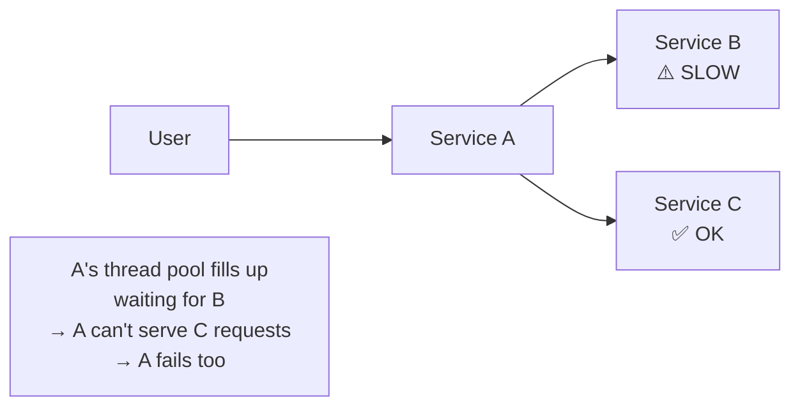
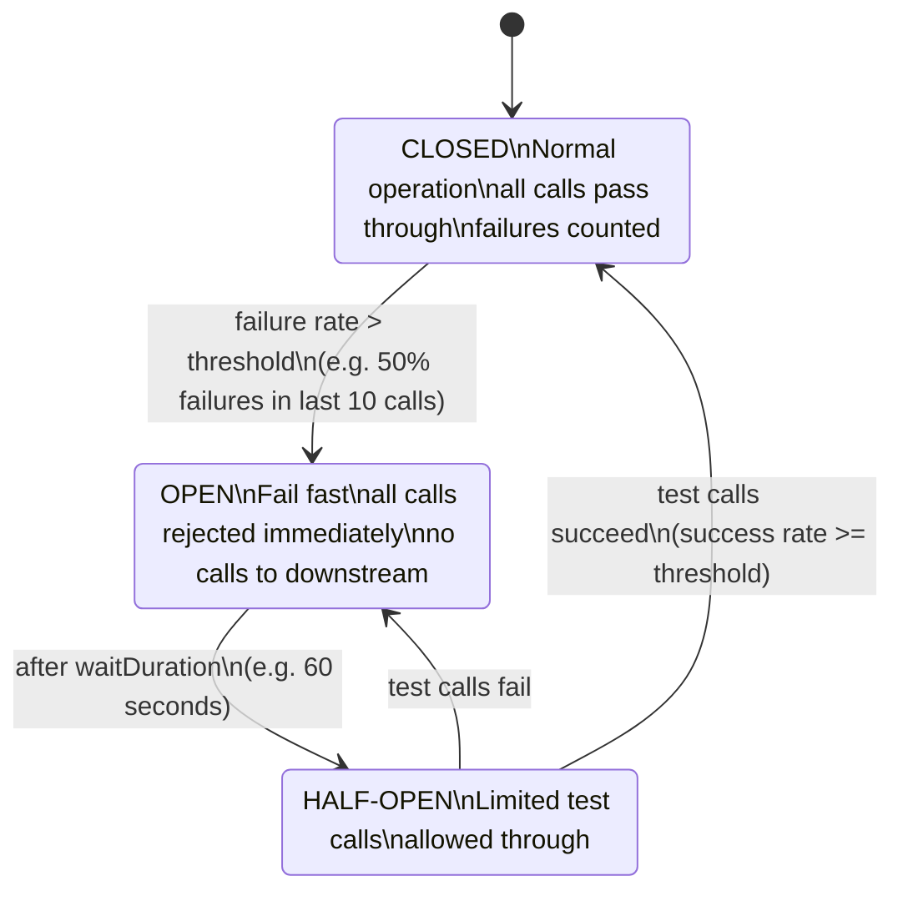

# Circuit Breaker Pattern

> **References:** [Martin Fowler - CircuitBreaker](https://martinfowler.com/bliki/CircuitBreaker.html) | [Resilience4j](https://resilience4j.readme.io/docs/circuitbreaker) | [Netflix Hystrix (retired)](https://github.com/Netflix/Hystrix)

---

## Problem: Cascading Failures

In microservices, if Service B is slow/down, callers in Service A pile up waiting, exhausting threads, causing Service A to also fail — **cascading failure**.



---

## Circuit Breaker States



### State Transitions
- **CLOSED → OPEN:** When failure rate exceeds threshold (e.g., 50% in last 10 calls)
- **OPEN → HALF-OPEN:** After wait duration (e.g., 60 seconds)
- **HALF-OPEN → CLOSED:** Permitted calls succeed (system recovered)
- **HALF-OPEN → OPEN:** Permitted calls fail (system still down)

---

## Java Implementation with Resilience4j

### Dependencies (pom.xml)
```xml
<dependency>
    <groupId>io.github.resilience4j</groupId>
    <artifactId>resilience4j-spring-boot3</artifactId>
    <version>2.1.0</version>
</dependency>
```

### Configuration (application.yml)
```yaml
resilience4j:
  circuitbreaker:
    instances:
      paymentService:
        registerHealthIndicator: true
        slidingWindowType: COUNT_BASED
        slidingWindowSize: 10              # Last 10 calls
        failureRateThreshold: 50           # Open if 50%+ fail
        slowCallRateThreshold: 80          # Also open if 80%+ are slow
        slowCallDurationThreshold: 2000ms  # "slow" = >2 seconds
        waitDurationInOpenState: 60s       # Wait 60s before trying half-open
        permittedNumberOfCallsInHalfOpenState: 3
        minimumNumberOfCalls: 5            # Min calls before calculating rate
        automaticTransitionFromOpenToHalfOpenEnabled: true
```

### Service with Circuit Breaker

```java
@Service
public class PaymentServiceClient {

    private final CircuitBreaker circuitBreaker;
    private final RestTemplate restTemplate;

    public PaymentServiceClient(CircuitBreakerRegistry registry, RestTemplate restTemplate) {
        this.circuitBreaker = registry.circuitBreaker("paymentService");
        this.restTemplate = restTemplate;
        
        // Subscribe to state change events for monitoring
        this.circuitBreaker.getEventPublisher()
            .onStateTransition(event ->
                log.warn("Circuit breaker state: {} → {}",
                    event.getStateTransition().getFromState(),
                    event.getStateTransition().getToState()));
    }

    public PaymentResponse processPayment(PaymentRequest request) {
        Supplier<PaymentResponse> supplier = CircuitBreaker.decorateSupplier(
            circuitBreaker,
            () -> callPaymentService(request)
        );

        // Fallback: return cached result or graceful degradation
        return Try.ofSupplier(supplier)
            .recover(CallNotPermittedException.class, ex -> {
                log.warn("Circuit OPEN — using fallback for payment");
                return fallbackPaymentResponse(request);
            })
            .recover(Exception.class, ex -> {
                log.error("Payment service call failed", ex);
                throw new PaymentServiceException("Payment unavailable", ex);
            })
            .get();
    }

    // Annotation-based alternative
    @CircuitBreaker(name = "paymentService", fallbackMethod = "paymentFallback")
    public PaymentResponse processPaymentAnnotated(PaymentRequest request) {
        return callPaymentService(request);
    }

    public PaymentResponse paymentFallback(PaymentRequest request, Exception ex) {
        log.warn("Payment fallback triggered: {}", ex.getMessage());
        return PaymentResponse.pending(request.getOrderId());
    }

    private PaymentResponse callPaymentService(PaymentRequest request) {
        return restTemplate.postForObject(
            "http://payment-service/api/payments",
            request,
            PaymentResponse.class
        );
    }

    private PaymentResponse fallbackPaymentResponse(PaymentRequest request) {
        return PaymentResponse.builder()
            .orderId(request.getOrderId())
            .status("QUEUED_FOR_RETRY")
            .message("Payment service temporarily unavailable")
            .build();
    }
}
```

---

## AWS Mapping

| Circuit Breaker Concern | AWS Service/Feature |
|------------------------|-------------------|
| Application-level CB | Resilience4j in ECS/EKS service |
| Infrastructure-level CB | ALB target group health checks |
| Service mesh CB | AWS App Mesh `outlier_detection` |
| API throttling (similar concept) | API Gateway throttling + usage plans |
| Timeout / retry | SDK retry configuration (exponential backoff) |
| Monitoring CB state | CloudWatch custom metrics + alarms |

### App Mesh Circuit Breaking Config
```json
{
  "outlierDetection": {
    "maxServerErrors": 5,
    "interval": { "value": 10, "unit": "s" },
    "baseEjectionDuration": { "value": 30, "unit": "s" },
    "maxEjectionPercent": 50
  }
}
```

---

## Bulkhead vs Circuit Breaker

| Pattern | Problem it solves | Mechanism |
|---------|-----------------|-----------|
| Circuit Breaker | Downstream service failure | State machine that opens on failures |
| Bulkhead | Thread pool exhaustion | Separate thread pools per downstream |
| Rate Limiter | Overloading yourself | Count-based or token-based limiting |
| Timeout | Slow calls blocking threads | Hard time limit per call |

---

## When NOT to Use Circuit Breaker

1. **Monolithic applications** — no distributed calls to protect
2. **Database calls within the same process** — use connection pool timeouts instead
3. **Synchronous calls that MUST succeed** — CB fallback must be acceptable
4. **Early-stage services** — adds complexity; use timeouts first

---

## Interview Q&A

**Q1: Walk me through what happens when a circuit breaker opens.**
> When the failure rate exceeds the threshold, the circuit opens. Subsequent calls immediately throw `CallNotPermittedException` without even attempting to reach the downstream service. This gives the downstream service time to recover and prevents the caller's thread pool from filling up. After `waitDurationInOpenState`, the circuit transitions to half-open and allows a small number of test calls. If those succeed, it closes again.

**Q2: What's the difference between a circuit breaker and a retry?**
> Retries are good for transient failures (brief network hiccup). Circuit breakers are for sustained failures (service is down for minutes). If you retry into a failing service, you amplify load on an already struggling service. Circuit breakers + retries work together: retry 1-3 times immediately, then let the circuit breaker handle sustained failures by failing fast.

**Q3: How do you monitor circuit breaker health in production?**
> Resilience4j exports metrics to Micrometer which integrates with CloudWatch, Prometheus/Grafana. Key metrics: `circuitbreaker.state` (0=closed, 1=open, 2=half-open), `circuitbreaker.failure.rate`, `circuitbreaker.calls`. Set CloudWatch alarms on state=1 (open) to alert on-call. Dashboard showing state transitions over time helps diagnose systemic issues.
