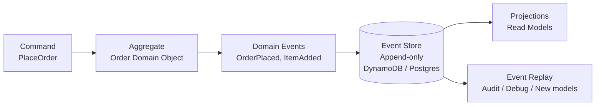
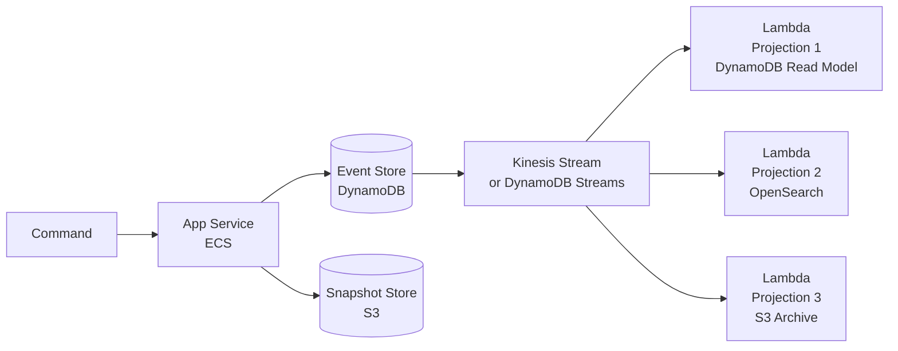

# Event Sourcing Pattern

> **References:** [Martin Fowler - Event Sourcing](https://martinfowler.com/eaaDev/EventSourcing.html) | [Greg Young - CQRS & ES](https://cqrs.files.wordpress.com/2010/11/cqrs_documents.pdf) | [Axon Framework](https://axoniq.io/)

---

## What Is Event Sourcing?

Instead of storing the **current state** of an entity, store the **sequence of events** that led to that state. The current state is derived by replaying all events.

```
Traditional:  orders table → row: {orderId: 123, status: SHIPPED, total: 99.99}
Event-Sourced: order_events table → 
    {orderId: 123, event: OrderPlaced, ...}
    {orderId: 123, event: PaymentProcessed, ...}
    {orderId: 123, event: OrderShipped, ...}
    Current state = replay all 3 events
```

---

## Event Store Design



---

## Java Implementation: Domain Events

```java
// Base event
public abstract class DomainEvent {
    private final String eventId = UUID.randomUUID().toString();
    private final String aggregateId;
    private final long version;
    private final Instant occurredAt = Instant.now();
    private final String eventType = this.getClass().getSimpleName();
    
    protected DomainEvent(String aggregateId, long version) {
        this.aggregateId = aggregateId;
        this.version = version;
    }
}

// Concrete events
public class OrderPlacedEvent extends DomainEvent {
    private final String userId;
    private final List<OrderItem> items;
    private final BigDecimal total;
    
    public OrderPlacedEvent(String orderId, long version, String userId, 
                            List<OrderItem> items, BigDecimal total) {
        super(orderId, version);
        this.userId = userId;
        this.items = items;
        this.total = total;
    }
}

public class PaymentProcessedEvent extends DomainEvent {
    private final String paymentId;
    private final BigDecimal amount;
    
    public PaymentProcessedEvent(String orderId, long version, String paymentId, BigDecimal amount) {
        super(orderId, version);
        this.paymentId = paymentId;
        this.amount = amount;
    }
}

public class OrderShippedEvent extends DomainEvent {
    private final String trackingNumber;
    private final String carrier;
    
    public OrderShippedEvent(String orderId, long version, String trackingNumber, String carrier) {
        super(orderId, version);
        this.trackingNumber = trackingNumber;
        this.carrier = carrier;
    }
}
```

---

## Java Implementation: Aggregate

```java
public class Order {
    
    private String orderId;
    private String userId;
    private OrderStatus status;
    private List<OrderItem> items = new ArrayList<>();
    private BigDecimal total;
    private String paymentId;
    private String trackingNumber;
    private long version = 0;
    
    // Uncommitted events to be stored
    private final List<DomainEvent> uncommittedEvents = new ArrayList<>();
    
    // Command methods — validate and apply events
    public static Order place(String userId, List<OrderItem> items) {
        Order order = new Order();
        String orderId = UUID.randomUUID().toString();
        BigDecimal total = items.stream()
            .map(i -> i.getPrice().multiply(BigDecimal.valueOf(i.getQuantity())))
            .reduce(BigDecimal.ZERO, BigDecimal::add);
        
        order.applyAndRecord(new OrderPlacedEvent(orderId, 1, userId, items, total));
        return order;
    }
    
    public void processPayment(String paymentId, BigDecimal amount) {
        if (status != OrderStatus.PENDING) {
            throw new IllegalStateException("Cannot process payment for order in state: " + status);
        }
        applyAndRecord(new PaymentProcessedEvent(orderId, version + 1, paymentId, amount));
    }
    
    public void ship(String trackingNumber, String carrier) {
        if (status != OrderStatus.PAID) {
            throw new IllegalStateException("Cannot ship unpaid order");
        }
        applyAndRecord(new OrderShippedEvent(orderId, version + 1, trackingNumber, carrier));
    }
    
    // Apply event to aggregate state (called during replay AND new events)
    private void apply(DomainEvent event) {
        if (event instanceof OrderPlacedEvent e) {
            this.orderId = e.getAggregateId();
            this.userId = e.getUserId();
            this.items = e.getItems();
            this.total = e.getTotal();
            this.status = OrderStatus.PENDING;
            this.version = e.getVersion();
        } else if (event instanceof PaymentProcessedEvent e) {
            this.paymentId = e.getPaymentId();
            this.status = OrderStatus.PAID;
            this.version = e.getVersion();
        } else if (event instanceof OrderShippedEvent e) {
            this.trackingNumber = e.getTrackingNumber();
            this.status = OrderStatus.SHIPPED;
            this.version = e.getVersion();
        }
    }
    
    private void applyAndRecord(DomainEvent event) {
        apply(event);
        uncommittedEvents.add(event);
    }
    
    // Rebuild from event history (replay)
    public static Order reconstitute(List<DomainEvent> events) {
        Order order = new Order();
        events.forEach(order::apply);
        return order;
    }
    
    public List<DomainEvent> getUncommittedEvents() {
        return Collections.unmodifiableList(uncommittedEvents);
    }
    
    public void clearUncommittedEvents() {
        uncommittedEvents.clear();
    }
}
```

---

## Java Implementation: Event Store (DynamoDB)

```java
@Repository
public class DynamoDbEventStore {

    private final DynamoDbClient dynamoDb;
    private static final String TABLE = "EventStore";

    public void append(String aggregateId, List<DomainEvent> events, long expectedVersion) {
        // Optimistic concurrency control: ensure no interleaved writes
        for (DomainEvent event : events) {
            try {
                dynamoDb.putItem(PutItemRequest.builder()
                    .tableName(TABLE)
                    .item(Map.of(
                        "aggregateId", str(aggregateId),
                        "version", num(String.valueOf(event.getVersion())),
                        "eventType", str(event.getEventType()),
                        "eventData", str(objectMapper.writeValueAsString(event)),
                        "occurredAt", str(event.getOccurredAt().toString())
                    ))
                    .conditionExpression("attribute_not_exists(#v)")
                    .expressionAttributeNames(Map.of("#v", "version"))
                    .build());
            } catch (ConditionalCheckFailedException e) {
                throw new OptimisticLockException(
                    "Concurrent modification detected for aggregate " + aggregateId);
            }
        }
    }

    public List<DomainEvent> load(String aggregateId) {
        QueryResponse response = dynamoDb.query(QueryRequest.builder()
            .tableName(TABLE)
            .keyConditionExpression("aggregateId = :id")
            .expressionAttributeValues(Map.of(
                ":id", str(aggregateId)
            ))
            .scanIndexForward(true) // Oldest first
            .build());
        
        return response.items().stream()
            .map(this::deserializeEvent)
            .toList();
    }
    
    // Load from snapshot version onwards
    public List<DomainEvent> loadFromVersion(String aggregateId, long fromVersion) {
        QueryResponse response = dynamoDb.query(QueryRequest.builder()
            .tableName(TABLE)
            .keyConditionExpression("aggregateId = :id AND #v >= :version")
            .expressionAttributeNames(Map.of("#v", "version"))
            .expressionAttributeValues(Map.of(
                ":id", str(aggregateId),
                ":version", num(String.valueOf(fromVersion))
            ))
            .scanIndexForward(true)
            .build());
        
        return response.items().stream()
            .map(this::deserializeEvent)
            .toList();
    }
}
```

---

## Snapshot Optimization

For aggregates with thousands of events, replaying from the beginning is slow. Snapshots save the state at a point in time.

```java
@Service
public class OrderRepository {

    private final DynamoDbEventStore eventStore;
    private final SnapshotStore snapshotStore;
    private static final int SNAPSHOT_THRESHOLD = 50; // snapshot every 50 events

    public Order load(String orderId) {
        // 1. Check for latest snapshot
        Optional<Snapshot<Order>> snapshot = snapshotStore.loadLatest(orderId);
        
        if (snapshot.isPresent()) {
            // 2. Replay only events AFTER snapshot version
            Order order = snapshot.get().getState();
            long fromVersion = snapshot.get().getVersion() + 1;
            List<DomainEvent> recentEvents = eventStore.loadFromVersion(orderId, fromVersion);
            recentEvents.forEach(order::apply);  // Apply remaining events
            return order;
        } else {
            // 3. Full replay
            List<DomainEvent> events = eventStore.load(orderId);
            return Order.reconstitute(events);
        }
    }

    public void save(Order order) {
        List<DomainEvent> uncommitted = order.getUncommittedEvents();
        eventStore.append(order.getOrderId(), uncommitted, order.getVersion() - uncommitted.size());
        order.clearUncommittedEvents();
        
        // Create snapshot if threshold reached
        if (order.getVersion() % SNAPSHOT_THRESHOLD == 0) {
            snapshotStore.save(new Snapshot<>(order.getOrderId(), order.getVersion(), order));
        }
    }
}
```

---

## AWS Architecture



---

## When NOT to Use Event Sourcing

1. **Simple CRUD systems** — massive overhead for no benefit
2. **Small teams without DDD experience** — requires deep domain modeling expertise
3. **Reporting-heavy systems** — querying event streams is harder than querying tables
4. **Frequently changing event schemas** — migrating old events is painful
5. **Low-complexity domains** — event sourcing shines in complex business rules

---

## Interview Q&A

**Q1: How do you handle event schema evolution in Event Sourcing?**
> Three strategies: (1) Upcasting: when loading old events, transform them to the new schema before applying (read-side migration). (2) Versioned events: keep old event class, add new version class, handle both in apply() method. (3) Copy-and-replace: replay all events through a new projection to a new store. Avoid changing the meaning of events — always append new events instead.

**Q2: What are the advantages of Event Sourcing over traditional CRUD?**
> (1) Complete audit trail — every state change is recorded with who, what, when. (2) Time travel — reconstruct state at any point in history. (3) Event replay — build new read models from history. (4) Debugging — reproduce bugs by replaying the exact sequence of events. (5) Natural integration point — events can trigger other services asynchronously.

**Q3: How does snapshotting work and when should you use it?**
> A snapshot captures the current state of an aggregate at a version N. Instead of replaying all N events, you load the snapshot and replay only events since version N. Use when: (1) aggregates accumulate many events (100+), (2) replay time is noticeably slow, (3) aggregates have long lifespans. Snapshot every 50-100 events is a common heuristic. Store snapshots in S3 or DynamoDB.
