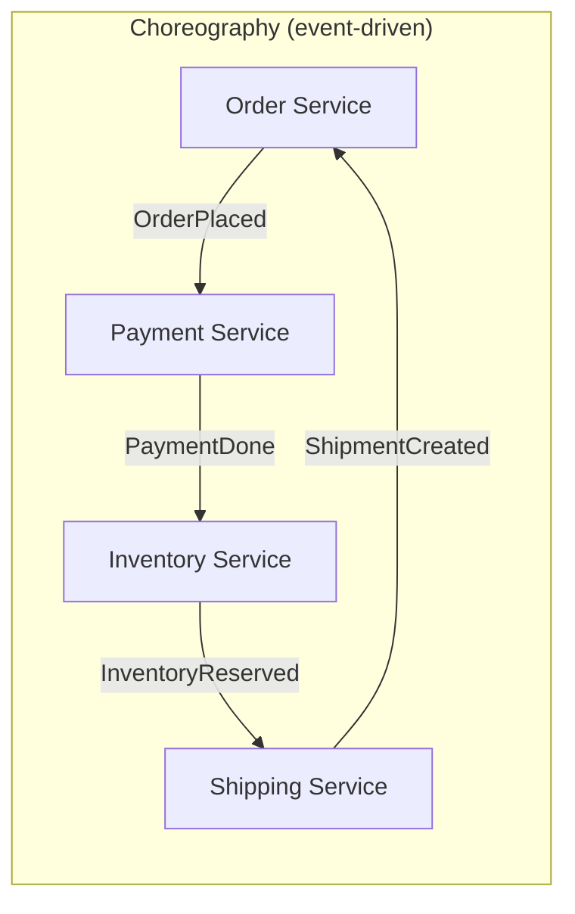
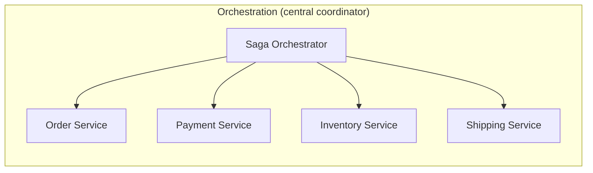
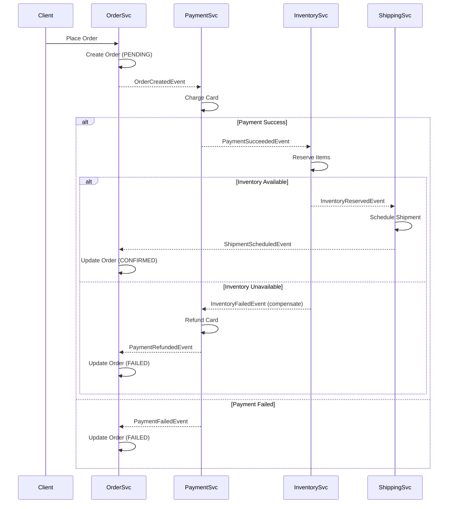

# Saga Pattern

> **References:** [Chris Richardson - Saga Pattern](https://microservices.io/patterns/data/saga.html) | [AWS Step Functions](https://aws.amazon.com/step-functions/) | [DDIA Ch 9](https://dataintensive.net/)

---

## Problem: Distributed Transactions

In microservices, a business operation (e.g., place order) spans multiple services each with their own DB. You can't use ACID transactions across services.

**2PC problems:**
- Coordinator is SPOF
- Participants are locked during Phase 1 → performance bottleneck
- If coordinator crashes after Phase 1, participants block forever

**Saga solution:** Break the transaction into a sequence of local transactions, each publishing events to trigger the next step. If a step fails, execute **compensating transactions** in reverse order.

---

## Saga: Choreography vs Orchestration





| Dimension | Choreography | Orchestration |
|-----------|-------------|--------------|
| Coupling | Loose (event-based) | Central orchestrator |
| Observability | Hard to trace flow | Easy (single coordinator) |
| Complexity | Distributed across services | Concentrated in orchestrator |
| Failure handling | Compensating events published | Orchestrator manages rollback |
| AWS | SNS/SQS per step | AWS Step Functions |

---

## Sequence Diagram: Order Saga



---

## Java Implementation: Choreography with SNS/SQS

```java
// Order Service — publishes domain event
@Service
@Transactional
public class OrderService {

    private final OrderRepository orderRepository;
    private final SnsClient snsClient;
    private static final String ORDER_TOPIC_ARN = "arn:aws:sns:...";

    public Order placeOrder(PlaceOrderRequest request) {
        // Local transaction: create order in PENDING state
        Order order = Order.builder()
            .id(UUID.randomUUID().toString())
            .userId(request.getUserId())
            .items(request.getItems())
            .totalAmount(request.getTotalAmount())
            .status(OrderStatus.PENDING)
            .build();
        orderRepository.save(order);

        // Publish event (outbox pattern for reliability)
        publishEvent(new OrderCreatedEvent(order.getId(), order.getTotalAmount(), order.getUserId()));
        
        return order;
    }

    // Handle compensating event — payment refunded
    @SqsListener("order-compensation-queue")
    public void handlePaymentRefunded(PaymentRefundedEvent event) {
        Order order = orderRepository.findById(event.getOrderId()).orElseThrow();
        order.setStatus(OrderStatus.FAILED);
        order.setFailureReason("Inventory unavailable - payment refunded");
        orderRepository.save(order);
        log.info("Order {} failed and payment refunded", event.getOrderId());
    }

    private void publishEvent(Object event) {
        snsClient.publish(PublishRequest.builder()
            .topicArn(ORDER_TOPIC_ARN)
            .message(objectMapper.writeValueAsString(event))
            .messageAttribute("eventType", MessageAttributeValue.builder()
                .stringValue(event.getClass().getSimpleName())
                .dataType("String")
                .build())
            .build());
    }
}

// Payment Service — listens and publishes
@Service
public class PaymentSagaHandler {

    private final PaymentService paymentService;
    private final SnsClient snsClient;

    @SqsListener("payment-queue")  // subscribed to order topic
    public void handleOrderCreated(OrderCreatedEvent event) {
        try {
            paymentService.chargeCard(event.getUserId(), event.getAmount(), event.getOrderId());
            // Success — publish to inventory
            publishEvent(new PaymentSucceededEvent(event.getOrderId(), event.getUserId()));
        } catch (PaymentFailedException e) {
            // Failure — publish compensation event
            publishEvent(new PaymentFailedEvent(event.getOrderId(), e.getReason()));
        }
    }

    // Compensating transaction: handle inventory failure
    @SqsListener("payment-compensation-queue")
    public void handleInventoryFailed(InventoryFailedEvent event) {
        // Compensate: refund the payment
        paymentService.refund(event.getOrderId());
        publishEvent(new PaymentRefundedEvent(event.getOrderId()));
    }
}
```

---

## Java Implementation: Orchestration with AWS Step Functions

```java
// Saga orchestrator using Step Functions
@Service
public class OrderSagaOrchestrator {

    private final SfnClient sfnClient;
    private static final String STATE_MACHINE_ARN = "arn:aws:states:...:stateMachine:OrderSaga";

    public String startOrderSaga(Order order) {
        String input = objectMapper.writeValueAsString(Map.of(
            "orderId", order.getId(),
            "userId", order.getUserId(),
            "amount", order.getTotalAmount()
        ));
        
        StartExecutionResponse response = sfnClient.startExecution(
            StartExecutionRequest.builder()
                .stateMachineArn(STATE_MACHINE_ARN)
                .name("order-saga-" + order.getId())
                .input(input)
                .build()
        );
        
        return response.executionArn();
    }
}
```

Step Functions State Machine (JSON):
```json
{
  "Comment": "Order Saga",
  "StartAt": "ProcessPayment",
  "States": {
    "ProcessPayment": {
      "Type": "Task",
      "Resource": "arn:aws:lambda:...:processPayment",
      "Next": "ReserveInventory",
      "Catch": [{"ErrorEquals": ["PaymentFailed"], "Next": "OrderFailed"}]
    },
    "ReserveInventory": {
      "Type": "Task",
      "Resource": "arn:aws:lambda:...:reserveInventory",
      "Next": "ScheduleShipping",
      "Catch": [{"ErrorEquals": ["InventoryFailed"], "Next": "RefundPayment"}]
    },
    "RefundPayment": {
      "Type": "Task",
      "Resource": "arn:aws:lambda:...:refundPayment",
      "Next": "OrderFailed"
    },
    "ScheduleShipping": {
      "Type": "Task",
      "Resource": "arn:aws:lambda:...:scheduleShipping",
      "Next": "OrderConfirmed"
    },
    "OrderConfirmed": {"Type": "Succeed"},
    "OrderFailed": {"Type": "Fail"}
  }
}
```

---

## Idempotency in Sagas

Every saga step MUST be idempotent — replays due to retries must not cause double-processing.

```java
@Service
public class IdempotentPaymentHandler {

    private final DynamoDbClient dynamoDb;

    public void processPayment(String orderId, BigDecimal amount) {
        // Check if already processed
        if (isAlreadyProcessed(orderId)) {
            log.info("Payment for order {} already processed, skipping", orderId);
            return;
        }
        
        try {
            // Atomic claim: fails if another instance is processing
            claimProcessing(orderId);
            chargeCard(orderId, amount);
            markComplete(orderId, "SUCCESS");
        } catch (ConditionalCheckFailedException e) {
            // Another instance is processing — idempotent, just skip
            log.info("Payment for order {} being processed elsewhere", orderId);
        } catch (Exception e) {
            markComplete(orderId, "FAILED");
            throw e;
        }
    }
}
```

---

## When NOT to Use Saga

1. **Simple CRUD within a single service** — no need for saga, use local transactions
2. **Operations needing isolation** — saga steps can be seen by other transactions mid-saga
3. **Teams without async messaging infrastructure** — adds complexity; start with synchronous 2PC or monolith
4. **Very short-lived transactions** — overhead of event publishing isn't worth it

---

## Interview Q&A

**Q1: How does the Saga pattern handle failures?**
> Each saga step has a corresponding compensating transaction. If step N fails, the saga executes compensating transactions for steps N-1, N-2, etc., in reverse order. Compensating transactions must be idempotent and "semantically" undo the action (e.g., refund a payment). Note: compensations undo logical actions, not necessarily restore exact previous state.

**Q2: What's the difference between choreography and orchestration sagas?**
> Choreography: each service reacts to events and publishes its own. No central coordinator. Advantage: loose coupling. Disadvantage: hard to see the overall saga state — you have to correlate events across multiple services. Orchestration: a central orchestrator (like Step Functions) drives each step. Advantage: clear visibility, easy to add error handling. Disadvantage: orchestrator becomes a coupling point.

**Q3: How do you handle the "saga isolation" problem — can users see intermediate states?**
> Yes, sagas don't provide transaction isolation. A user checking their order mid-saga might see "PENDING" state while payment is processing. Solutions: (1) Mark intermediate states clearly (PENDING vs CONFIRMED). (2) Use semantic locks — prevent other operations on the order while saga is running. (3) Commutative updates where possible. (4) Communicate clearly with UX: "Your order is being processed."
