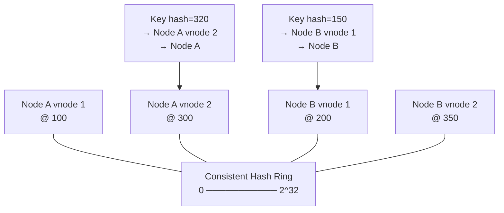

# Sharding Pattern

> **References:** [GeeksForGeeks - Sharding](https://www.geeksforgeeks.org/database-sharding-a-system-design-concept/) | [DDIA Ch 6](https://dataintensive.net/) | [DynamoDB Partitioning Best Practices](https://docs.aws.amazon.com/amazondynamodb/latest/developerguide/bp-partition-key-design.html)

---

## What Is the Sharding Pattern?

Horizontal partitioning of data across multiple nodes (shards). Each shard holds a mutually exclusive subset of data and is independently scalable.

---

## When to Use

- Data volume exceeds single-node capacity (>1TB with growth)
- Write throughput exceeds single-node capability (>10K writes/sec)
- Geographic data locality required (EU data in EU)
- Query latency is bottlenecked on single DB

## When NOT to Use

- Data is < 1TB — vertical scaling is simpler
- Complex cross-shard queries or joins are needed
- ACID transactions span multiple entities (sharding breaks this)
- Early-stage product — premature complexity

---

## Consistent Hashing with Virtual Nodes

See [Sharding-and-Partitioning.md](../02-Database-Deep-Dive/Sharding-and-Partitioning.md) for the full algorithm.



---

## Java: Shard Routing Service

```java
@Service
public class ShardRouter {

    private final ConsistentHashRing<DatabaseShard> ring;
    private final Map<String, DatabaseShard> shardMap = new ConcurrentHashMap<>();
    
    public ShardRouter(List<DatabaseShard> shards) {
        this.ring = new ConsistentHashRing<>(150); // 150 virtual nodes per shard
        shards.forEach(shard -> {
            ring.addNode(shard);
            shardMap.put(shard.getShardId(), shard);
        });
    }
    
    public DatabaseShard getShardForKey(String key) {
        return ring.getNode(key);
    }
    
    // For replication: get N shards for key
    public List<DatabaseShard> getReplicaShards(String key, int replicaFactor) {
        return ring.getNodes(key, replicaFactor);
    }
    
    // Add a new shard (only ~1/N keys remapped)
    public void addShard(DatabaseShard newShard) {
        ring.addNode(newShard);
        shardMap.put(newShard.getShardId(), newShard);
        log.info("Added shard {}, approximately 1/{} of keys remapped",
            newShard.getShardId(), shardMap.size());
    }
}

// Sharded repository pattern
@Repository
public class ShardedUserRepository {
    
    private final ShardRouter router;
    
    public User findById(String userId) {
        DatabaseShard shard = router.getShardForKey(userId);
        return shard.getJdbcTemplate().queryForObject(
            "SELECT * FROM users WHERE id = ?",
            USER_MAPPER, userId
        );
    }
    
    public void save(User user) {
        DatabaseShard shard = router.getShardForKey(user.getId());
        shard.getJdbcTemplate().update(
            "INSERT INTO users (id, name, email) VALUES (?, ?, ?) ON CONFLICT (id) DO UPDATE SET ...",
            user.getId(), user.getName(), user.getEmail()
        );
    }
    
    // Cross-shard query — scatter-gather pattern
    public List<User> findByEmailDomain(String domain) {
        // Must query ALL shards in parallel (expensive!)
        return shardRouter.getAllShards().parallelStream()
            .flatMap(shard -> shard.getJdbcTemplate()
                .query("SELECT * FROM users WHERE email LIKE ?",
                    USER_MAPPER, "%" + domain)
                .stream())
            .toList();
    }
}
```

---

## Hotspot Prevention

```java
// DynamoDB: add random suffix to distribute writes
@Service
public class HotKeyShardingService {

    private static final int SHARD_COUNT = 10;
    private final DynamoDbClient dynamoDb;

    // Write: distribute across SHARD_COUNT sub-keys
    public void incrementCounter(String entityId, long delta) {
        int shard = ThreadLocalRandom.current().nextInt(SHARD_COUNT);
        String shardedKey = entityId + "_shard_" + shard;
        
        dynamoDb.updateItem(UpdateItemRequest.builder()
            .tableName("Counters")
            .key(Map.of("PK", str(shardedKey)))
            .updateExpression("ADD #cnt :delta")
            .expressionAttributeNames(Map.of("#cnt", "count"))
            .expressionAttributeValues(Map.of(":delta", num(String.valueOf(delta))))
            .build());
    }

    // Read: aggregate across all sub-keys
    public long getCounter(String entityId) {
        List<String> keys = IntStream.range(0, SHARD_COUNT)
            .mapToObj(i -> entityId + "_shard_" + i)
            .toList();
        
        Map<String, KeysAndAttributes> requestItems = Map.of(
            "Counters", KeysAndAttributes.builder()
                .keys(keys.stream()
                    .map(k -> Map.of("PK", str(k)))
                    .toList())
                .build()
        );
        
        BatchGetItemResponse response = dynamoDb.batchGetItem(
            BatchGetItemRequest.builder().requestItems(requestItems).build()
        );
        
        return response.responses().get("Counters").stream()
            .mapToLong(item -> Long.parseLong(item.getOrDefault("count",
                AttributeValue.builder().n("0").build()).n()))
            .sum();
    }
}
```

---

## AWS Sharding Mapping

| Service | Sharding Mechanism | Max Scale |
|---------|------------------|----------|
| DynamoDB | Auto-partitioned by PK hash | Unlimited (provisioned/on-demand) |
| Aurora | Vertical scale + read replicas (not true sharding) | 128 TB, 15 replicas |
| ElastiCache Redis Cluster | 16,384 hash slots, consistent hashing | 500 nodes |
| Amazon Keyspaces | Cassandra vnodes, consistent hashing | Unlimited |
| Redshift | Distribution key to compute nodes | PB scale |

---

## Tradeoffs

| Dimension | Benefit | Cost |
|-----------|---------|------|
| Write throughput | Scales linearly | Cross-shard transactions broken |
| Storage | Unlimited horizontal | Hot shard still possible |
| Query flexibility | Simple key lookups fast | Cross-shard scatter-gather expensive |
| Operational | Each shard independent | More infra to manage |

---

## Interview Q&A

**Q1: How do you rebalance shards without downtime?**
> (1) Double sharding: add one new shard per existing shard. With consistent hashing, only 1/N keys move to the new shard. (2) Run the new shard empty, slowly migrate data in background. (3) Use dual-write during migration: write to both old and new locations, read from new only after migration complete. (4) DynamoDB handles this automatically with adaptive capacity.

**Q2: What shard key would you choose for a social media platform?**
> User ID is the most common. Benefits: even distribution (assuming UUIDs/hashes, not sequential IDs), all user data on same shard enables fast user-centric queries, no cross-shard queries for most user actions. Problem: celebrity users (millions of followers) can cause hotspots. Solution: use a different key for fan-out (follower notifications) — time-based sharding for the notification feed.

**Q3: How do you handle a transaction that spans two shards?**
> Options: (1) Saga pattern — compensating transactions for rollback. (2) Move related data to same shard by choosing a better shard key. (3) XA 2PC if your shard DBs support it (most don't in cloud-native). (4) Accept eventual consistency — write to both shards, handle inconsistency at the application level. Best approach: redesign the data model to avoid cross-shard transactions.
