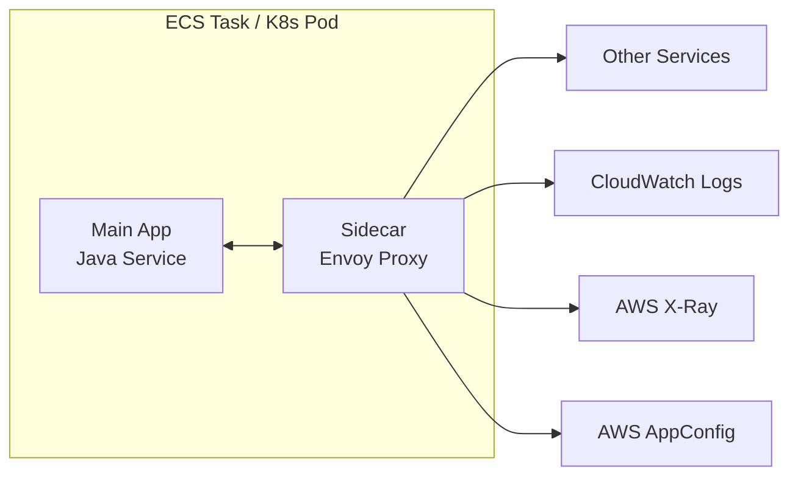

# Sidecar Pattern

> **References:** [Microsoft - Sidecar Pattern](https://docs.microsoft.com/en-us/azure/architecture/patterns/sidecar) | [AWS App Mesh](https://aws.amazon.com/app-mesh/) | [Envoy Proxy](https://www.envoyproxy.io/)

---

## What Is the Sidecar Pattern?

Deploy a helper container alongside your main application container in the same pod/task. The sidecar handles cross-cutting concerns (logging, monitoring, proxy, config) without changing application code.



---

## Sidecar Use Cases

| Use Case | Sidecar | AWS Example |
|---------|---------|-------------|
| Service mesh proxy | Envoy | AWS App Mesh |
| Logging | Fluent Bit, Fluentd | CloudWatch Logs sidecar |
| Distributed tracing | X-Ray daemon | AWS X-Ray sidecar |
| Config refresh | AWS AppConfig agent | AppConfig sidecar |
| Secret rotation | Vault agent, Secrets Manager | AWS Secrets Manager rotation |
| mTLS / auth | Envoy + SDS | App Mesh mTLS |
| Health proxy | NGINX sidecar | ALB routing |

---

## Java App + Logging Sidecar

### ECS Task Definition (Two Containers)

```json
{
  "family": "order-service",
  "containerDefinitions": [
    {
      "name": "order-service",
      "image": "123456789.dkr.ecr.us-east-1.amazonaws.com/order-service:latest",
      "essential": true,
      "portMappings": [{"containerPort": 8080}],
      "environment": [
        {"name": "LOG_OUTPUT", "value": "/var/log/app/app.log"}
      ],
      "mountPoints": [
        {"sourceVolume": "log-volume", "containerPath": "/var/log/app"}
      ],
      "logConfiguration": {
        "logDriver": "awslogs",
        "options": {
          "awslogs-group": "/ecs/order-service",
          "awslogs-region": "us-east-1"
        }
      }
    },
    {
      "name": "fluent-bit-sidecar",
      "image": "amazon/aws-for-fluent-bit:stable",
      "essential": false,
      "mountPoints": [
        {"sourceVolume": "log-volume", "containerPath": "/var/log/app"}
      ],
      "environment": [
        {"name": "FLB_LOG_LEVEL", "value": "info"}
      ]
    }
  ],
  "volumes": [
    {"name": "log-volume", "host": {}}
  ]
}
```

---

## Kubernetes Sidecar with X-Ray

```yaml
apiVersion: apps/v1
kind: Deployment
metadata:
  name: order-service
spec:
  replicas: 3
  selector:
    matchLabels:
      app: order-service
  template:
    metadata:
      labels:
        app: order-service
    spec:
      containers:
        - name: order-service
          image: order-service:latest
          ports:
            - containerPort: 8080
          env:
            - name: AWS_XRAY_DAEMON_ADDRESS
              value: "127.0.0.1:2000"  # X-Ray sidecar on localhost
        
        - name: xray-daemon          # ← Sidecar
          image: amazon/aws-xray-daemon:latest
          ports:
            - containerPort: 2000
              protocol: UDP
          resources:
            limits:
              cpu: "100m"
              memory: "64Mi"
```

---

## Java Service — Using X-Ray Sidecar for Tracing

```java
@Configuration
public class XRayConfig {
    
    @Bean
    public AWSXRayRecorder xRayRecorder() {
        // X-Ray SDK sends traces to the sidecar daemon at 127.0.0.1:2000
        // No code change needed — sidecar handles forwarding to X-Ray service
        return AWSXRayRecorderBuilder.standard()
            .withPlugin(new EC2Plugin())
            .withPlugin(new ECSPlugin())
            .build();
    }
}

@Service
public class OrderService {

    @XRayEnabled  // Annotation automatically creates subsegments via sidecar
    public Order processOrder(OrderRequest request) {
        // All downstream calls automatically traced
        // X-Ray SDK → UDP → X-Ray daemon sidecar → X-Ray service
        return createAndPersistOrder(request);
    }
    
    @XRayEnabled
    private Order createAndPersistOrder(OrderRequest request) {
        AWSXRay.createSubsegment("DynamoDB.putOrder", (subsegment) -> {
            subsegment.putAnnotation("orderId", request.getOrderId());
            subsegment.putAnnotation("userId", request.getUserId());
            return orderRepository.save(mapper.map(request));
        });
        return null;
    }
}
```

---

## App Mesh Envoy Sidecar — mTLS Between Services

```yaml
# App Mesh VirtualNode — sidecar Envoy handles mTLS automatically
apiVersion: appmesh.k8s.aws/v1beta2
kind: VirtualNode
metadata:
  name: order-service
spec:
  meshRef:
    name: my-mesh
  listeners:
    - portMapping:
        port: 8080
        protocol: http
      tls:
        mode: STRICT   # Enforce mTLS
        certificate:
          acm:
            certificateAuthorityArns:
              - arn:aws:acm-pca:...
  backends:
    - virtualService:
        virtualServiceRef:
          name: payment-service   # mTLS to payment-service enforced by Envoy sidecar
  serviceDiscovery:
    awsCloudMap:
      namespaceName: my-namespace
      serviceName: order-service
```

---

## AWS AppConfig Sidecar for Feature Flags

```java
// Java app reads config from localhost — AppConfig sidecar handles refresh
@Service
public class FeatureFlagService {

    private final RestTemplate localConfigClient;
    private static final String APPCONFIG_SIDECAR_URL = 
        "http://localhost:2772/applications/MyApp/environments/prod/configurations/feature-flags";

    public boolean isFeatureEnabled(String featureName) {
        try {
            // AppConfig agent sidecar handles polling AWS AppConfig every 45 seconds
            // and caches locally. App reads from localhost — very fast!
            FeatureFlags flags = localConfigClient.getForObject(
                APPCONFIG_SIDECAR_URL, FeatureFlags.class);
            return flags != null && flags.isEnabled(featureName);
        } catch (Exception e) {
            log.warn("Could not fetch feature flags, defaulting to disabled");
            return false;
        }
    }
}
```

---

## Ambassador and Adapter Variants

| Variant | Description | Example |
|---------|------------|---------|
| **Sidecar** | Extends app with new functionality | Logging, tracing, proxy |
| **Ambassador** | Proxy for outbound traffic | Client-side load balancing, retry |
| **Adapter** | Standardizes interface | Legacy app → modern monitoring |

---

## When NOT to Use Sidecar

1. **Serverless (Lambda)** — no container infrastructure; use Lambda extensions instead
2. **Simple single-service deployment** — overhead not worth it
3. **High-performance, low-latency services** — sidecar proxy adds 1-5ms per hop
4. **Small teams** — operational complexity of service mesh is high

---

## Interview Q&A

**Q1: What's the main advantage of the sidecar pattern over library-based solutions?**
> Language/framework agnosticism. If mTLS, logging, and tracing are implemented as sidecars, any language (Java, Python, Go) gets them automatically without code changes. With libraries, each language needs its own implementation. Also, sidecars can be updated independently without redeploying the application — you update the sidecar image in the task definition.

**Q2: How does AWS App Mesh work with sidecars?**
> App Mesh injects an Envoy proxy sidecar into each ECS task or Kubernetes pod. All inbound/outbound traffic flows through Envoy (via iptables rules). Envoy enforces: (1) mTLS between services, (2) retries and circuit breaking, (3) traffic shaping (canary deployments), (4) observability (metrics to CloudWatch, traces to X-Ray). The application code is unchanged.

**Q3: How would you handle secret injection using a sidecar?**
> Two approaches: (1) Init container: runs before the app, fetches secrets from Secrets Manager, writes to a shared volume, then exits. App reads from the volume. (2) Rotating sidecar: runs alongside app, periodically rotates secrets in Secrets Manager and updates the shared volume. App reads via filesystem watch or periodic reload. This avoids hardcoding secrets in environment variables (visible in ECS console).
