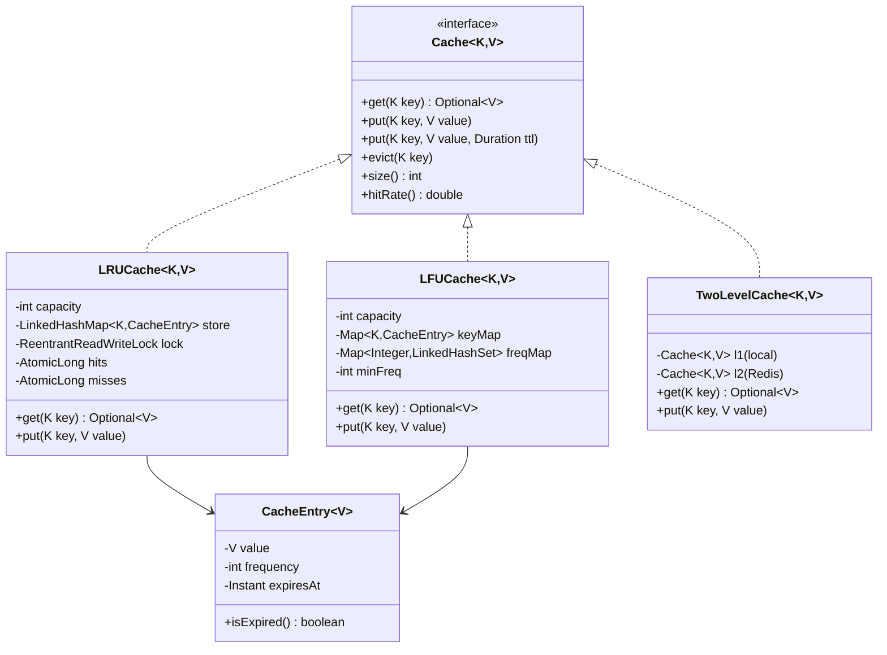

# Cache Implementation — Low Level Design

> **References:** [GeeksForGeeks - LRU Cache](https://www.geeksforgeeks.org/lru-cache-implementation/) | [Redis Data Structures](https://redis.io/docs/data-types/) | [Caffeine Cache](https://github.com/ben-manes/caffeine)

---

## Requirements

- LRU Cache (Least Recently Used eviction) with O(1) get and put
- LFU Cache (Least Frequently Used eviction)
- Thread-safe for concurrent access
- TTL support per entry
- Configurable max size

---

## Eviction Policies

| Policy | Evicts | Best For |
|--------|--------|---------|
| **LRU** | Least recently accessed | General purpose (temporal locality) |
| **LFU** | Least frequently accessed | Long-lived hot items |
| **FIFO** | Oldest inserted | Simple queue-like access |
| **ARC** | Adaptive (LRU + LFU) | Mixed access patterns |
| **Random** | Random entry | Ultra-low overhead |

---

## Class Diagram



---

## Java: LRU Cache (O(1) get + put)

```java
public class LRUCache<K, V> {

    private final int capacity;
    private final Map<K, Node<K, V>> map;
    private final Node<K, V> head; // Most recently used sentinel
    private final Node<K, V> tail; // Least recently used sentinel
    private final ReentrantReadWriteLock lock = new ReentrantReadWriteLock();
    private final AtomicLong hits = new AtomicLong();
    private final AtomicLong misses = new AtomicLong();

    public LRUCache(int capacity) {
        this.capacity = capacity;
        this.map = new HashMap<>(capacity);
        this.head = new Node<>(null, null);
        this.tail = new Node<>(null, null);
        head.next = tail;
        tail.prev = head;
    }

    public Optional<V> get(K key) {
        lock.readLock().lock();
        try {
            Node<K, V> node = map.get(key);
            if (node == null || node.isExpired()) {
                misses.incrementAndGet();
                if (node != null) evict(key); // Remove expired
                return Optional.empty();
            }
            hits.incrementAndGet();
            // Move to front (most recently used)
            moveToFront(node);
            return Optional.of(node.value);
        } finally {
            lock.readLock().unlock();
        }
    }

    public void put(K key, V value) {
        put(key, value, null);
    }

    public void put(K key, V value, Duration ttl) {
        lock.writeLock().lock();
        try {
            Node<K, V> existing = map.get(key);
            if (existing != null) {
                existing.value = value;
                existing.expiresAt = ttl != null ? Instant.now().plus(ttl) : null;
                moveToFront(existing);
                return;
            }
            
            if (map.size() >= capacity) {
                // Remove LRU (tail.prev is the least recently used)
                Node<K, V> lru = tail.prev;
                remove(lru);
                map.remove(lru.key);
            }
            
            Node<K, V> newNode = new Node<>(key, value);
            newNode.expiresAt = ttl != null ? Instant.now().plus(ttl) : null;
            addToFront(newNode);
            map.put(key, newNode);
        } finally {
            lock.writeLock().unlock();
        }
    }

    public void evict(K key) {
        lock.writeLock().lock();
        try {
            Node<K, V> node = map.remove(key);
            if (node != null) remove(node);
        } finally {
            lock.writeLock().unlock();
        }
    }

    private void moveToFront(Node<K, V> node) {
        remove(node);
        addToFront(node);
    }

    private void addToFront(Node<K, V> node) {
        node.next = head.next;
        node.prev = head;
        head.next.prev = node;
        head.next = node;
    }

    private void remove(Node<K, V> node) {
        node.prev.next = node.next;
        node.next.prev = node.prev;
    }

    public double hitRate() {
        long total = hits.get() + misses.get();
        return total == 0 ? 0.0 : (double) hits.get() / total;
    }

    private static class Node<K, V> {
        K key;
        V value;
        Node<K, V> prev, next;
        Instant expiresAt;

        Node(K key, V value) { this.key = key; this.value = value; }
        boolean isExpired() { return expiresAt != null && Instant.now().isAfter(expiresAt); }
    }
}
```

---

## Java: LFU Cache (O(1) all operations)

```java
public class LFUCache<K, V> {

    private final int capacity;
    private int minFreq;
    private final Map<K, CacheEntry<V>> keyMap = new HashMap<>();
    private final Map<Integer, LinkedHashSet<K>> freqMap = new HashMap<>();
    // freqMap: frequency → ordered set of keys with that frequency (LRU within same freq)

    public LFUCache(int capacity) {
        this.capacity = capacity;
    }

    public Optional<V> get(K key) {
        CacheEntry<V> entry = keyMap.get(key);
        if (entry == null || entry.isExpired()) return Optional.empty();
        incrementFreq(key, entry);
        return Optional.of(entry.value);
    }

    public void put(K key, V value, Duration ttl) {
        if (capacity <= 0) return;
        
        if (keyMap.containsKey(key)) {
            CacheEntry<V> entry = keyMap.get(key);
            entry.value = value;
            entry.expiresAt = ttl != null ? Instant.now().plus(ttl) : null;
            incrementFreq(key, entry);
            return;
        }
        
        if (keyMap.size() >= capacity) {
            // Evict the least frequently used (and among those, least recently used)
            LinkedHashSet<K> minFreqKeys = freqMap.get(minFreq);
            K evictKey = minFreqKeys.iterator().next(); // First = LRU among min freq
            minFreqKeys.remove(evictKey);
            keyMap.remove(evictKey);
        }
        
        keyMap.put(key, new CacheEntry<>(value, 1, ttl));
        freqMap.computeIfAbsent(1, k -> new LinkedHashSet<>()).add(key);
        minFreq = 1;
    }

    private void incrementFreq(K key, CacheEntry<V> entry) {
        int oldFreq = entry.freq;
        entry.freq++;
        
        // Remove from old frequency bucket
        freqMap.get(oldFreq).remove(key);
        if (freqMap.get(oldFreq).isEmpty()) {
            freqMap.remove(oldFreq);
            if (minFreq == oldFreq) minFreq++;
        }
        
        // Add to new frequency bucket
        freqMap.computeIfAbsent(entry.freq, k -> new LinkedHashSet<>()).add(key);
    }

    private static class CacheEntry<V> {
        V value;
        int freq;
        Instant expiresAt;

        CacheEntry(V value, int freq, Duration ttl) {
            this.value = value;
            this.freq = freq;
            this.expiresAt = ttl != null ? Instant.now().plus(ttl) : null;
        }
        boolean isExpired() { return expiresAt != null && Instant.now().isAfter(expiresAt); }
    }
}
```

---

## Cache Patterns

### Cache-Aside (Lazy Loading)
```java
public Product getProduct(String productId) {
    // 1. Check cache
    String cached = redis.opsForValue().get("product:" + productId);
    if (cached != null) return deserialize(cached);
    
    // 2. Cache miss → DB
    Product product = productRepository.findById(productId).orElseThrow();
    
    // 3. Populate cache
    redis.opsForValue().set("product:" + productId, serialize(product), Duration.ofMinutes(30));
    return product;
}
```

### Write-Through
```java
public Product saveProduct(Product product) {
    Product saved = productRepository.save(product);           // 1. Write to DB
    redis.opsForValue().set("product:" + saved.getId(),        // 2. Write to cache
        serialize(saved), Duration.ofMinutes(30));
    return saved;
}
```

### Write-Behind (Async)
```java
public void saveProductAsync(Product product) {
    redis.opsForValue().set("product:" + product.getId(), serialize(product)); // 1. Cache first
    asyncWriteQueue.offer(product); // 2. Queue for async DB write
}
// Background thread writes queue to DB
```

---

## Cache Stampede Prevention

```java
// Problem: many requests for same key on cache miss → all hit DB simultaneously
// Solution: probabilistic early expiration (PER)
public Product getProductWithPER(String productId) {
    CacheEntry entry = redis.get("product:" + productId);
    
    if (entry != null) {
        // PER: probabilistically refresh before expiry
        double remaining = entry.getRemainingTtlSeconds();
        double beta = 1.0; // Tuning parameter
        if (-beta * Math.log(Math.random()) > remaining) {
            // Probabilistically refresh now to avoid stampede
            refreshAsync(productId);
        }
        return entry.getValue();
    }
    
    // Use distributed lock to prevent stampede
    String lockKey = "lock:product:" + productId;
    Boolean locked = redis.opsForValue().setIfAbsent(lockKey, "1", Duration.ofSeconds(10));
    if (Boolean.TRUE.equals(locked)) {
        try {
            Product product = productRepository.findById(productId).orElseThrow();
            redis.opsForValue().set("product:" + productId, serialize(product), Duration.ofMinutes(30));
            return product;
        } finally {
            redis.delete(lockKey);
        }
    } else {
        // Another thread is loading — wait briefly and retry
        Thread.sleep(100);
        return getProductWithPER(productId);
    }
}
```

---

## AWS Caching Architecture

| Cache Type | AWS Service | Use Case |
|-----------|------------|---------|
| Application cache (L1) | Local ConcurrentHashMap / Caffeine | Hot objects in JVM heap |
| Distributed cache (L2) | ElastiCache Redis | Shared cache across instances |
| DB query cache | DAX (DynamoDB) | DynamoDB query caching |
| HTTP/API cache | API Gateway cache | Response caching per endpoint |
| CDN/static cache | CloudFront | Static assets, API responses |
| Full-page cache | CloudFront | Pre-rendered pages |

---

## Interview Q&A

**Q1: What is the time complexity of LRU cache operations and how do you achieve O(1)?**
> Both get and put are O(1). Use a HashMap for O(1) key lookup + a doubly-linked list for O(1) insert/delete at any position (given a pointer). The map stores key → node pointer. On get: look up in map (O(1)), move node to front of list (O(1) with pointer). On put: insert at front (O(1)), if full, remove tail (O(1) since we have tail pointer).

**Q2: When would you choose LFU over LRU?**
> LFU is better when access frequency matters more than recency. Example: a news homepage where some articles are perennially popular — LFU keeps them cached even if they weren't accessed in the last few minutes. LRU would evict them during a brief lull. LFU is harder to implement (O(1) version requires frequency buckets with LinkedHashSet) and can be slow to react to changing access patterns.

**Q3: How do you handle cache invalidation in a distributed system?**
> (1) TTL expiration: simple, but stale data window = TTL. (2) Write-through: update cache on every write — strong consistency but slower writes. (3) Event-based invalidation: publish "product updated" event, consumers delete their cache entries. (4) Cache tags: group related cache entries by tag, invalidate entire tag. (5) Version numbers in cache keys: "product:v2:123" — increment version on update, old keys expire naturally.
