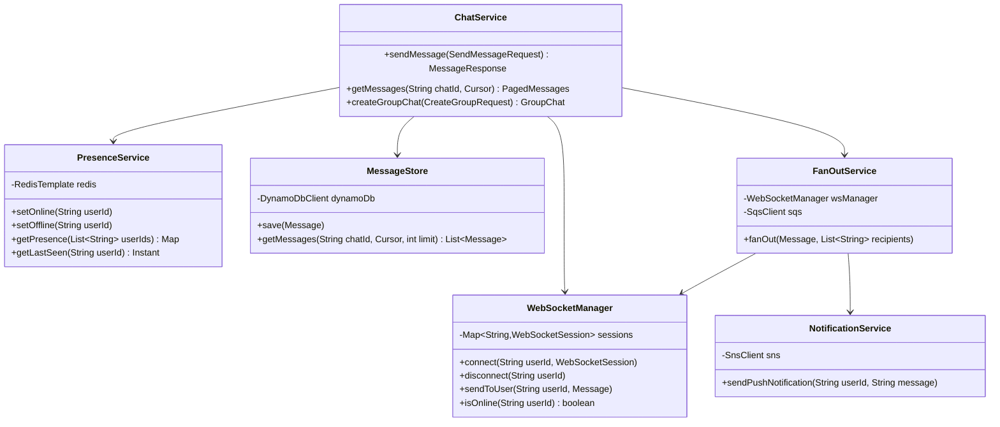
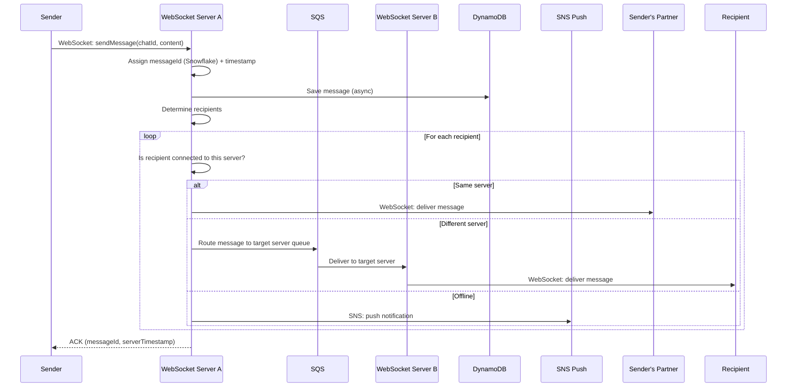
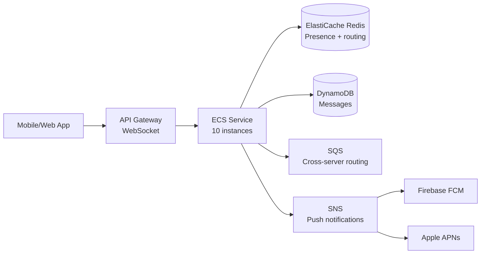

# Chat System — Low Level Design

> **References:** [System Design Interview Vol 2 - Alex Xu](https://www.amazon.com/dp/1736049119) | [WhatsApp Architecture](https://highscalability.com/the-whatsapp-architecture-facebook-uses-to-process-60-billion/) | [Discord Architecture](https://discord.com/blog/how-discord-stores-billions-of-messages)

---

## Requirements

### Functional
- 1-1 chat and group chat (up to 500 members)
- Online presence (online/offline/last seen)
- Message delivery status (sent, delivered, read)
- Message history and pagination
- Push notifications for offline users

### Non-Functional
- 50M DAU, 40 messages/user/day = 2B messages/day
- < 100ms message delivery latency
- Message order preserved per conversation
- Messages stored for 5 years

---

## Capacity Estimation

```
Messages/day: 50M DAU × 40 = 2B messages/day
Messages/sec: 2B / 86400 ≈ 23,000 msg/sec peak
Storage/day: 23,000 × (avg 100 bytes) = 2.3 MB/sec = 200 GB/day
5-year storage: 200 GB × 365 × 5 = 365 TB

WebSocket connections: 50M DAU × 20% online = 10M concurrent
```

---

## Class Diagram



---

## Sequence Diagram: Send Message



---

## Java Implementation: WebSocket Handler

```java
@Component
public class ChatWebSocketHandler extends TextWebSocketHandler {

    private final WebSocketManager wsManager;
    private final ChatService chatService;
    private final ObjectMapper objectMapper;

    @Override
    public void afterConnectionEstablished(WebSocketSession session) {
        String userId = extractUserId(session);
        wsManager.connect(userId, session);
        log.info("User {} connected via WebSocket", userId);
    }

    @Override
    protected void handleTextMessage(WebSocketSession session, TextMessage message) throws Exception {
        String userId = extractUserId(session);
        WsMessage wsMessage = objectMapper.readValue(message.getPayload(), WsMessage.class);
        
        switch (wsMessage.getType()) {
            case "SEND_MESSAGE" -> handleSendMessage(userId, wsMessage);
            case "TYPING" -> handleTypingIndicator(userId, wsMessage);
            case "READ_RECEIPT" -> handleReadReceipt(userId, wsMessage);
            case "PING" -> sendPong(session);
        }
    }

    private void handleSendMessage(String senderId, WsMessage wsMessage) {
        SendMessageRequest request = SendMessageRequest.builder()
            .chatId(wsMessage.getChatId())
            .senderId(senderId)
            .content(wsMessage.getContent())
            .contentType(wsMessage.getContentType())
            .clientMessageId(wsMessage.getClientMessageId()) // Idempotency
            .build();
        
        chatService.sendMessage(request);
    }

    @Override
    public void afterConnectionClosed(WebSocketSession session, CloseStatus status) {
        String userId = extractUserId(session);
        wsManager.disconnect(userId);
    }

    private String extractUserId(WebSocketSession session) {
        return (String) session.getAttributes().get("userId");
    }
}
```

---

## Java Implementation: Chat Service + Fan-out

```java
@Service
public class ChatService {

    private final MessageStore messageStore;
    private final WebSocketManager wsManager;
    private final PresenceService presenceService;
    private final NotificationService notificationService;
    private final SqsClient sqsClient;
    private final SnowflakeIdGenerator idGenerator;

    @Transactional
    public MessageResponse sendMessage(SendMessageRequest request) {
        // Idempotency: check if already processed
        // (clientMessageId dedup)
        
        Message message = Message.builder()
            .messageId(String.valueOf(idGenerator.nextId()))
            .chatId(request.getChatId())
            .senderId(request.getSenderId())
            .content(request.getContent())
            .contentType(request.getContentType())
            .sentAt(Instant.now())
            .status(MessageStatus.SENT)
            .build();
        
        // 1. Persist message
        messageStore.save(message);
        
        // 2. Fan-out to recipients
        List<String> recipients = getChatMembers(request.getChatId())
            .stream()
            .filter(id -> !id.equals(request.getSenderId()))
            .toList();
        
        fanOutMessage(message, recipients);
        
        return MessageResponse.from(message);
    }

    private void fanOutMessage(Message message, List<String> recipients) {
        for (String recipientId : recipients) {
            if (wsManager.isConnectedLocally(recipientId)) {
                // Direct WebSocket delivery on this server
                wsManager.sendToUser(recipientId, message);
            } else {
                // Route via SQS to the correct server instance
                // Each WS server listens on its own queue
                String targetServerId = wsManager.findUserServer(recipientId);
                
                if (targetServerId != null) {
                    // User is online but on different server
                    routeToServer(targetServerId, message, recipientId);
                } else {
                    // User is offline — push notification
                    notificationService.sendPushNotification(recipientId, message);
                }
            }
        }
    }

    private void routeToServer(String serverId, Message message, String recipientId) {
        String queueUrl = "https://sqs.us-east-1.amazonaws.com/account/ws-server-" + serverId;
        sqsClient.sendMessage(SendMessageRequest.builder()
            .queueUrl(queueUrl)
            .messageBody(objectMapper.writeValueAsString(
                new RoutedMessage(recipientId, message)))
            .build());
    }
}
```

---

## Presence Service

```java
@Service
public class PresenceService {

    private final RedisTemplate<String, String> redis;
    private static final Duration ONLINE_TTL = Duration.ofSeconds(30);
    private static final String ONLINE_PREFIX = "presence:online:";
    private static final String LAST_SEEN_PREFIX = "presence:lastseen:";

    public void setOnline(String userId) {
        String key = ONLINE_PREFIX + userId;
        redis.opsForValue().set(key, "1", ONLINE_TTL);
        // Heartbeat: clients send PING every 20s to renew TTL
    }

    public void setOffline(String userId) {
        String key = ONLINE_PREFIX + userId;
        redis.delete(key);
        redis.opsForValue().set(LAST_SEEN_PREFIX + userId,
            Instant.now().toString(), Duration.ofDays(30));
    }

    public Map<String, PresenceStatus> getPresence(List<String> userIds) {
        // Batch Redis MGET for efficiency
        List<String> keys = userIds.stream()
            .map(id -> ONLINE_PREFIX + id)
            .toList();
        
        List<String> values = redis.opsForValue().multiGet(keys);
        Map<String, PresenceStatus> result = new HashMap<>();
        
        for (int i = 0; i < userIds.size(); i++) {
            boolean isOnline = values.get(i) != null;
            if (isOnline) {
                result.put(userIds.get(i), PresenceStatus.ONLINE);
            } else {
                String lastSeenStr = redis.opsForValue().get(LAST_SEEN_PREFIX + userIds.get(i));
                result.put(userIds.get(i), new PresenceStatus(
                    false,
                    lastSeenStr != null ? Instant.parse(lastSeenStr) : null
                ));
            }
        }
        return result;
    }
}
```

---

## Data Model

**DynamoDB Table: Messages**
| Attribute | Type | Notes |
|-----------|------|-------|
| PK | String | `CHAT#{chatId}` |
| SK | String | `MSG#{timestamp}#{messageId}` |
| senderId | String | |
| content | String | Encrypted at rest |
| contentType | String | TEXT, IMAGE, VIDEO |
| status | String | SENT, DELIVERED, READ |
| sentAt | String | ISO-8601 |

**Access patterns:**
- Get messages in a chat (paginated, newest first): Query PK=CHAT#{chatId}, SK begins_with MSG#, scanIndexForward=false
- Get last message per chat (for conversation list): GSI on chatId + sentAt

---

## AWS Deployment



---

## Interview Q&A

**Q1: How do you deliver messages to a user connected to a different WebSocket server?**
> Each WebSocket server registers its connected users in Redis (userId → serverId). When delivering a message, check Redis for the target user's server. If different, publish to that server's SQS queue. Each server has a dedicated SQS queue it polls. This allows horizontal scaling of WebSocket servers without a shared in-memory state.

**Q2: How do you maintain message ordering in a group chat?**
> Use Snowflake IDs (monotonically increasing per-server, time-ordered globally). Sort by Snowflake ID on read. For strict ordering: use a sequence number per chat (DynamoDB atomic counter). Alternative: clients reconcile ordering by sending at timestamp + messageId, display sorted by time.

**Q3: How would you support end-to-end encryption?**
> Use Signal Protocol: each user has an identity key pair + ephemeral keys. When A sends to B, A fetches B's public key, encrypts message client-side. Server stores ciphertext only. Server never sees plaintext. This prevents server-side snooping. Complexity: key distribution, multi-device support (each device has separate keys).
