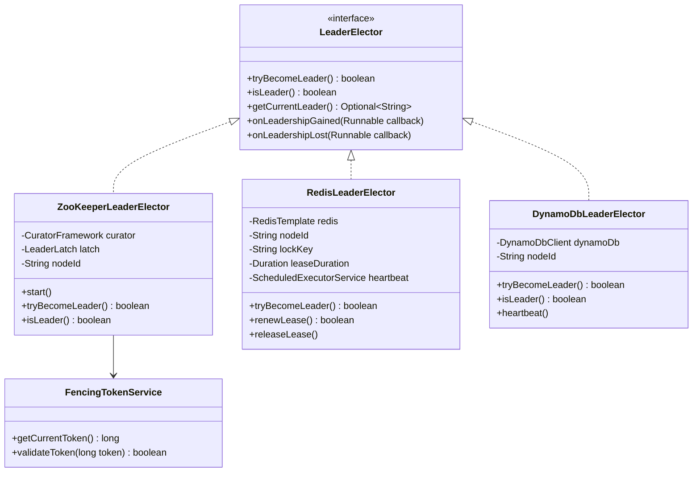
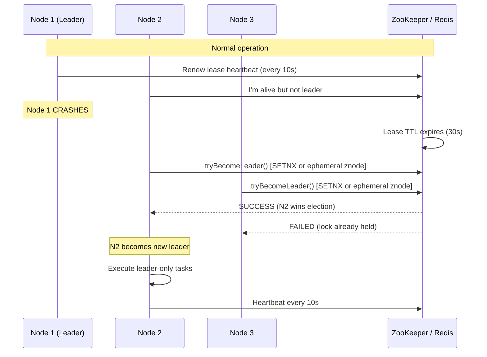

# Leader Election — Low Level Design

> **References:** [Apache ZooKeeper](https://zookeeper.apache.org/) | [Redis SETNX](https://redis.io/commands/setnx/) | [Raft Paper](https://raft.github.io/) | [Fencing Tokens](https://martin.kleppmann.com/2016/02/08/how-to-do-distributed-locking.html)

---

## Requirements

- Elect a single leader among N nodes
- Detect leader failure and elect a new leader quickly (< 30s)
- Prevent split-brain (two nodes both think they are leader)
- Fencing tokens to prevent stale leader from writing after losing lease

---

## Class Diagram



---

## Sequence Diagram: Leader Election & Failover



---

## Java: Redis-Based Leader Election

```java
@Service
public class RedisLeaderElector implements LeaderElector {

    private final StringRedisTemplate redis;
    private final String nodeId;
    private final String lockKey = "leader:election";
    private final Duration leaseDuration = Duration.ofSeconds(30);
    private final Duration heartbeatInterval = Duration.ofSeconds(10);
    private final ScheduledExecutorService scheduler = Executors.newSingleThreadScheduledExecutor();
    
    private volatile boolean isLeader = false;
    private volatile long currentFencingToken = 0;
    private final List<Runnable> gainCallbacks = new CopyOnWriteArrayList<>();
    private final List<Runnable> lossCallbacks = new CopyOnWriteArrayList<>();

    public RedisLeaderElector(StringRedisTemplate redis, 
                              @Value("${node.id:${random.uuid}}") String nodeId) {
        this.redis = redis;
        this.nodeId = nodeId;
    }

    @PostConstruct
    public void start() {
        // Try to become leader immediately on startup
        scheduler.scheduleAtFixedRate(this::heartbeatOrAcquire,
            0, heartbeatInterval.toSeconds(), TimeUnit.SECONDS);
    }

    private void heartbeatOrAcquire() {
        if (isLeader) {
            // Renew our lease
            boolean renewed = renewLease();
            if (!renewed) {
                // Lost leadership (e.g., Redis failover caused our key to disappear)
                isLeader = false;
                log.warn("Node {} lost leadership!", nodeId);
                lossCallbacks.forEach(Runnable::run);
            }
        } else {
            // Try to acquire leadership
            if (tryBecomeLeader()) {
                isLeader = true;
                log.info("Node {} became leader! Fencing token: {}", nodeId, currentFencingToken);
                gainCallbacks.forEach(Runnable::run);
            }
        }
    }

    @Override
    public boolean tryBecomeLeader() {
        // Lua script: atomic SETNX + SET fencing token
        String script = """
            if redis.call('SET', KEYS[1], ARGV[1], 'NX', 'EX', ARGV[2]) then
                local token = redis.call('INCR', KEYS[2])
                return token
            else
                return 0
            end
            """;
        
        Long result = redis.execute(
            RedisScript.of(script, Long.class),
            List.of(lockKey, "fencing:token"),
            nodeId,
            String.valueOf(leaseDuration.toSeconds())
        );
        
        if (result != null && result > 0) {
            currentFencingToken = result;
            return true;
        }
        return false;
    }

    private boolean renewLease() {
        // Only extend if we still own the lock (avoid extending someone else's)
        String script = """
            if redis.call('GET', KEYS[1]) == ARGV[1] then
                return redis.call('EXPIRE', KEYS[1], ARGV[2])
            else
                return 0
            end
            """;
        
        Long result = redis.execute(
            RedisScript.of(script, Long.class),
            List.of(lockKey),
            nodeId,
            String.valueOf(leaseDuration.toSeconds())
        );
        return Long.valueOf(1L).equals(result);
    }

    @Override
    public boolean isLeader() { return isLeader; }

    @Override
    public Optional<String> getCurrentLeader() {
        return Optional.ofNullable(redis.opsForValue().get(lockKey));
    }

    public long getCurrentFencingToken() { return currentFencingToken; }
    
    public void onLeadershipGained(Runnable callback) { gainCallbacks.add(callback); }
    public void onLeadershipLost(Runnable callback) { lossCallbacks.add(callback); }

    @PreDestroy
    public void shutdown() {
        scheduler.shutdown();
        if (isLeader) releaseLease();
    }

    private void releaseLease() {
        String script = """
            if redis.call('GET', KEYS[1]) == ARGV[1] then
                return redis.call('DEL', KEYS[1])
            else
                return 0
            end
            """;
        redis.execute(RedisScript.of(script, Long.class), List.of(lockKey), nodeId);
        isLeader = false;
    }
}
```

---

## Java: ZooKeeper-Based Leader Election (Apache Curator)

```java
@Service
public class ZooKeeperLeaderElector {

    private final CuratorFramework curator;
    private final LeaderLatch latch;
    private final String nodeId;
    
    public ZooKeeperLeaderElector(
            CuratorFramework curator,
            @Value("${node.id}") String nodeId) {
        this.curator = curator;
        this.nodeId = nodeId;
        this.latch = new LeaderLatch(curator, "/leader-election", nodeId);
        
        latch.addListener(new LeaderLatchListener() {
            @Override
            public void isLeader() {
                log.info("Node {} won leader election!", nodeId);
                startLeaderTasks();
            }

            @Override
            public void notLeader() {
                log.info("Node {} lost leadership", nodeId);
                stopLeaderTasks();
            }
        });
    }

    @PostConstruct
    public void start() throws Exception {
        latch.start(); // Registers ephemeral znode, waits for leadership
    }

    public boolean isLeader() {
        return latch.hasLeadership();
    }

    // ZooKeeper provides fencing via sequential znodes
    // Leader is the participant with the lowest sequence number
    // When leader dies, its ephemeral znode is deleted automatically
    
    @PreDestroy
    public void stop() throws IOException {
        latch.close(); // Releases leadership, triggers new election
    }
}
```

---

## Fencing Tokens

Prevent stale leader from writing after lease expiry.

```java
@Service
public class StorageService {

    private final DynamoDbClient dynamoDb;
    private long currentAcceptedToken = 0;

    // Only accept writes with a token >= last seen token
    public void write(String key, String value, long fencingToken) {
        if (fencingToken < currentAcceptedToken) {
            throw new StaleLeaderException(
                "Fencing token " + fencingToken + 
                " is older than current " + currentAcceptedToken);
        }
        
        // Conditional write: reject if a higher token has already written
        try {
            dynamoDb.putItem(PutItemRequest.builder()
                .tableName("SharedStorage")
                .item(Map.of(
                    "key", str(key),
                    "value", str(value),
                    "fencingToken", num(String.valueOf(fencingToken))
                ))
                .conditionExpression("attribute_not_exists(fencingToken) OR fencingToken <= :token")
                .expressionAttributeValues(Map.of(":token", num(String.valueOf(fencingToken))))
                .build());
            
            currentAcceptedToken = Math.max(currentAcceptedToken, fencingToken);
        } catch (ConditionalCheckFailedException e) {
            throw new StaleLeaderException("Write rejected by fencing token check");
        }
    }
}

// Leader uses fencing token on every operation
@Service
public class LeaderTask {
    
    private final StorageService storage;
    private final RedisLeaderElector elector;

    @Scheduled(fixedDelay = 5000)
    public void executeLeaderTask() {
        if (!elector.isLeader()) return;
        
        long token = elector.getCurrentFencingToken();
        try {
            storage.write("cluster-state", computeState(), token);
        } catch (StaleLeaderException e) {
            log.warn("No longer the leader, stopping leader task");
            // Don't do any more work
        }
    }
}
```

---

## AWS Deployment Options

| Use Case | AWS Solution |
|---------|-------------|
| Scheduled job leader election | EventBridge Scheduler + Lambda (stateless, no election needed) |
| Stateful leader election | DynamoDB conditional writes + TTL |
| ZooKeeper managed | Amazon MSK (Kafka uses ZooKeeper/KRaft) |
| Redis-based election | ElastiCache Redis (single primary) |
| ECS task leader | ECS service with desired=1 (AWS ensures single task) |

---

## Interview Q&A

**Q1: What is a fencing token and why is it needed?**
> A fencing token is a monotonically increasing number assigned when a node becomes leader. Even if a "zombie" leader (that lost its lease) tries to write, the storage layer rejects writes with stale tokens. Without fencing, a paused leader can wake up after lease expiry and overwrite data written by the new leader, causing data corruption.

**Q2: How does ZooKeeper implement leader election?**
> Each candidate creates a sequential ephemeral znode under a common path (e.g., /election/candidate-). The node with the lowest sequence number is the leader. All other nodes watch the znode with the next lowest number. When the leader dies, its ephemeral znode is deleted, and the node watching it gets notified and becomes the new leader. No thundering herd (each node watches only one predecessor).

**Q3: What's the difference between a mutex lock and a leader election?**
> A mutex is for short-duration critical sections (milliseconds) — one request at a time. Leader election is for long-duration role assignment (minutes/hours) — one node runs leader duties continuously. Leader election requires: heartbeat/lease renewal, failure detection, automatic re-election. A mutex is just acquire/release.
