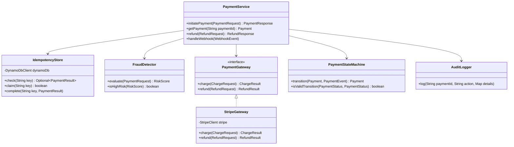
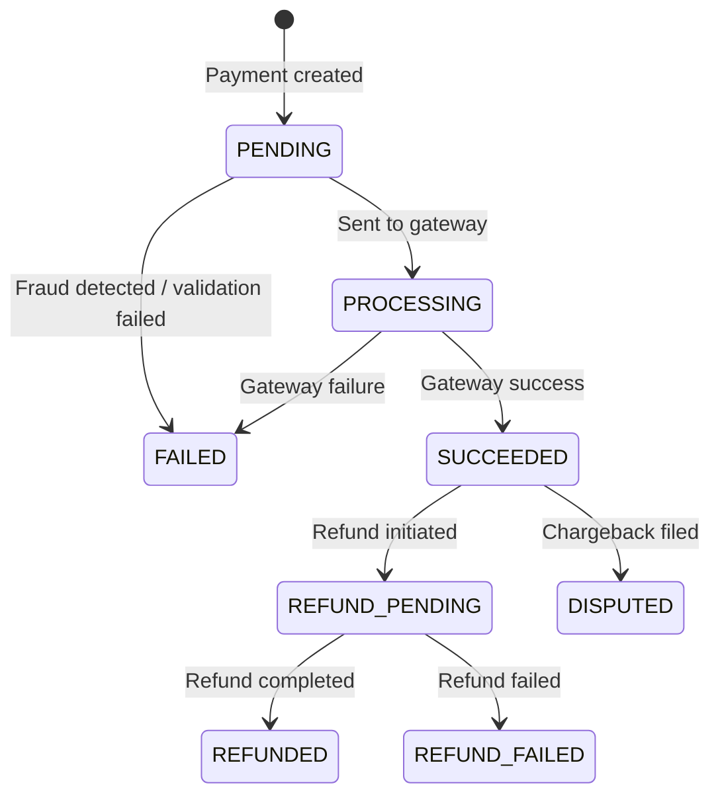
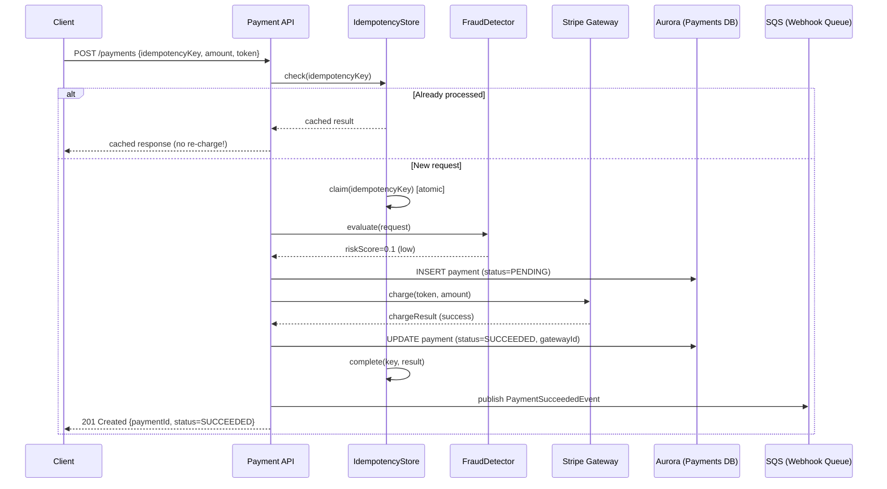

# Payment Service — Low Level Design

> **References:** [Stripe API Design](https://stripe.com/docs/api) | [PayPal Architecture](https://medium.com/paypal-tech) | [PCI DSS Standards](https://www.pcisecuritystandards.org/)

---

## Requirements

### Functional
- Process payments (credit card, wallet, bank transfer)
- Idempotent payment processing (prevent double charge)
- Refunds (full and partial)
- Payment status tracking (PENDING → PROCESSING → SUCCEEDED/FAILED)
- Webhook notifications on status changes

### Non-Functional
- Exactly-once payment processing (critical!)
- < 3 second p99 latency
- 99.99% availability
- PCI DSS compliance (no raw card data stored)
- Full audit trail

---

## Class Diagram



---

## Payment State Machine



---

## Sequence Diagram: Payment Flow



---

## Java Implementation

### Idempotency with DynamoDB

```java
@Component
public class IdempotencyStore {

    private final DynamoDbClient dynamoDb;
    private static final String TABLE = "IdempotencyKeys";
    private static final long TTL_HOURS = 24;

    // Returns existing result if key was already processed
    public Optional<PaymentResult> check(String idempotencyKey) {
        GetItemResponse response = dynamoDb.getItem(GetItemRequest.builder()
            .tableName(TABLE)
            .key(Map.of("idempotencyKey", str(idempotencyKey)))
            .build());
        
        if (response.item().isEmpty()) return Optional.empty();
        
        String status = response.item().get("status").s();
        if ("COMPLETED".equals(status)) {
            return Optional.of(deserializeResult(response.item().get("result").s()));
        }
        return Optional.empty(); // IN_PROGRESS — caller should wait/retry
    }

    // Atomically claim the key — returns false if already claimed
    public boolean claim(String idempotencyKey) {
        try {
            dynamoDb.putItem(PutItemRequest.builder()
                .tableName(TABLE)
                .item(Map.of(
                    "idempotencyKey", str(idempotencyKey),
                    "status", str("IN_PROGRESS"),
                    "claimedAt", str(Instant.now().toString()),
                    "ttl", num(String.valueOf(
                        Instant.now().plusSeconds(TTL_HOURS * 3600).getEpochSecond()))
                ))
                .conditionExpression("attribute_not_exists(idempotencyKey)")
                .build());
            return true;
        } catch (ConditionalCheckFailedException e) {
            return false; // Already claimed
        }
    }

    public void complete(String idempotencyKey, PaymentResult result) {
        dynamoDb.updateItem(UpdateItemRequest.builder()
            .tableName(TABLE)
            .key(Map.of("idempotencyKey", str(idempotencyKey)))
            .updateExpression("SET #s = :status, #r = :result, completedAt = :ts")
            .expressionAttributeNames(Map.of("#s", "status", "#r", "result"))
            .expressionAttributeValues(Map.of(
                ":status", str("COMPLETED"),
                ":result", str(serializeResult(result)),
                ":ts", str(Instant.now().toString())
            ))
            .build());
    }
}
```

### Payment Service

```java
@Service
public class PaymentService {

    private final IdempotencyStore idempotencyStore;
    private final FraudDetector fraudDetector;
    private final PaymentGateway gateway;
    private final PaymentRepository repository;
    private final AuditLogger auditLogger;
    private final SqsClient sqsClient;

    @Transactional
    public PaymentResponse initiatePayment(PaymentRequest request) {
        String idempotencyKey = request.getIdempotencyKey();
        
        // 1. Check idempotency cache
        Optional<PaymentResult> existing = idempotencyStore.check(idempotencyKey);
        if (existing.isPresent()) {
            log.info("Idempotent response for key {}", idempotencyKey);
            return PaymentResponse.from(existing.get());
        }
        
        // 2. Claim idempotency key (atomic)
        if (!idempotencyStore.claim(idempotencyKey)) {
            // Another thread is processing — return 409 or wait
            throw new ConcurrentPaymentException("Payment is being processed");
        }
        
        try {
            // 3. Fraud detection
            RiskScore risk = fraudDetector.evaluate(request);
            if (risk.isHighRisk()) {
                auditLogger.log(request.getOrderId(), "FRAUD_BLOCKED", risk.toMap());
                throw new FraudDetectedException("Payment blocked: high risk score " + risk.getScore());
            }
            
            // 4. Create payment record
            Payment payment = Payment.builder()
                .paymentId(UUID.randomUUID().toString())
                .orderId(request.getOrderId())
                .userId(request.getUserId())
                .amount(request.getAmount())
                .currency(request.getCurrency())
                .status(PaymentStatus.PROCESSING)
                .build();
            repository.save(payment);
            
            // 5. Charge via gateway (idempotent call using orderId)
            ChargeResult chargeResult = gateway.charge(ChargeRequest.builder()
                .idempotencyKey(request.getOrderId()) // Gateway-level idempotency
                .paymentToken(request.getPaymentToken()) // Tokenized card
                .amount(request.getAmount())
                .currency(request.getCurrency())
                .build());
            
            // 6. Update payment status
            payment.setStatus(PaymentStatus.SUCCEEDED);
            payment.setGatewayTransactionId(chargeResult.getTransactionId());
            payment.setCompletedAt(Instant.now());
            repository.save(payment);
            
            // 7. Complete idempotency entry
            PaymentResult result = PaymentResult.success(payment.getPaymentId(), chargeResult);
            idempotencyStore.complete(idempotencyKey, result);
            
            // 8. Publish success event (async, non-blocking)
            publishEvent(new PaymentSucceededEvent(payment));
            auditLogger.log(payment.getPaymentId(), "PAYMENT_SUCCEEDED", payment.toMap());
            
            return PaymentResponse.success(payment);
            
        } catch (GatewayException e) {
            // Gateway failure — update status and complete idempotency
            repository.updateStatus(request.getOrderId(), PaymentStatus.FAILED);
            idempotencyStore.complete(idempotencyKey, PaymentResult.failed(e.getMessage()));
            throw new PaymentFailedException("Payment gateway error: " + e.getMessage(), e);
        }
    }

    @Transactional
    public RefundResponse refund(RefundRequest request) {
        Payment payment = repository.findById(request.getPaymentId())
            .orElseThrow(() -> new PaymentNotFoundException(request.getPaymentId()));
        
        if (payment.getStatus() != PaymentStatus.SUCCEEDED) {
            throw new InvalidPaymentStateException("Can only refund SUCCEEDED payments");
        }
        
        if (request.getAmount().compareTo(payment.getAmount()) > 0) {
            throw new InvalidRefundAmountException("Refund cannot exceed original payment");
        }
        
        RefundResult refundResult = gateway.refund(RefundRequest.builder()
            .gatewayTransactionId(payment.getGatewayTransactionId())
            .amount(request.getAmount())
            .reason(request.getReason())
            .build());
        
        payment.setStatus(PaymentStatus.REFUNDED);
        repository.save(payment);
        
        publishEvent(new PaymentRefundedEvent(payment, request.getAmount()));
        return RefundResponse.success(refundResult.getRefundId());
    }
}
```

---

## Data Model

**Aurora PostgreSQL: payments**
```sql
CREATE TABLE payments (
    payment_id    UUID PRIMARY KEY DEFAULT gen_random_uuid(),
    order_id      UUID NOT NULL,
    user_id       UUID NOT NULL,
    amount        DECIMAL(12,2) NOT NULL,
    currency      CHAR(3) NOT NULL,
    status        VARCHAR(20) NOT NULL DEFAULT 'PENDING',
    gateway       VARCHAR(50),
    gateway_txn_id VARCHAR(255),
    idempotency_key VARCHAR(255) UNIQUE,
    created_at    TIMESTAMPTZ DEFAULT NOW(),
    completed_at  TIMESTAMPTZ,
    CONSTRAINT valid_status CHECK (
        status IN ('PENDING','PROCESSING','SUCCEEDED','FAILED','REFUNDED','DISPUTED')
    )
);
CREATE INDEX idx_payments_order_id ON payments(order_id);
CREATE INDEX idx_payments_user_id ON payments(user_id);
```

---

## AWS Deployment

| Component | AWS Service | Notes |
|-----------|------------|-------|
| API | API Gateway + ECS (Fargate) | Private VPC, no direct internet |
| Payment DB | Aurora PostgreSQL Multi-AZ | ACID, encrypted at rest |
| Idempotency store | DynamoDB | TTL-based expiry |
| Secrets (API keys) | Secrets Manager | Auto-rotation |
| Encryption | AWS KMS | Encrypt sensitive fields |
| Events | SQS FIFO | Exactly-once delivery for payment events |
| Audit log | CloudWatch Logs + S3 | 7-year retention for compliance |
| Network | VPC with private subnets | PCI-DSS zone isolation |

---

## Interview Q&A

**Q1: How do you prevent double-charging a customer?**
> Three layers: (1) Client-side: disable submit button after first click, send idempotency key. (2) Server-side: DynamoDB idempotency store with atomic conditional write — only one request can claim a key. (3) Gateway-side: send orderId as Stripe's idempotency key — Stripe deduplicates on their end too. All three together make double-charge essentially impossible.

**Q2: What is PCI DSS and how does it affect your design?**
> PCI DSS (Payment Card Industry Data Security Standard) requires: (1) Never store raw card numbers — use tokenization (Stripe token). (2) Encrypt cardholder data in transit (TLS 1.2+) and at rest (KMS). (3) Network segmentation — payment services in isolated VPC. (4) Access control — principle of least privilege. (5) Audit logs — immutable audit trail of all payment events. (6) Regular security testing.

**Q3: How do you handle a payment that succeeds at the gateway but your service crashes before updating the DB?**
> The idempotency key is set to IN_PROGRESS. On retry, the client uses the same key — the server reclaims it and re-calls the gateway with the same idempotency key. The gateway returns the same result (already processed). The server updates the DB and marks idempotency as COMPLETE. Use a background reconciliation job that scans IN_PROGRESS payments older than 5 minutes and reconciles with the gateway.
