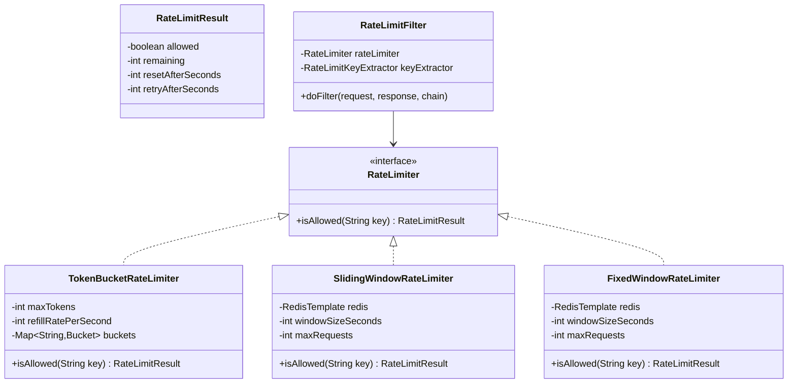
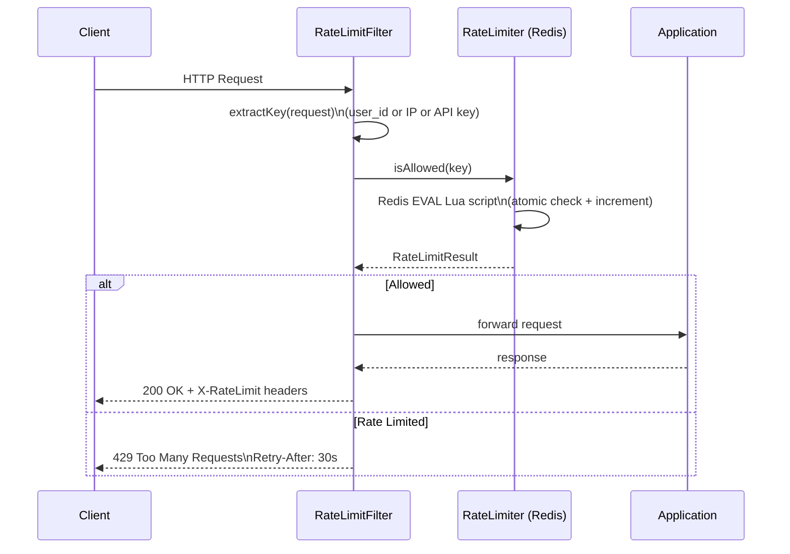

# Rate Limiter — Low Level Design

> **References:** [GeeksForGeeks - Rate Limiter](https://www.geeksforgeeks.org/rate-limiter-system-design/) | [Cloudflare Rate Limiting](https://developers.cloudflare.com/waf/rate-limiting-rules/) | [Stripe API Rate Limiting](https://stripe.com/docs/rate-limits)

---

## Requirements

### Functional
- Limit requests per user/IP/API key
- Support multiple windows: per-second, per-minute, per-day
- Return 429 Too Many Requests with Retry-After header
- Distributed: works across multiple server instances

### Non-Functional
- < 5ms latency overhead per request
- High availability (failure = allow, not block)
- 10,000 RPS per rate limiter instance

---

## Algorithms Comparison

| Algorithm | Memory | Burst Handling | Smoothness | Complexity |
|-----------|--------|---------------|------------|------------|
| Fixed Window | O(1) | Yes (boundary burst) | Low | Low |
| Sliding Window Log | O(requests) | No | High | Medium |
| Sliding Window Counter | O(1) | Approximate | High | Medium |
| Token Bucket | O(1) | Yes (accumulates tokens) | Medium | Low |
| Leaky Bucket | O(queue) | No (drops excess) | Highest | Medium |

---

## Class Diagram



---

## Sequence Diagram



---

## Java Implementation: Token Bucket

```java
@Component
public class TokenBucketRateLimiter implements RateLimiter {

    private final Map<String, AtomicLong[]> buckets = new ConcurrentHashMap<>();
    // [0] = current tokens, [1] = last refill timestamp
    private final int maxTokens;
    private final int refillRatePerSecond;
    
    public TokenBucketRateLimiter(
            @Value("${rate.limit.max-tokens:100}") int maxTokens,
            @Value("${rate.limit.refill-rate:10}") int refillRatePerSecond) {
        this.maxTokens = maxTokens;
        this.refillRatePerSecond = refillRatePerSecond;
    }
    
    @Override
    public RateLimitResult isAllowed(String key) {
        AtomicLong[] bucket = buckets.computeIfAbsent(key, k ->
            new AtomicLong[]{new AtomicLong(maxTokens), new AtomicLong(System.currentTimeMillis())}
        );
        
        AtomicLong tokens = bucket[0];
        AtomicLong lastRefill = bucket[1];
        
        // Refill tokens based on elapsed time
        long now = System.currentTimeMillis();
        long elapsed = now - lastRefill.get();
        long newTokens = (elapsed / 1000) * refillRatePerSecond;
        
        if (newTokens > 0) {
            tokens.set(Math.min(maxTokens, tokens.get() + newTokens));
            lastRefill.set(now);
        }
        
        // Try to consume a token
        long currentTokens = tokens.get();
        if (currentTokens > 0 && tokens.compareAndSet(currentTokens, currentTokens - 1)) {
            return RateLimitResult.allowed((int)(currentTokens - 1));
        }
        
        return RateLimitResult.denied(0, refillRatePerSecond > 0 ? 1000 / refillRatePerSecond : 1);
    }
}
```

---

## Java Implementation: Sliding Window Counter (Redis + Lua)

```java
@Component
public class RedisSlicingWindowRateLimiter implements RateLimiter {

    private final RedisTemplate<String, String> redis;
    private final int windowSizeSeconds;
    private final int maxRequests;
    
    // Lua script for atomic sliding window counter
    // Uses two adjacent fixed windows to approximate sliding window
    private static final String SLIDING_WINDOW_SCRIPT = """
        local key = KEYS[1]
        local now = tonumber(ARGV[1])
        local window = tonumber(ARGV[2])
        local limit = tonumber(ARGV[3])
        
        local currentWindow = math.floor(now / window)
        local prevWindow = currentWindow - 1
        
        local currentKey = key .. ':' .. currentWindow
        local prevKey = key .. ':' .. prevWindow
        
        local currentCount = tonumber(redis.call('GET', currentKey) or 0)
        local prevCount = tonumber(redis.call('GET', prevKey) or 0)
        
        -- Weight: how far into current window we are (0.0 to 1.0)
        local timeInCurrentWindow = now % window
        local weight = 1.0 - (timeInCurrentWindow / window)
        
        -- Approximate count in sliding window
        local slidingCount = math.floor(prevCount * weight) + currentCount
        
        if slidingCount >= limit then
            return {0, slidingCount, limit - slidingCount}
        end
        
        -- Increment current window counter
        redis.call('INCR', currentKey)
        redis.call('EXPIRE', currentKey, window * 2)
        
        return {1, slidingCount + 1, limit - slidingCount - 1}
        """;
    
    private final RedisScript<List<Long>> script = 
        RedisScript.of(SLIDING_WINDOW_SCRIPT, List.class);
    
    @Override
    public RateLimitResult isAllowed(String key) {
        long now = System.currentTimeMillis() / 1000; // seconds
        
        List<Long> result = redis.execute(
            script,
            Collections.singletonList(key),
            String.valueOf(now),
            String.valueOf(windowSizeSeconds),
            String.valueOf(maxRequests)
        );
        
        boolean allowed = result.get(0) == 1L;
        int currentCount = result.get(1).intValue();
        int remaining = result.get(2).intValue();
        
        return allowed
            ? RateLimitResult.allowed(remaining)
            : RateLimitResult.denied(remaining, windowSizeSeconds);
    }
}
```

---

## Spring Boot Rate Limit Filter

```java
@Component
@Order(1)
public class RateLimitFilter extends OncePerRequestFilter {
    
    private final RateLimiter rateLimiter;
    
    @Override
    protected void doFilterInternal(HttpServletRequest request, 
                                    HttpServletResponse response,
                                    FilterChain filterChain) throws ServletException, IOException {
        String key = extractKey(request);
        RateLimitResult result = rateLimiter.isAllowed(key);
        
        // Always add rate limit headers
        response.setHeader("X-RateLimit-Limit", String.valueOf(100));
        response.setHeader("X-RateLimit-Remaining", String.valueOf(result.getRemaining()));
        response.setHeader("X-RateLimit-Reset", String.valueOf(result.getResetAfterSeconds()));
        
        if (!result.isAllowed()) {
            response.setStatus(HttpStatus.TOO_MANY_REQUESTS.value());
            response.setHeader("Retry-After", String.valueOf(result.getRetryAfterSeconds()));
            response.setContentType(MediaType.APPLICATION_JSON_VALUE);
            response.getWriter().write("""
                {"error": "Too Many Requests", "retryAfter": %d}
                """.formatted(result.getRetryAfterSeconds()));
            return;
        }
        
        filterChain.doFilter(request, response);
    }
    
    private String extractKey(HttpServletRequest request) {
        // Priority: API key > User ID > IP
        String apiKey = request.getHeader("X-API-Key");
        if (apiKey != null) return "apikey:" + apiKey;
        
        String userId = extractUserId(request);
        if (userId != null) return "user:" + userId;
        
        String ip = Optional.ofNullable(request.getHeader("X-Forwarded-For"))
            .map(xff -> xff.split(",")[0].trim())
            .orElse(request.getRemoteAddr());
        return "ip:" + ip;
    }
}
```

---

## AWS Deployment

| Component | AWS Service | Notes |
|-----------|------------|-------|
| Application rate limiting | API Gateway Usage Plans | Built-in, per API key |
| Custom logic | Lambda Authorizer | Custom rate limit rules |
| Distributed counter | ElastiCache Redis | Atomic Lua scripts |
| DDoS protection | AWS WAF | Layer 7 rate limiting |
| IP-based blocking | WAF IP set rules | Auto-block abusive IPs |
| Monitoring | CloudWatch + X-Ray | Track 429 rates |

---

## Interview Q&A

**Q1: How do you make a rate limiter work across multiple servers?**
> Use a centralized store (Redis) as the counter. Each server evaluates rate limits against Redis atomically using Lua scripts (single script = atomic operation, no race conditions). Redis SETNX + EXPIRE for token bucket; INCR + EXPIRE for fixed window. This ensures consistent rate limiting regardless of which server handles the request.

**Q2: What is the difference between token bucket and leaky bucket?**
> Token bucket: tokens accumulate when not used. If you haven't made requests in a while, you "save up" tokens for a burst. Good for APIs that allow occasional bursts. Leaky bucket: requests queue up and are processed at a fixed rate. No burst allowed — perfectly smooth output rate. Good for protecting downstream services from any burst.

**Q3: How does the sliding window counter algorithm work?**
> It uses two adjacent fixed windows (current and previous) with a weight. If you're 70% into the current 1-minute window, you weight the previous window's count at 30% and add the current window's full count. This approximates a true sliding window with O(1) memory using only 2 Redis keys. Accuracy is within 0.003% of a true sliding window.
