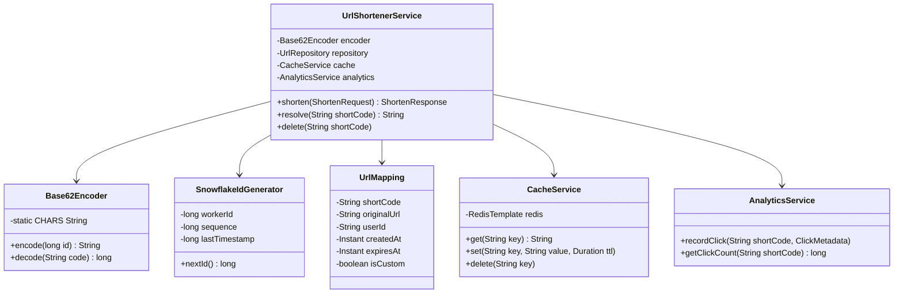
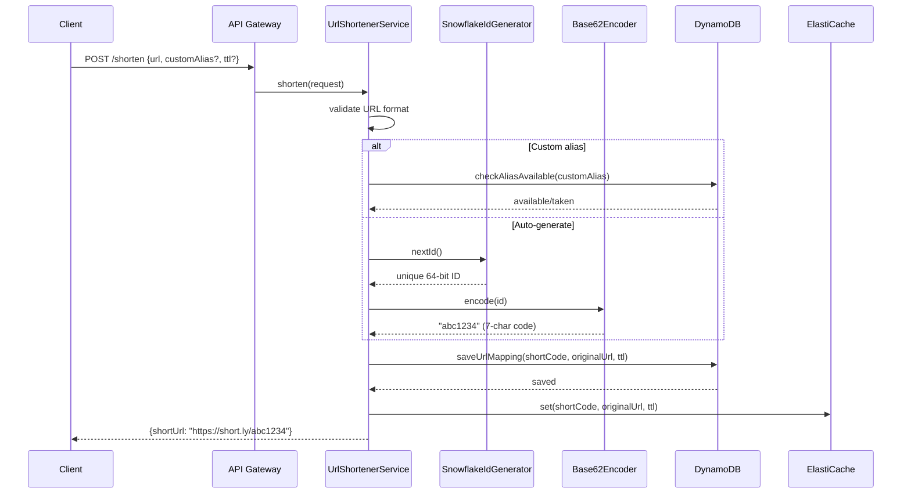
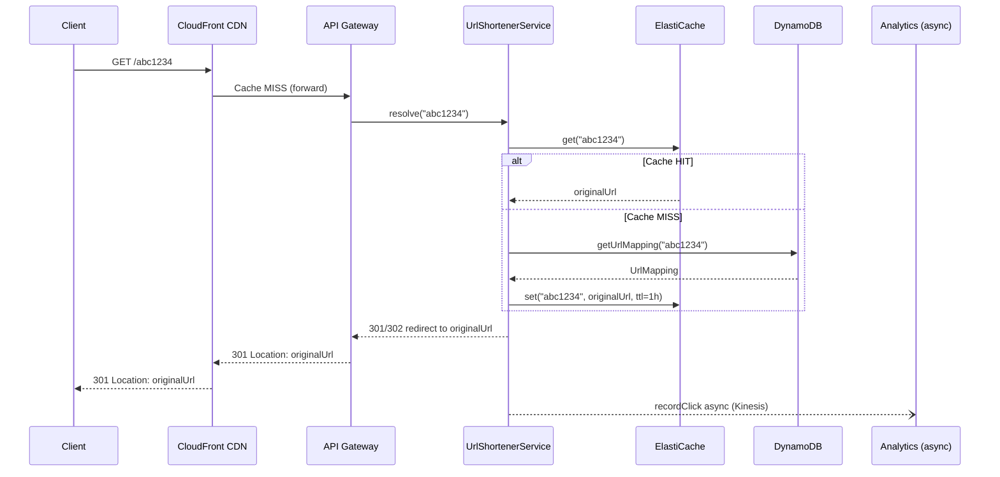
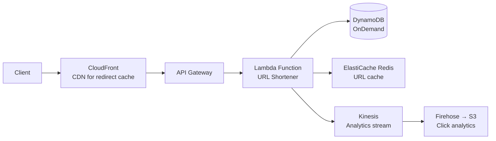

# URL Shortener — Low Level Design

> **References:** [System Design Interview Vol 1 - Alex Xu](https://www.amazon.com/System-Design-Interview-insiders-Second/dp/B08CMF2CQF) | [TinyURL Architecture](https://systemdesign.one/url-shortener-system-design/) | [GeeksForGeeks](https://www.geeksforgeeks.org/system-design-url-shortening-service/)

---

## Requirements

### Functional
- Shorten a long URL to a short code (e.g., `https://short.ly/abc123`)
- Redirect short URL to original with < 10ms p99
- Support custom aliases (e.g., `short.ly/my-promo`)
- URL expiration (optional TTL)
- Basic analytics (click count, referrer)

### Non-Functional
- 100M URLs stored
- 100:1 read:write ratio → 100 writes/sec, 10,000 reads/sec
- High availability: 99.99%
- Short code: 7 characters → 62^7 = 3.5 trillion possible codes

---

## Capacity Estimation

```
Writes:  100 writes/sec × 86400 sec = 8.6M writes/day
Storage: 8.6M × 500 bytes (URL + metadata) = 4.3 GB/day
5-year:  4.3 GB × 365 × 5 = 7.8 TB

Reads:   10,000 reads/sec peak
Cache:   80% hit rate → 2,000 cache misses/sec to DB
Bandwidth: 10,000 × 100 bytes = 1 MB/sec outbound
```

---

## Class Diagram



---

## Sequence Diagram: Shorten URL



---

## Sequence Diagram: Redirect



---

## Java Implementation

### Snowflake ID Generator

```java
@Component
public class SnowflakeIdGenerator {
    
    private static final long EPOCH = 1704067200000L; // 2024-01-01
    private static final long WORKER_ID_BITS = 5L;
    private static final long SEQUENCE_BITS = 12L;
    private static final long MAX_WORKER_ID = ~(-1L << WORKER_ID_BITS); // 31
    private static final long MAX_SEQUENCE = ~(-1L << SEQUENCE_BITS);   // 4095
    private static final long WORKER_ID_SHIFT = SEQUENCE_BITS;
    private static final long TIMESTAMP_SHIFT = SEQUENCE_BITS + WORKER_ID_BITS;
    
    private final long workerId;
    private long sequence = 0L;
    private long lastTimestamp = -1L;
    
    public SnowflakeIdGenerator(@Value("${snowflake.worker-id:0}") long workerId) {
        if (workerId > MAX_WORKER_ID || workerId < 0)
            throw new IllegalArgumentException("Worker ID must be 0-" + MAX_WORKER_ID);
        this.workerId = workerId;
    }
    
    public synchronized long nextId() {
        long now = currentTime();
        if (now == lastTimestamp) {
            sequence = (sequence + 1) & MAX_SEQUENCE;
            if (sequence == 0) now = waitForNextMillis(lastTimestamp);
        } else {
            sequence = 0L;
        }
        lastTimestamp = now;
        return ((now - EPOCH) << TIMESTAMP_SHIFT)
             | (workerId << WORKER_ID_SHIFT)
             | sequence;
    }
    
    private long waitForNextMillis(long lastTs) {
        long ts = currentTime();
        while (ts <= lastTs) ts = currentTime();
        return ts;
    }
    
    private long currentTime() { return System.currentTimeMillis(); }
}
```

### Base62 Encoder

```java
@Component
public class Base62Encoder {
    
    private static final String CHARS = 
        "0123456789ABCDEFGHIJKLMNOPQRSTUVWXYZabcdefghijklmnopqrstuvwxyz";
    private static final int BASE = 62;
    
    public String encode(long id) {
        if (id == 0) return String.valueOf(CHARS.charAt(0));
        StringBuilder sb = new StringBuilder();
        while (id > 0) {
            sb.append(CHARS.charAt((int)(id % BASE)));
            id /= BASE;
        }
        return sb.reverse().toString();
    }
    
    public long decode(String code) {
        long result = 0;
        for (char c : code.toCharArray()) {
            result = result * BASE + CHARS.indexOf(c);
        }
        return result;
    }
}
```

### URL Shortener Service

```java
@Service
public class UrlShortenerService {
    
    private final SnowflakeIdGenerator idGenerator;
    private final Base62Encoder encoder;
    private final DynamoDbClient dynamoDb;
    private final RedisTemplate<String, String> redis;
    
    private static final String TABLE = "UrlMappings";
    private static final Duration CACHE_TTL = Duration.ofHours(1);
    
    public ShortenResponse shorten(ShortenRequest request) {
        validateUrl(request.getOriginalUrl());
        
        String shortCode;
        if (request.getCustomAlias() != null) {
            validateAlias(request.getCustomAlias());
            shortCode = request.getCustomAlias();
        } else {
            shortCode = encoder.encode(idGenerator.nextId());
        }
        
        Instant expiresAt = request.getTtlSeconds() != null
            ? Instant.now().plusSeconds(request.getTtlSeconds())
            : null;
        
        // Save to DynamoDB with conditional write (prevent duplicates)
        try {
            dynamoDb.putItem(PutItemRequest.builder()
                .tableName(TABLE)
                .item(buildItem(shortCode, request.getOriginalUrl(), expiresAt))
                .conditionExpression("attribute_not_exists(shortCode)")
                .build());
        } catch (ConditionalCheckFailedException e) {
            throw new AliasAlreadyExistsException("Short code already taken: " + shortCode);
        }
        
        // Warm cache
        redis.opsForValue().set("url:" + shortCode, request.getOriginalUrl(), CACHE_TTL);
        
        return ShortenResponse.builder()
            .shortUrl("https://short.ly/" + shortCode)
            .shortCode(shortCode)
            .expiresAt(expiresAt)
            .build();
    }
    
    public String resolve(String shortCode) {
        // 1. Check cache
        String cached = redis.opsForValue().get("url:" + shortCode);
        if (cached != null) return cached;
        
        // 2. Cache miss → DB
        GetItemResponse response = dynamoDb.getItem(GetItemRequest.builder()
            .tableName(TABLE)
            .key(Map.of("shortCode", AttributeValue.builder().s(shortCode).build()))
            .build());
        
        if (response.item().isEmpty()) throw new UrlNotFoundException(shortCode);
        
        String originalUrl = response.item().get("originalUrl").s();
        
        // Check TTL
        String expiresAtStr = response.item().containsKey("expiresAt")
            ? response.item().get("expiresAt").s() : null;
        if (expiresAtStr != null && Instant.parse(expiresAtStr).isBefore(Instant.now())) {
            throw new UrlExpiredException(shortCode);
        }
        
        // Populate cache
        redis.opsForValue().set("url:" + shortCode, originalUrl, CACHE_TTL);
        return originalUrl;
    }
    
    private void validateUrl(String url) {
        if (!url.startsWith("http://") && !url.startsWith("https://"))
            throw new InvalidUrlException("URL must start with http:// or https://");
    }
}
```

---

## Data Model

**DynamoDB Table: UrlMappings**
| Attribute | Type | Notes |
|-----------|------|-------|
| shortCode (PK) | String | 7-char Base62 code |
| originalUrl | String | The long URL |
| userId | String | Creator's user ID |
| createdAt | String | ISO-8601 timestamp |
| expiresAt | String | Optional TTL |
| clickCount | Number | Approximate (from analytics) |
| isCustom | Boolean | Custom alias flag |

**DynamoDB TTL:** Set `expiresAt` as TTL attribute → automatic cleanup.

---

## AWS Deployment



---

## Interview Discussion

**Scale to 100 billion URLs:**
- DynamoDB auto-partitions — no schema change needed
- Use S3 + Glacier for archival of expired URLs
- Consider multi-region DynamoDB Global Tables if global

**Preventing collision:**
- Snowflake IDs are globally unique (no collision possible)
- For custom aliases: conditional DynamoDB write ensures uniqueness

**301 vs 302 redirect:**
- 301 Permanent: browser caches → reduces server load but can't track analytics
- 302 Temporary: no browser cache → every redirect hits server → better analytics
- Use 301 for production performance; 302 for analytics-critical use cases

---

## Interview Q&A

**Q1: How do you prevent the same long URL from getting multiple short codes?**
> Option 1: Hash the long URL and use as a lookup key (GSI on originalUrl hash). Check if exists before generating. Option 2: Accept duplicates — same URL can have multiple short codes. Option 3: Use a bloom filter to quickly check "probably already shortened" before DB lookup.

**Q2: How would you handle custom vanity URLs?**
> Accept custom alias in the request. Validate: alphanumeric + hyphens only, min 3 chars, not a reserved word (api, admin, www). DynamoDB conditional write with `attribute_not_exists(shortCode)` atomically prevents duplicates. Charge premium for custom aliases (business model).

**Q3: How do you scale to 10 million redirects/sec?**
> (1) CloudFront CDN: cache 301 redirects at edge — most traffic never hits origin. (2) ElastiCache Redis: in-memory lookup < 1ms. (3) DynamoDB OnDemand: auto-scales reads. (4) Global Accelerator for multi-region. (5) Lambda concurrency = auto-scales.
