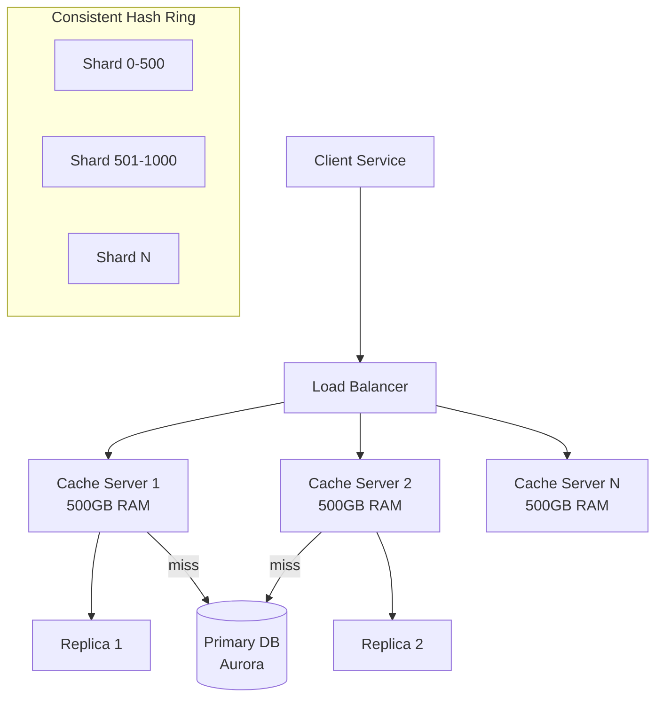
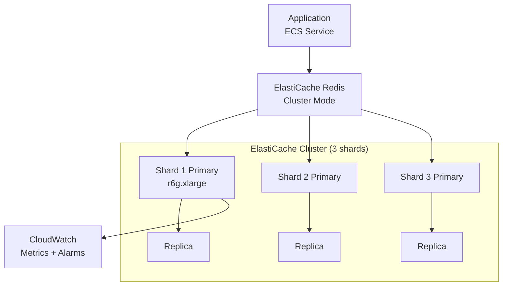

# Design a Distributed Cache

> **References:** [Redis Architecture](https://redis.io/docs/management/replication/) | [Memcached vs Redis](https://aws.amazon.com/elasticache/redis-vs-memcached/) | [Caching Strategies](https://codeahoy.com/2017/08/11/caching-strategies-and-how-to-choose-the-right-one/)

---

## Clarifying Questions

1. What data is being cached? (DB query results, session data, computed objects)
2. What is the target hit ratio? (>95%)
3. How much data? (10TB hot data)
4. What eviction policy? (LRU for most use cases)
5. Consistency requirements? (eventual OK, or invalidation on write?)
6. What throughput? (1M reads/sec, 100K writes/sec)

---

## Capacity Estimation

```
Hot data: 10TB
Cache hit ratio target: 95%

At 1M reads/sec, 95% hit rate:
- Cache reads: 950,000/sec
- DB reads: 50,000/sec (only misses)

Redis memory: 10TB hot data
  - Redis single node max: ~500GB RAM
  - Nodes needed: 10TB / 500GB = 20 nodes
  - With replication: 20 primary + 20 replica = 40 nodes

Throughput per node: 50K ops/sec (conservative for Redis cluster)
Nodes for 1M reads: 1M / 50K = 20 nodes ✓ (matches storage needs)
```

---

## Architecture



---

## Hot Key Problem & Solutions

```java
@Service
public class HotKeyAwareCache {

    private final RedisTemplate<String, Object> redis;
    // Local micro-cache for extremely hot keys (avoid Redis bottleneck)
    private final Cache<String, Object> localMicroCache = 
        Caffeine.newBuilder()
            .maximumSize(1000)
            .expireAfterWrite(Duration.ofSeconds(5)) // Very short TTL
            .build();
    private final HotKeyDetector hotKeyDetector;

    public Object get(String key) {
        // 1. Check local micro-cache (hottest keys)
        Object localValue = localMicroCache.getIfPresent(key);
        if (localValue != null) return localValue;
        
        // 2. Check Redis
        Object redisValue = redis.opsForValue().get(key);
        if (redisValue != null) {
            // Track access frequency
            if (hotKeyDetector.isHot(key)) {
                localMicroCache.put(key, redisValue); // Promote to local cache
            }
            return redisValue;
        }
        
        return null; // Cache miss
    }

    public void set(String key, Object value, Duration ttl) {
        // Invalidate local micro-cache on write
        localMicroCache.invalidate(key);
        redis.opsForValue().set(key, value, ttl);
    }
}

@Service
public class HotKeyDetector {
    // Count key access frequency using count-min sketch (memory-efficient)
    private final CountMinSketch sketch = new CountMinSketch(1000, 5);
    private static final long HOT_THRESHOLD = 10_000; // > 10K/min = hot

    public boolean isHot(String key) {
        sketch.add(key, 1);
        return sketch.estimateCount(key) > HOT_THRESHOLD;
    }
}
```

---

## Cache Stampede Prevention

```java
@Service
public class StampedePreventingCache {

    private final RedisTemplate<String, Object> redis;
    private final Map<String, CompletableFuture<Object>> inflightLoads = 
        new ConcurrentHashMap<>();
    private final ExecutorService loadExecutor = Executors.newCachedThreadPool();

    // Request coalescing: only one thread loads from DB per key
    public Object getWithCoalescing(String key, Supplier<Object> loader, Duration ttl) {
        Object cached = redis.opsForValue().get(key);
        if (cached != null) return cached;
        
        // Use computeIfAbsent to ensure only one inflight load per key
        CompletableFuture<Object> future = inflightLoads.computeIfAbsent(key, k -> {
            CompletableFuture<Object> f = CompletableFuture.supplyAsync(() -> {
                Object value = loader.get();
                redis.opsForValue().set(k, value, ttl);
                return value;
            }, loadExecutor);
            
            f.whenComplete((v, ex) -> inflightLoads.remove(k)); // Cleanup
            return f;
        });
        
        try {
            return future.get(3, TimeUnit.SECONDS);
        } catch (Exception e) {
            return loader.get(); // Fallback: load directly
        }
    }
}
```

---

## Caching Strategies

| Strategy | How | Pros | Cons | AWS |
|---------|-----|------|------|-----|
| Cache-Aside | App checks cache, loads DB on miss, warms cache | Simple, lazy | Cache-cold start, thundering herd | ElastiCache + any DB |
| Write-Through | Write to cache + DB together | No stale data | Slow writes, unused cache entries | ElastiCache |
| Write-Behind | Write to cache immediately, async to DB | Fast writes | Risk of data loss on crash | ElastiCache + SQS |
| Read-Through | Cache fetches from DB on miss automatically | Less app code | Less flexible | DAX for DynamoDB |
| Refresh-Ahead | Pre-populate cache before TTL expires | No cold starts | Fetches data that may not be read | Custom + Lambda |

---

## AWS ElastiCache Design



**Key ElastiCache settings:**
- `maxmemory-policy: allkeys-lru` (evict LRU keys when full)
- `appendonly: no` (performance over durability for cache)
- Enable encryption in transit + at rest
- Multi-AZ with Auto-Failover

---

## Monitoring & Alerting

| Metric | Alert |
|--------|-------|
| Cache hit rate | < 90% → investigate evictions |
| Evictions | > 1000/sec → undersized cache |
| Memory usage | > 80% → add nodes |
| CPU utilization | > 70% → scale out |
| Connection count | > 60K → connection pooling issue |
| Replication lag | > 100ms → network issue |

---

## Interview Q&A

**Q1: What causes cache stampede and how do you prevent it?**
> Cache stampede (thundering herd): a hot key expires, and hundreds of concurrent requests all find a cache miss simultaneously, all querying the DB at once. Prevention: (1) Probabilistic early expiration: randomly refresh hot keys before they expire. (2) Request coalescing: only one goroutine/thread loads from DB, others wait for its result. (3) Mutex lock in Redis: SETNX before DB query, others wait. (4) Staggered TTLs: add random jitter (TTL = base ± random(10%)).

**Q2: When would you choose Redis over Memcached?**
> Redis: persistence (RDB/AOF snapshots), data structures (sorted sets, streams, geo), pub/sub messaging, transactions (MULTI/EXEC), Lua scripting, clustering. Memcached: simpler key-value, multi-threaded (better single-node throughput), no persistence. Choose Redis when you need: leaderboards (sorted sets), session storage with TTL, real-time analytics, pub/sub, or geospatial queries.

**Q3: How do you handle cache invalidation in a microservices architecture?**
> Event-driven invalidation: when a service updates an entity, it publishes an "EntityUpdated" event to SNS/SQS. All services with cached versions of that entity subscribe and delete their cache entries. Use fanout (SNS → SQS per service). Tag-based invalidation: group related cache entries by tags, invalidate entire tag group. Version-based: include version in cache key ("product:v5:123") — increment version on update, old keys expire naturally via TTL.
