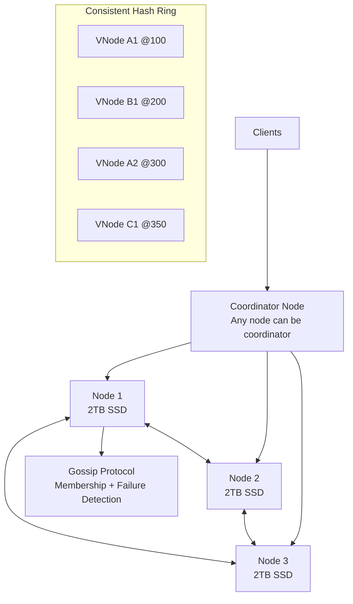
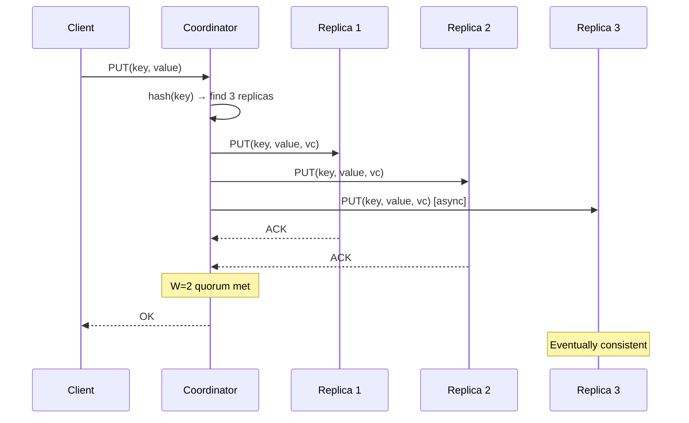
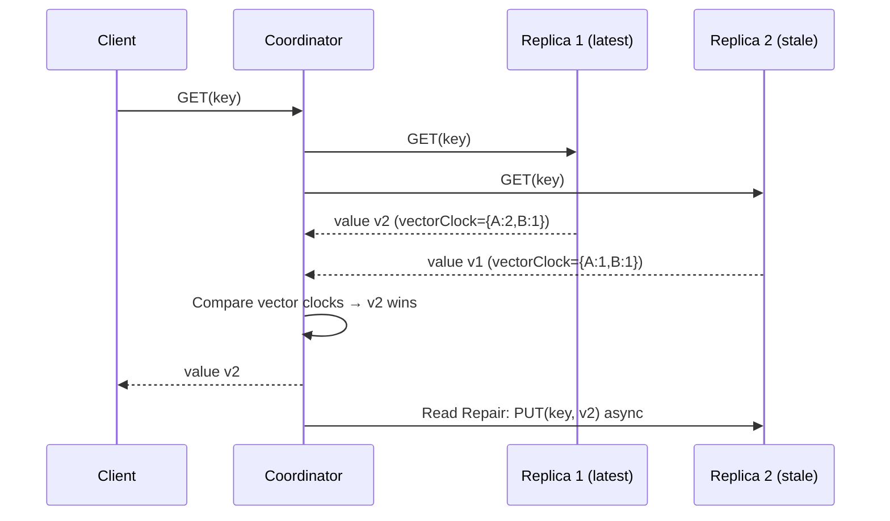

# Design a Distributed Key-Value Store

> **References:** [Amazon Dynamo Paper (2007)](https://www.allthingsdistributed.com/files/amazon-dynamo-sosp2007.pdf) | [Cassandra Architecture](https://cassandra.apache.org/doc/latest/cassandra/architecture/overview.html) | [DDIA Ch 6](https://dataintensive.net/)

---

## Clarifying Questions

1. What is the target scale? (10B keys, 1KB avg value)
2. What consistency level? (eventual OK, or strong required?)
3. Single-region or multi-region?
4. What are the read/write ratios? (100K reads/sec, 10K writes/sec)
5. What operations are needed? (GET, PUT, DELETE, range scan?)
6. What are availability and durability requirements?

---

## Capacity Estimation

```
Keys: 10B
Avg value size: 1KB
Total data: 10B × 1KB = 10TB

Writes: 10,000/sec
Reads: 100,000/sec (10:1 read-heavy)

Replication factor: 3 (each key stored on 3 nodes)
Total storage needed: 10TB × 3 = 30TB

Nodes (with 2TB SSD each): 30TB / 2TB = 15 nodes
Ring nodes with 150 virtual nodes each = good distribution

Bandwidth:
Write: 10,000 × 1KB = 10MB/sec ingress
Read: 100,000 × 1KB = 100MB/sec egress
```

---

## Architecture Diagram



---

## Core Design Decisions

### Partitioning: Consistent Hashing with Virtual Nodes
- 150 virtual nodes per physical node
- Key → SHA-256 hash → map to ring position → find next N nodes clockwise
- Adding/removing nodes moves only 1/N of keys

### Replication: W + R > N Quorum
```
N = 3 (replication factor)
W = 2 (write quorum)
R = 2 (read quorum)
W + R = 4 > N = 3 → always read at least one node that has latest write
```

### Conflict Resolution: Vector Clocks
```java
// Each value has a vector clock for conflict detection
public class VersionedValue {
    private final byte[] data;
    private final Map<String, Long> vectorClock; // {nodeId: counter}
    
    // If neither clock dominates the other → concurrent write = conflict
    public ConflictStatus compareWith(VersionedValue other) {
        boolean thisDominates = true, otherDominates = true;
        
        Set<String> allNodes = new HashSet<>(vectorClock.keySet());
        allNodes.addAll(other.vectorClock.keySet());
        
        for (String node : allNodes) {
            long thisCounter = vectorClock.getOrDefault(node, 0L);
            long otherCounter = other.vectorClock.getOrDefault(node, 0L);
            if (thisCounter > otherCounter) otherDominates = false;
            if (thisCounter < otherCounter) thisDominates = false;
        }
        
        if (thisDominates) return ConflictStatus.THIS_WINS;
        if (otherDominates) return ConflictStatus.OTHER_WINS;
        return ConflictStatus.CONCURRENT; // Application must resolve
    }
}
```

---

## Data Model

```
Key-Value pairs with metadata:
{
  "key": "user:123:profile",
  "value": <bytes>,
  "vectorClock": {"nodeA": 5, "nodeB": 3},
  "timestamp": 1704067200000,
  "ttl": null
}

Storage: SSTable format (LSM-Tree, like Cassandra/RocksDB)
- Immutable SSTables sorted by key
- MemTable (in-memory write buffer)
- Compaction merges SSTables periodically
- Bloom filter per SSTable to skip non-existent keys
```

---

## Write Path



---

## Read Path + Read Repair



---

## Failure Recovery

### Hinted Handoff
When a replica is temporarily down, coordinator writes to a substitute node with a "hint" (intended recipient). When the downed node recovers, hints are delivered.

### Anti-Entropy with Merkle Trees
Background process periodically compares Merkle trees between replicas to detect and sync inconsistencies.

```
Merkle tree: 
- Leaf nodes = hashes of key-value ranges
- Internal nodes = hash of children
- Compare root hashes → if equal, in sync
- If different, recurse down → find the mismatched ranges → sync only those
```

---

## Caching Strategy
- Bloom filter per SSTable: O(1) check if a key doesn't exist in an SSTable (avoid disk reads for misses)
- Row cache: in-memory cache for hot keys (most recently read)
- Partition cache: cache partition summary to avoid scanning all SSTables

---

## Monitoring & Alerting

| Metric | Alert Threshold |
|--------|----------------|
| Read latency p99 | > 10ms |
| Write latency p99 | > 20ms |
| Quorum failures | > 0.1% |
| Replication lag | > 5s |
| Node disk usage | > 80% |
| Gossip divergence | Any |

---

## AWS Design

**Use DynamoDB as the managed equivalent:**
```
DynamoDB provides all of this out-of-the-box:
- Consistent hashing + auto-partitioning
- Multi-AZ replication (3 replicas)
- Eventual + strongly consistent reads
- Automatic scaling
- Point-in-time recovery (PITR)

For a custom KV store build:
- EC2 with NVMe SSD in placement groups
- Application-level consistent hashing (Java impl)
- RocksDB or H2 as local storage engine
- Kinesis for anti-entropy event streaming
- Route 53 for client-side node discovery
```

---

## Interview Q&A

**Q1: How does consistent hashing help with node addition/removal?**
> Without consistent hashing, adding a node requires remapping ALL keys (modulo changes). With consistent hashing, adding a node only moves the keys between the new node and its predecessor on the ring (~1/N of all keys). This minimizes data movement and cache invalidation during scaling events.

**Q2: How do you handle concurrent writes to the same key on different nodes?**
> Use vector clocks to detect concurrent writes. If VC(write1) < VC(write2), write2 wins (happened after). If neither dominates, they're concurrent → conflict. Application-level resolution: last-write-wins (timestamp-based, risk of clock skew), merge (add both to a set), or present conflict to caller (Riak's approach). DynamoDB Global Tables uses LWW.

**Q3: What is the read repair mechanism?**
> During a quorum read, the coordinator contacts R replicas and compares their responses. If replicas diverge (different vector clocks), the coordinator takes the latest version and asynchronously updates the stale replicas. This "repairs" divergence lazily without a dedicated background process, at the cost of slightly higher read latency when repairs occur.
