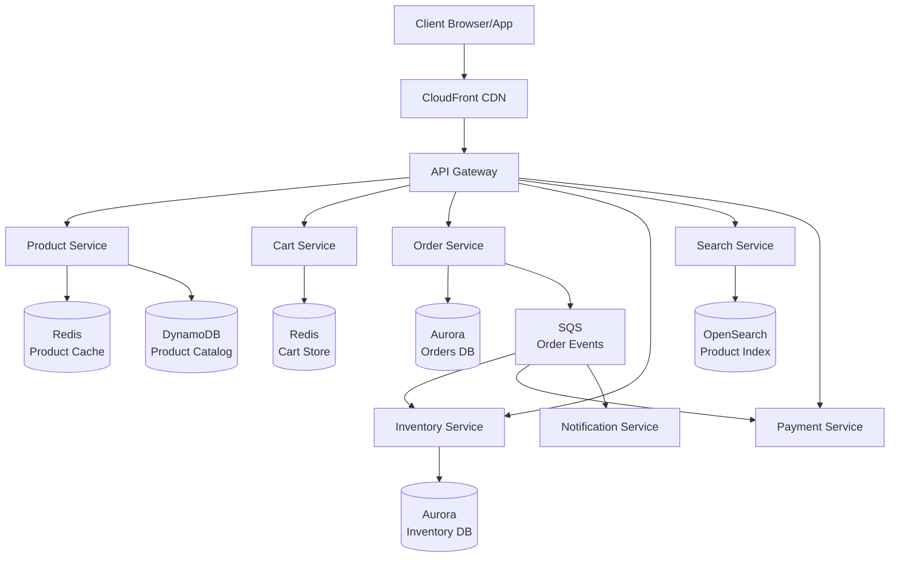

# Design an E-commerce Platform

> **References:** [Amazon Architecture](https://highscalability.com/amazon-architecture/) | [Shopify Engineering](https://shopify.engineering/) | [Flash Sale Architecture](https://medium.com/@narengowda/system-design-for-a-flash-sale-e-commerce-platform-3daa8e3c5523)

---

## Clarifying Questions

1. Scale? (10M products, 1M orders/day, Black Friday 10× spike)
2. Features? (catalog, search, cart, checkout, inventory, payments)
3. Global? (multi-region with data residency)
4. Flash sales? (yes, millions of users for a single product)

---

## Capacity Estimation

```
Products: 10M
Daily orders: 1M
Peak orders/sec: 1M / 86400 × 10x (BF) = 115 orders/sec peak

Page views/day: 100M
Peak QPS: 100M / 86400 × 5x peak = 5,800 QPS

Catalog reads: 5,800 QPS × 5 product reads/page = 29,000 reads/sec
With 95% cache hit: 1,450 DB reads/sec

Inventory updates: 1M orders × avg 3 items = 3M inventory updates/day = 35/sec
```

---

## Architecture



---

## Product Catalog Service

```java
@Service
public class ProductService {

    private final DynamoDbClient dynamoDb;
    private final RedisTemplate<String, String> redis;
    private final OpenSearchClient openSearch;
    private static final Duration CACHE_TTL = Duration.ofMinutes(30);

    public Product getProduct(String productId) {
        // L1: Redis cache
        String cached = redis.opsForValue().get("product:" + productId);
        if (cached != null) return deserialize(cached, Product.class);
        
        // L2: DynamoDB
        GetItemResponse response = dynamoDb.getItem(GetItemRequest.builder()
            .tableName("Products")
            .key(Map.of("PK", str("PRODUCT#" + productId)))
            .build());
        
        if (response.item().isEmpty()) throw new ProductNotFoundException(productId);
        
        Product product = mapToProduct(response.item());
        redis.opsForValue().set("product:" + productId, serialize(product), CACHE_TTL);
        
        return product;
    }
    
    // Warm cache on product update
    @EventListener
    public void onProductUpdated(ProductUpdatedEvent event) {
        // Invalidate cache immediately
        redis.delete("product:" + event.getProductId());
        // Update OpenSearch index
        openSearch.index(i -> i.index("products").id(event.getProductId())
            .document(event.getProduct()));
    }
}
```

---

## Cart Service (Redis-Based)

```java
@Service
public class CartService {

    private final RedisTemplate<String, Object> redis;
    private final ProductService productService;
    
    private String cartKey(String userId) { return "cart:" + userId; }

    public Cart addToCart(String userId, String productId, int quantity) {
        Product product = productService.getProduct(productId);
        
        // Check inventory snapshot (soft reservation, not hard lock)
        if (!inventoryService.hasStock(productId, quantity)) {
            throw new OutOfStockException(productId);
        }
        
        // Cart stored as Redis hash: field = productId, value = CartItem JSON
        CartItem item = CartItem.builder()
            .productId(productId)
            .name(product.getName())
            .price(product.getPrice())
            .quantity(quantity)
            .addedAt(Instant.now())
            .build();
        
        redis.opsForHash().put(cartKey(userId), productId, serialize(item));
        redis.expire(cartKey(userId), Duration.ofDays(30)); // Cart TTL
        
        return getCart(userId);
    }

    public Cart getCart(String userId) {
        Map<Object, Object> items = redis.opsForHash().entries(cartKey(userId));
        List<CartItem> cartItems = items.values().stream()
            .map(v -> deserialize((String) v, CartItem.class))
            .toList();
        
        BigDecimal total = cartItems.stream()
            .map(i -> i.getPrice().multiply(BigDecimal.valueOf(i.getQuantity())))
            .reduce(BigDecimal.ZERO, BigDecimal::add);
        
        return new Cart(userId, cartItems, total);
    }
}
```

---

## Inventory Service: Optimistic Locking

```java
@Service
public class InventoryService {

    private final JdbcTemplate jdbc;

    // Optimistic locking: uses version number to prevent overselling
    @Transactional
    public boolean reserveInventory(String productId, int quantity) {
        // Read current stock with version
        InventoryRecord record = jdbc.queryForObject(
            "SELECT stock_count, version FROM inventory WHERE product_id = ?",
            (rs, row) -> new InventoryRecord(rs.getInt("stock_count"), rs.getLong("version")),
            productId
        );
        
        if (record.getStockCount() < quantity) {
            return false; // Insufficient stock
        }
        
        // Conditional update: only succeeds if version unchanged
        int rowsUpdated = jdbc.update(
            "UPDATE inventory SET stock_count = stock_count - ?, version = version + 1 " +
            "WHERE product_id = ? AND version = ? AND stock_count >= ?",
            quantity, productId, record.getVersion(), quantity
        );
        
        if (rowsUpdated == 0) {
            // Another transaction modified inventory — retry
            throw new OptimisticLockException("Inventory modified concurrently, retry");
        }
        
        return true;
    }
}
```

---

## Flash Sale Design

Flash sales (e.g., 100K users competing for 1000 units) require special handling:

```java
@Service
public class FlashSaleService {

    private final RedisTemplate<String, String> redis;
    private final SqsClient sqsClient;

    // Pre-populate atomic counter in Redis
    public void initializeFlashSale(String productId, int totalStock) {
        redis.opsForValue().set("flash:stock:" + productId, String.valueOf(totalStock));
        redis.expire("flash:stock:" + productId, Duration.ofHours(1));
    }

    // Phase 1: Atomic stock reservation (Redis, not DB)
    public FlashSaleResult tryReserve(String userId, String productId, int quantity) {
        // Lua script: atomic check-and-decrement
        String script = """
            local stock = tonumber(redis.call('GET', KEYS[1]))
            if stock == nil or stock < tonumber(ARGV[1]) then
                return -1
            end
            return redis.call('DECRBY', KEYS[1], ARGV[1])
            """;
        
        Long remaining = redis.execute(
            RedisScript.of(script, Long.class),
            List.of("flash:stock:" + productId),
            String.valueOf(quantity)
        );
        
        if (remaining == null || remaining < 0) {
            return FlashSaleResult.soldOut();
        }
        
        // Phase 2: Queue order for async processing (decouple from DB)
        String orderId = UUID.randomUUID().toString();
        sqsClient.sendMessage(SendMessageRequest.builder()
            .queueUrl(FLASH_SALE_QUEUE_URL)
            .messageBody(objectMapper.writeValueAsString(new FlashSaleOrder(
                orderId, userId, productId, quantity)))
            .messageGroupId(userId) // FIFO: one order per user
            .build());
        
        return FlashSaleResult.reserved(orderId, remaining);
    }
}
```

---

## AWS Architecture

| Component | AWS Service |
|-----------|------------|
| CDN | CloudFront (product images, static assets) |
| API | API Gateway + ECS Fargate |
| Product catalog | DynamoDB + ElastiCache Redis |
| Search | OpenSearch Service |
| Cart | ElastiCache Redis (hash per user) |
| Orders | Aurora PostgreSQL Multi-AZ |
| Inventory | Aurora PostgreSQL (ACID needed) |
| Flash sale counters | ElastiCache Redis atomic DECRBY |
| Order processing | SQS FIFO + Lambda |
| Notifications | SES (email), SNS (SMS/push) |
| Images | S3 + CloudFront |

---

## Interview Q&A

**Q1: How do you prevent overselling during a flash sale?**
> Three-layer defense: (1) Redis atomic DECRBY: pre-load stock in Redis, each purchase atomically decrements — if result < 0, reject. (2) DB optimistic locking: conditional UPDATE with version check, retry on conflict. (3) SQS FIFO queue: process orders serially per user (messageGroupId = userId), deduplication window prevents double submissions. The Redis layer handles 99% of load before anything reaches the DB.

**Q2: How do you design the cart for a user who is not logged in?**
> Use a guest session ID (cookie) as the cart key. Store in Redis with a 30-day TTL. When user logs in, merge the guest cart with their account cart (if both have the same item, take the higher quantity). Publish "CartMerged" event. If user logs in on a different device, they see their account cart (guest cart is separate until merge is triggered).

**Q3: How would you handle Black Friday 10× traffic spike?**
> Pre-warm: (1) Load test 2 weeks before. (2) Pre-scale ECS services, RDS read replicas, and ElastiCache nodes the day before. (3) Pre-warm CloudFront cache by crawling popular product pages. (4) Pre-populate Redis with top 10K products. (5) Enable Aurora auto-scaling ACUs. (6) Put non-critical writes on SQS (async). (7) Circuit breakers for non-essential features (recommendations, personalization). (8) Degrade gracefully: show cached data when DB is slow.
