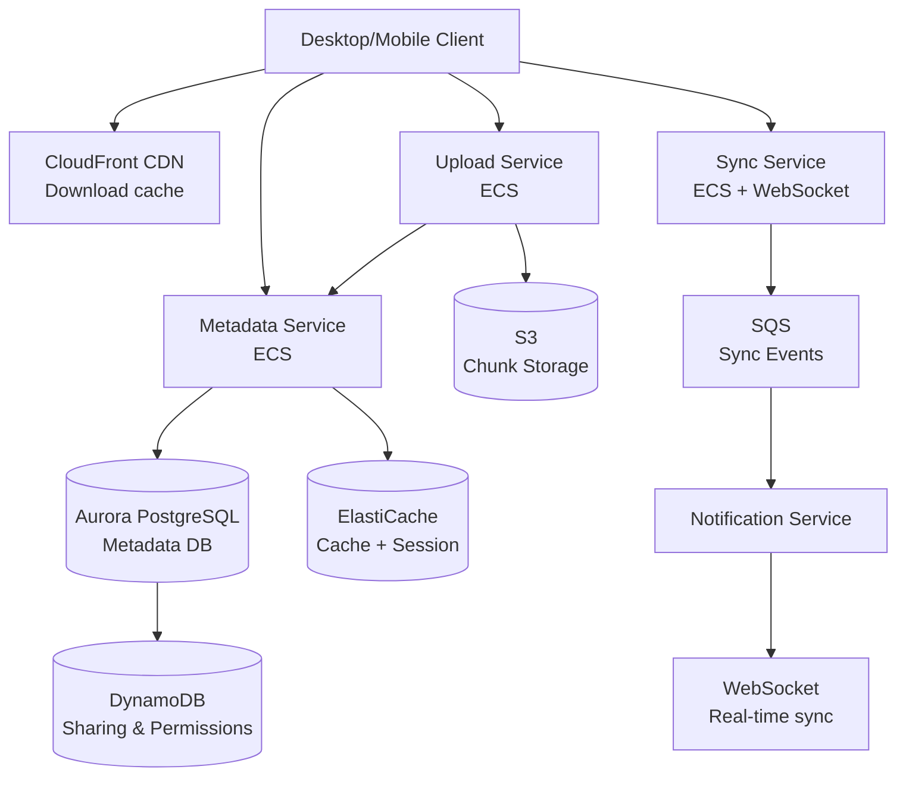

# Design a Global File Storage System (Dropbox / Google Drive)

> **References:** [Dropbox Architecture](https://dropbox.tech/infrastructure) | [GeeksForGeeks - Dropbox Design](https://www.geeksforgeeks.org/design-dropbox-a-system-design-interview-question/) | [Google Drive Architecture](https://cloud.google.com/architecture)

---

## Clarifying Questions

1. What features? (upload/download, sharing, sync, versioning, search)
2. Scale? (1B users, 10GB avg storage per user)
3. File size limits? (max 5GB per file)
4. Collaboration? (real-time co-editing or just sharing?)
5. Consistency requirements? (strong for sync, eventual for sharing)
6. Mobile + desktop clients? (yes, cross-platform sync)

---

## Capacity Estimation

```
Users: 1B total, 100M DAU
Avg storage: 10GB/user
Total storage: 1B × 10GB = 10EB (10 exabytes!)

Daily uploads: 100M users × 1 file/day = 100M uploads/day
Upload rate: 100M / 86400 ≈ 1,200 uploads/sec
Avg file size: 1MB → Bandwidth: 1,200 × 1MB = 1.2 GB/sec

Reads (downloads): 10:1 ratio → 12,000 downloads/sec
Delta sync: 100M files × avg delta 10KB = 1 TB/day of delta traffic
```

---

## Architecture Diagram



---

## Chunking & Deduplication

### Why Chunk Files?
- Large file uploads can resume (partial failure → retry failed chunks)
- Deduplication at chunk level (common chunks shared across users)
- Parallel upload of multiple chunks

### Chunk Strategy
```java
@Service
public class ChunkingService {

    private static final int CHUNK_SIZE_BYTES = 4 * 1024 * 1024; // 4MB chunks
    
    public List<FileChunk> chunkFile(File file) throws IOException {
        List<FileChunk> chunks = new ArrayList<>();
        MessageDigest sha256 = MessageDigest.getInstance("SHA-256");
        
        try (FileInputStream fis = new FileInputStream(file)) {
            byte[] buffer = new byte[CHUNK_SIZE_BYTES];
            int bytesRead;
            int index = 0;
            
            while ((bytesRead = fis.read(buffer)) != -1) {
                byte[] chunkData = Arrays.copyOf(buffer, bytesRead);
                
                // Content-addressable: hash IS the key
                String chunkHash = bytesToHex(sha256.digest(chunkData));
                
                chunks.add(FileChunk.builder()
                    .index(index++)
                    .hash(chunkHash)
                    .size(bytesRead)
                    .data(chunkData)
                    .build());
            }
        }
        return chunks;
    }
    
    // Calculate delta: only changed chunks need uploading
    public List<FileChunk> calculateDelta(List<String> existingHashes, 
                                          List<FileChunk> newChunks) {
        Set<String> existing = new HashSet<>(existingHashes);
        return newChunks.stream()
            .filter(chunk -> !existing.contains(chunk.getHash()))
            .toList(); // Only upload chunks not already in storage
    }
}
```

---

## Upload Flow

```java
@Service
public class UploadService {

    private final S3Client s3;
    private final MetadataService metadataService;
    private static final String BUCKET = "filestore-chunks";

    public UploadResult uploadFile(UploadRequest request) throws Exception {
        List<FileChunk> chunks = chunkingService.chunkFile(request.getFile());
        
        // 1. Check which chunks already exist (deduplication)
        List<String> existingHashes = metadataService.checkExistingChunks(
            chunks.stream().map(FileChunk::getHash).toList()
        );
        
        List<FileChunk> newChunks = chunkingService.calculateDelta(existingHashes, chunks);
        
        // 2. Get presigned URLs for new chunks (client uploads directly to S3)
        Map<String, String> presignedUrls = new HashMap<>();
        for (FileChunk chunk : newChunks) {
            String presignedUrl = generatePresignedUploadUrl(chunk.getHash());
            presignedUrls.put(chunk.getHash(), presignedUrl);
        }
        
        // 3. Client uploads chunks in parallel using presigned URLs
        // (Client-side: multiple parallel PUT requests to S3)
        
        // 4. Register file metadata after all chunks uploaded
        FileMetadata metadata = FileMetadata.builder()
            .fileId(UUID.randomUUID().toString())
            .userId(request.getUserId())
            .fileName(request.getFile().getName())
            .fileSize(request.getFile().length())
            .mimeType(detectMimeType(request.getFile()))
            .chunkHashes(chunks.stream().map(FileChunk::getHash).toList())
            .version(1)
            .createdAt(Instant.now())
            .build();
        
        metadataService.save(metadata);
        
        // 5. Notify sync clients
        publishSyncEvent(new FileUploadedEvent(request.getUserId(), metadata));
        
        return new UploadResult(metadata.getFileId(), 
                               chunks.size(), 
                               newChunks.size()); // Show dedup savings
    }
    
    private String generatePresignedUploadUrl(String chunkHash) {
        PutObjectPresignRequest presign = PutObjectPresignRequest.builder()
            .signatureDuration(Duration.ofMinutes(15))
            .putObjectRequest(PutObjectRequest.builder()
                .bucket(BUCKET)
                .key("chunks/" + chunkHash) // Content-addressable!
                .build())
            .build();
        
        return s3Presigner.presignPutObject(presign).url().toString();
    }
}
```

---

## Sync Design

```java
@Service
public class SyncService {

    private final MetadataService metadataService;
    private final WebSocketManager wsManager;

    // Client polls for changes since last sync cursor
    public SyncResponse getSyncDelta(String userId, String syncCursor) {
        Instant lastSync = decodeCursor(syncCursor);
        
        List<FileChange> changes = metadataService.getChangesSince(userId, lastSync);
        
        String newCursor = encodeCursor(Instant.now());
        return new SyncResponse(changes, newCursor, changes.size() > 0);
    }

    // Real-time: push changes via WebSocket when files change
    @SqsListener("sync-events-queue")
    public void handleSyncEvent(FileUploadedEvent event) {
        // Notify all devices of this user that a new file was uploaded
        List<String> userDevices = deviceRegistry.getDevices(event.getUserId());
        for (String deviceId : userDevices) {
            if (!deviceId.equals(event.getSourceDeviceId())) {
                wsManager.sendToDevice(deviceId, new SyncNotification(
                    "FILE_CHANGED",
                    event.getFileMetadata()
                ));
            }
        }
    }
}
```

---

## Data Model

**Aurora PostgreSQL: files**
```sql
CREATE TABLE files (
    file_id       UUID PRIMARY KEY,
    user_id       UUID NOT NULL,
    parent_folder_id UUID REFERENCES files(file_id),
    name          TEXT NOT NULL,
    file_size     BIGINT,
    mime_type     TEXT,
    is_folder     BOOLEAN DEFAULT false,
    is_deleted    BOOLEAN DEFAULT false,
    version       INT DEFAULT 1,
    created_at    TIMESTAMPTZ DEFAULT NOW(),
    updated_at    TIMESTAMPTZ DEFAULT NOW()
);

CREATE TABLE file_versions (
    version_id    UUID PRIMARY KEY,
    file_id       UUID REFERENCES files(file_id),
    version       INT,
    chunk_hashes  TEXT[],  -- ordered array of chunk SHA-256 hashes
    file_size     BIGINT,
    created_at    TIMESTAMPTZ DEFAULT NOW()
);

CREATE TABLE file_shares (
    share_id      UUID PRIMARY KEY,
    file_id       UUID REFERENCES files(file_id),
    shared_with   UUID,    -- user or group
    permission    TEXT CHECK (permission IN ('READ', 'WRITE', 'ADMIN')),
    share_link    TEXT UNIQUE, -- public share link
    expires_at    TIMESTAMPTZ
);
```

---

## AWS Deployment

| Component | AWS Service | Notes |
|-----------|------------|-------|
| Chunk storage | S3 Standard | Content-addressed by SHA-256 hash |
| Long-term archival | S3 Glacier | Files not accessed in 90 days |
| Metadata DB | Aurora PostgreSQL | Strong consistency needed |
| Cache | ElastiCache Redis | File listing cache, presigned URL cache |
| CDN | CloudFront | Downloads served from edge |
| Sync notifications | API Gateway WebSocket + SQS | Real-time + async |
| File processing | Lambda + S3 Events | Virus scan, thumbnail generation |
| Search | OpenSearch | Full-text file name search |

---

## Interview Q&A

**Q1: How does chunking enable efficient sync (delta sync)?**
> Each chunk is identified by its SHA-256 hash (content-addressable). When a file changes, only the modified chunks have different hashes. The client compares the chunk hashes of its local version with what's stored — only uploads chunks whose hashes differ. For a 1GB file where only 1 line changed: 1 chunk (4MB) uploads instead of 1GB. This is the "rsync-style" delta sync.

**Q2: How do you handle file deduplication across users?**
> Content-addressable storage: chunk hash = storage key. If User A and User B upload the same file (same content → same hash), S3 stores it once. The metadata table just records which hashes belong to which file. This can save 30-40% of storage. Important: permissions are at the metadata layer — both users can "own" the same chunks without seeing each other's data.

**Q3: How do you handle sync conflicts when the same file is edited on two devices offline?**
> Use version numbers: each file has a version, updated on every change. When syncing: (1) Check if local version == server version → no conflict, just sync. (2) If local version < server version AND local has changes → conflict. Resolution strategies: (a) "Copy-on-conflict" — create "file (conflicted copy)" alongside the original. (b) Three-way merge for text files. (c) Timestamp-based LWW for simplicity. Show conflict files to user.
