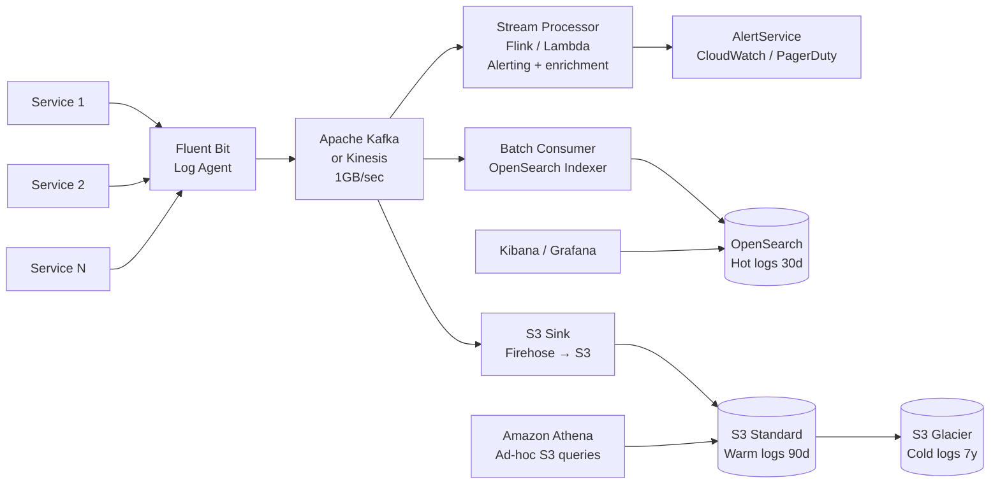

# Design a Large-Scale Log System

> **References:** [Elasticsearch Architecture](https://www.elastic.co/guide/en/elasticsearch/reference/current/scalability.html) | [Apache Kafka Docs](https://kafka.apache.org/documentation/) | [AWS OpenSearch](https://aws.amazon.com/opensearch-service/)

---

## Clarifying Questions

1. Log volume? (10K services, 1M events/sec)
2. Retention? (hot: 30 days, warm: 90 days, cold: 7 years)
3. Search requirements? (full-text search, structured queries, both)
4. Real-time alerts? (yes, within 30 seconds of anomaly)
5. Structured or unstructured logs? (structured JSON preferred)
6. Compliance? (SOC2, GDPR data masking)

---

## Capacity Estimation

```
Log events/sec: 1,000,000 (1M)
Avg log size: 1KB
Ingestion rate: 1M × 1KB = 1 GB/sec
Daily volume: 1 GB/sec × 86400 = 86 TB/day

30-day hot storage: 86 TB × 30 = 2.6 PB (OpenSearch)
90-day warm: 86 TB × 90 = 7.7 PB (S3 Standard)
7-year cold: 86 TB × 365 × 7 = 220 PB (S3 Glacier)

Kafka throughput: 1GB/sec → 10 partitions × 100MB/sec each
```

---

## Architecture



---

## Log Schema (Structured JSON)

```json
{
  "timestamp": "2024-01-15T10:30:00.123Z",
  "level": "ERROR",
  "service": "payment-service",
  "version": "2.3.1",
  "host": "i-1234567890abcdef0",
  "traceId": "4bf92f3577b34da6",
  "spanId": "00f067aa0ba902b7",
  "userId": "user-123",
  "requestId": "req-456",
  "message": "Payment failed: insufficient funds",
  "errorCode": "PAYMENT_DECLINED",
  "durationMs": 234,
  "httpStatus": 402,
  "environment": "production",
  "region": "us-east-1"
}
```

---

## Java: Structured Logging with Logback + JSON

```java
// logback-spring.xml
// <appender class="ch.qos.logback.core.ConsoleAppender">
//   <encoder class="net.logstash.logback.encoder.LogstashEncoder"/>
// </appender>

@Service
public class PaymentService {

    private static final Logger log = LoggerFactory.getLogger(PaymentService.class);

    public PaymentResult processPayment(PaymentRequest request) {
        long startTime = System.currentTimeMillis();
        
        try {
            PaymentResult result = doProcessPayment(request);
            
            log.info("Payment processed",
                kv("orderId", request.getOrderId()),
                kv("userId", request.getUserId()),
                kv("amount", request.getAmount()),
                kv("currency", request.getCurrency()),
                kv("durationMs", System.currentTimeMillis() - startTime),
                kv("status", "SUCCESS")
            );
            
            return result;
            
        } catch (PaymentDeclinedException e) {
            log.warn("Payment declined",
                kv("orderId", request.getOrderId()),
                kv("errorCode", e.getCode()),
                kv("durationMs", System.currentTimeMillis() - startTime),
                kv("status", "DECLINED")
            );
            throw e;
        } catch (Exception e) {
            log.error("Payment processing error",
                kv("orderId", request.getOrderId()),
                kv("errorClass", e.getClass().getName()),
                kv("errorMessage", e.getMessage()),
                kv("durationMs", System.currentTimeMillis() - startTime),
                kv("status", "ERROR"),
                e
            );
            throw e;
        }
    }
}
```

---

## Kinesis Firehose → OpenSearch Pipeline

```java
@Service
public class LogConsumerService {

    private final OpenSearchClient openSearch;
    private static final int BATCH_SIZE = 1000;
    private static final String LOG_INDEX_PREFIX = "logs-";

    @KafkaListener(topics = "application-logs", groupId = "log-indexer")
    public void consumeLogs(List<ConsumerRecord<String, String>> records) {
        // Batch index to OpenSearch for efficiency
        BulkRequest.Builder bulk = new BulkRequest.Builder();
        
        for (ConsumerRecord<String, String> record : records) {
            LogEvent event = objectMapper.readValue(record.value(), LogEvent.class);
            
            // Daily rolling index: logs-2024-01-15
            String indexName = LOG_INDEX_PREFIX + 
                event.getTimestamp().toString().substring(0, 10);
            
            bulk.operations(op -> op
                .index(idx -> idx
                    .index(indexName)
                    .document(event)
                )
            );
        }
        
        BulkResponse response = openSearch.bulk(bulk.build());
        if (response.errors()) {
            log.error("Bulk indexing errors: {}", countErrors(response));
        }
        
        log.info("Indexed {} log events", records.size());
    }
}
```

---

## Real-Time Alerting

```java
@Service
public class LogAlertingService {

    private final CloudWatchClient cloudWatch;
    private final SnsClient sns;
    
    // Sliding window error rate monitor
    private final Map<String, Deque<Long>> errorTimestamps = new ConcurrentHashMap<>();

    @KafkaListener(topics = "application-logs", groupId = "alerting")
    public void processForAlerts(LogEvent event) {
        if ("ERROR".equals(event.getLevel())) {
            checkErrorRate(event.getService());
        }
        
        // Specific pattern alerts
        if (event.getMessage().contains("OutOfMemoryError")) {
            sendAlert(AlertSeverity.CRITICAL, event.getService(), 
                "OOM Error detected on " + event.getHost());
        }
        
        // Latency alerts
        if (event.getDurationMs() != null && event.getDurationMs() > 5000) {
            publishMetric(event.getService() + ".slowRequests", 1.0);
        }
    }

    private void checkErrorRate(String service) {
        Deque<Long> errors = errorTimestamps.computeIfAbsent(service, 
            k -> new ArrayDeque<>());
        
        long now = System.currentTimeMillis();
        errors.addLast(now);
        
        // Remove errors older than 1 minute
        while (!errors.isEmpty() && errors.peekFirst() < now - 60_000) {
            errors.pollFirst();
        }
        
        // Alert if > 100 errors per minute
        if (errors.size() > 100) {
            sendAlert(AlertSeverity.HIGH, service,
                String.format("High error rate: %d errors/min", errors.size()));
        }
    }

    private void sendAlert(AlertSeverity severity, String service, String message) {
        sns.publish(PublishRequest.builder()
            .topicArn("arn:aws:sns:...:alerts")
            .subject("[" + severity + "] " + service)
            .message(message)
            .build());
    }
}
```

---

## Index Lifecycle Management (ILM)

```json
{
  "policy": {
    "phases": {
      "hot": {
        "min_age": "0ms",
        "actions": {
          "rollover": { "max_size": "50GB", "max_age": "1d" },
          "set_priority": { "priority": 100 }
        }
      },
      "warm": {
        "min_age": "7d",
        "actions": {
          "shrink": { "number_of_shards": 1 },
          "forcemerge": { "max_num_segments": 1 },
          "set_priority": { "priority": 50 }
        }
      },
      "cold": {
        "min_age": "30d",
        "actions": {
          "searchable_snapshot": { "snapshot_repository": "s3-repository" }
        }
      },
      "delete": {
        "min_age": "90d",
        "actions": { "delete": {} }
      }
    }
  }
}
```

---

## AWS Deployment

| Component | AWS Service | Notes |
|-----------|------------|-------|
| Log agents | ECS sidecar (Fluent Bit) | Per service, structured logs |
| Message queue | Kinesis Data Streams | 1GB/sec, 24h retention |
| Search | OpenSearch Service | Multi-AZ, 30-day hot |
| Long-term storage | S3 + Glacier | Lifecycle policies |
| Ad-hoc queries | Amazon Athena | Query S3 with SQL |
| Dashboards | CloudWatch dashboards + Grafana | |
| Alerts | CloudWatch Alarms + SNS | PagerDuty integration |
| Managed delivery | Kinesis Firehose | Auto-batch to S3/OpenSearch |

---

## Interview Q&A

**Q1: How do you search 90 days of log data efficiently?**
> Hot (0-30 days): OpenSearch index with full-text search and structured queries. Warm (30-90 days): S3 with Athena for SQL-based ad-hoc queries (cheaper, slower — seconds vs milliseconds). Cold (90 days+): S3 Glacier for compliance; use Glacier Select for sampling. Keep metadata index in OpenSearch pointing to S3 location for each log segment.

**Q2: How do you prevent log storms from overloading the pipeline?**
> (1) Kinesis/Kafka as buffer — absorbs spikes up to buffer capacity. (2) Rate limiting at the log agent (Fluent Bit rate limit plugin). (3) Log level filtering in production (WARN+ only unless debug mode). (4) Sampling for very high-volume services (log 1% of INFO, 100% of ERROR). (5) Backpressure: if Kinesis is full, log agents buffer locally (disk-backed).

**Q3: How do you correlate logs across services for a single request?**
> Distributed tracing: every request gets a `traceId` (UUID) generated at the API gateway. This is passed as a header (`X-Trace-Id`) through all downstream service calls. Each service includes `traceId` in every log line. Search in OpenSearch by traceId to see all log lines from all services for a single user request — the distributed trace reconstruction.
