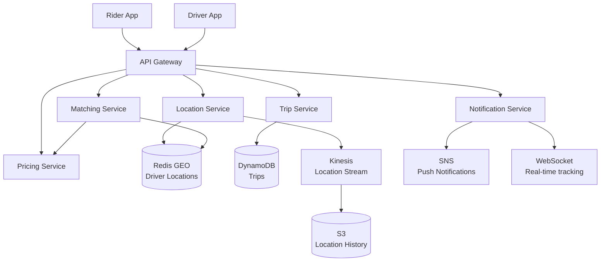

# Design a Ride-Sharing System (Uber/Lyft)

> **References:** [Uber Engineering Blog](https://eng.uber.com/) | [GeeksForGeeks - Uber Design](https://www.geeksforgeeks.org/system-design-of-uber-app-uber-system-design/) | [H3 Geospatial Indexing](https://eng.uber.com/h3/)

---

## Clarifying Questions

1. What features? (matching, pricing, trip tracking, payments, ratings)
2. How many drivers and riders? (500K active drivers, 5M daily rides)
3. Global or single-region? (start single-region, design for global)
4. Matching algorithm? (nearest available driver, or optimize ETA)
5. Real-time tracking granularity? (every 4 seconds)
6. Surge pricing? (yes, supply/demand based)

---

## Capacity Estimation

```
Rides/day: 5M
Peak rides/sec: 5M / 86400 × 5x peak factor ≈ 300 rides/sec

Active drivers (20% of 500K): 100K concurrent drivers
Location updates: 100K drivers × 1 update/4sec = 25K location updates/sec

Storage:
- Trips: 300/sec × 86400 × 365 = 9.5B trips/year
- Location history: 25K × 4 bytes × 86400 = 8.6GB/day
- Driver locations (current): 100K × 64 bytes = 6.4MB (fully in Redis)
```

---

## Architecture Diagram



---

## Location Service Design

### Geohashing with Redis GEO

```java
@Service
public class LocationService {

    private final RedisTemplate<String, String> redis;
    private static final String DRIVER_GEO_KEY = "drivers:geo";
    private static final double SEARCH_RADIUS_KM = 5.0;

    // Driver app sends location update every 4 seconds
    public void updateDriverLocation(String driverId, double lat, double lon, boolean isAvailable) {
        if (isAvailable) {
            // Update position in Redis GEO index
            redis.opsForGeo().add(DRIVER_GEO_KEY,
                new Point(lon, lat),  // Redis GEO uses lon,lat order
                driverId);
            
            // Set driver status in hash (expiry = 60s, client must refresh)
            redis.opsForHash().put("driver:status", driverId, "AVAILABLE");
            redis.expire("driver:status:" + driverId, Duration.ofSeconds(60));
        } else {
            // Driver offline or on trip — remove from available pool
            redis.opsForGeo().remove(DRIVER_GEO_KEY, driverId);
            redis.opsForHash().put("driver:status", driverId, "BUSY");
        }
        
        // Publish to Kinesis for location history
        publishLocationEvent(driverId, lat, lon);
    }

    // Find nearest N available drivers within radius
    public List<NearbyDriver> findNearbyDrivers(double riderLat, double riderLon) {
        GeoResults<RedisGeoCommands.GeoLocation<String>> results = redis.opsForGeo()
            .radius(DRIVER_GEO_KEY,
                new Circle(new Point(riderLon, riderLat), 
                           new Distance(SEARCH_RADIUS_KM, RedisGeoCommands.DistanceUnit.KILOMETERS)),
                RedisGeoCommands.GeoRadiusCommandArgs.newGeoRadiusArgs()
                    .includeDistance()
                    .includeCoordinates()
                    .sortAscending()   // Nearest first
                    .limit(10)         // Top 10 nearest
            );
        
        return results.getContent().stream()
            .map(r -> new NearbyDriver(
                r.getContent().getName(),
                r.getDistance().getValue(),
                r.getContent().getPoint()
            ))
            .toList();
    }
}
```

---

## Matching Service

```java
@Service
public class MatchingService {

    private final LocationService locationService;
    private final PricingService pricingService;
    private final TripService tripService;
    private final NotificationService notificationService;

    public MatchResult matchRiderToDriver(MatchRequest request) {
        // 1. Find nearby available drivers
        List<NearbyDriver> candidates = locationService.findNearbyDrivers(
            request.getRiderLat(), request.getRiderLon());
        
        if (candidates.isEmpty()) {
            return MatchResult.noDriversAvailable();
        }
        
        // 2. Rank by ETA (distance + traffic estimate)
        List<RankedDriver> ranked = candidates.stream()
            .map(d -> new RankedDriver(d, estimateETA(d, request)))
            .sorted(Comparator.comparingLong(RankedDriver::getEtaSeconds))
            .toList();
        
        // 3. Offer to top driver(s), wait for acceptance
        for (RankedDriver candidate : ranked) {
            DriverResponse response = offerTrip(candidate.getDriverId(), request);
            
            if (response.isAccepted()) {
                // 4. Create trip
                Trip trip = tripService.createTrip(
                    request.getRiderId(),
                    candidate.getDriverId(),
                    request.getPickupLocation(),
                    request.getDestination(),
                    pricingService.calculateFare(request, candidate)
                );
                
                // 5. Notify rider
                notificationService.notifyRider(request.getRiderId(),
                    "Driver " + candidate.getDriverName() + " is on the way! ETA: " +
                    candidate.getEtaSeconds() / 60 + " min");
                
                return MatchResult.matched(trip, candidate);
            }
        }
        
        return MatchResult.allDriversDeclined();
    }
    
    private DriverResponse offerTrip(String driverId, MatchRequest request) {
        // Push notification to driver app via WebSocket or APNS/FCM
        // Wait up to 15 seconds for response
        CompletableFuture<DriverResponse> responseFuture = 
            notificationService.sendTripOffer(driverId, request);
        
        try {
            return responseFuture.get(15, TimeUnit.SECONDS);
        } catch (TimeoutException e) {
            return DriverResponse.timeout();
        }
    }
}
```

---

## Surge Pricing Service

```java
@Service
public class PricingService {

    private final RedisTemplate<String, String> redis;
    
    // Calculate surge multiplier based on supply/demand in geohash cell
    public BigDecimal getSurgeMultiplier(String geohash) {
        // Count available drivers in geohash cell
        long availableDrivers = countAvailableDrivers(geohash);
        
        // Count pending ride requests in last 5 minutes
        long pendingRequests = countPendingRequests(geohash);
        
        if (availableDrivers == 0) return BigDecimal.valueOf(3.0); // Max surge
        
        double demandToSupplyRatio = (double) pendingRequests / availableDrivers;
        
        // Surge tiers
        if (demandToSupplyRatio < 1.0) return BigDecimal.ONE;          // 1.0x
        if (demandToSupplyRatio < 1.5) return BigDecimal.valueOf(1.5); // 1.5x
        if (demandToSupplyRatio < 2.0) return BigDecimal.valueOf(2.0); // 2.0x
        if (demandToSupplyRatio < 3.0) return BigDecimal.valueOf(2.5); // 2.5x
        return BigDecimal.valueOf(3.0);                                 // 3.0x max
    }
    
    public Fare calculateFare(MatchRequest request, RankedDriver driver) {
        BigDecimal baseFare = BigDecimal.valueOf(2.50);
        BigDecimal perMileRate = BigDecimal.valueOf(1.10);
        BigDecimal perMinuteRate = BigDecimal.valueOf(0.25);
        BigDecimal surgeMultiplier = getSurgeMultiplier(
            GeoHashEncoder.encode(request.getPickupLocation(), 5));
        
        double distanceMiles = calculateDistance(request.getPickupLocation(), request.getDestination());
        double durationMinutes = driver.getEtaSeconds() / 60.0 + estimateTripDuration(distanceMiles);
        
        BigDecimal fare = baseFare
            .add(perMileRate.multiply(BigDecimal.valueOf(distanceMiles)))
            .add(perMinuteRate.multiply(BigDecimal.valueOf(durationMinutes)))
            .multiply(surgeMultiplier);
        
        return new Fare(fare, surgeMultiplier);
    }
}
```

---

## Data Model

**DynamoDB: Trips**
| Attribute | Type | Notes |
|-----------|------|-------|
| PK | String | `TRIP#{tripId}` |
| SK | String | `METADATA` |
| riderId | String | |
| driverId | String | |
| status | String | REQUESTED, ACCEPTED, IN_PROGRESS, COMPLETED, CANCELLED |
| pickupLat/Lon | Number | |
| destLat/Lon | Number | |
| fare | Number | |
| surgeMultiplier | Number | |
| createdAt | String | |

---

## AWS Deployment

| Component | AWS Service |
|-----------|------------|
| API Gateway | API Gateway (REST + WebSocket) |
| Location Service | ECS (high-write throughput) |
| Driver locations | ElastiCache Redis (GEO commands) |
| Trip data | DynamoDB |
| Location history | Kinesis → S3 |
| Push notifications | SNS (FCM + APNs) |
| Real-time tracking | API Gateway WebSocket |
| Matching compute | ECS with auto-scaling |

---

## Failure Recovery

- **Driver goes offline mid-trip:** Trip service polls driver location; if no update for 2 minutes, alert rider, trigger re-match
- **Matching service crash:** Pending match requests in SQS, re-process on recovery
- **Redis failover:** ElastiCache Multi-AZ automatic failover (< 60s); location data is ephemeral (drivers re-send on reconnect)

---

## Interview Q&A

**Q1: How do you efficiently find nearby drivers?**
> Redis GEO commands: GEOADD for updates, GEORADIUS for proximity search. Redis GEO uses geohash internally (52-bit encoding) stored as a sorted set. GEORADIUS with distance and limit is O(N+log(M)) where M is total drivers. For 100K drivers, this is extremely fast (microseconds). For even larger scale, use Uber's H3 hexagonal geohash library.

**Q2: How do you handle the case where no drivers are available?**
> (1) Widen the search radius (5km → 10km → 20km). (2) Show accurate ETA for when next driver will arrive. (3) Queue the request and notify when a driver becomes available. (4) Surge pricing to attract more drivers to the area. (5) After 5 minutes of no match, cancel with notification.

**Q3: How does surge pricing work technically?**
> Divide the map into geohash cells (~1km grid). Use Redis to count available drivers and pending requests per cell. Calculate demand/supply ratio. Cache surge multiplier per cell for 30 seconds (recalculate periodically). Store surge history in S3 for analysis. Show surge to rider before confirmation.
