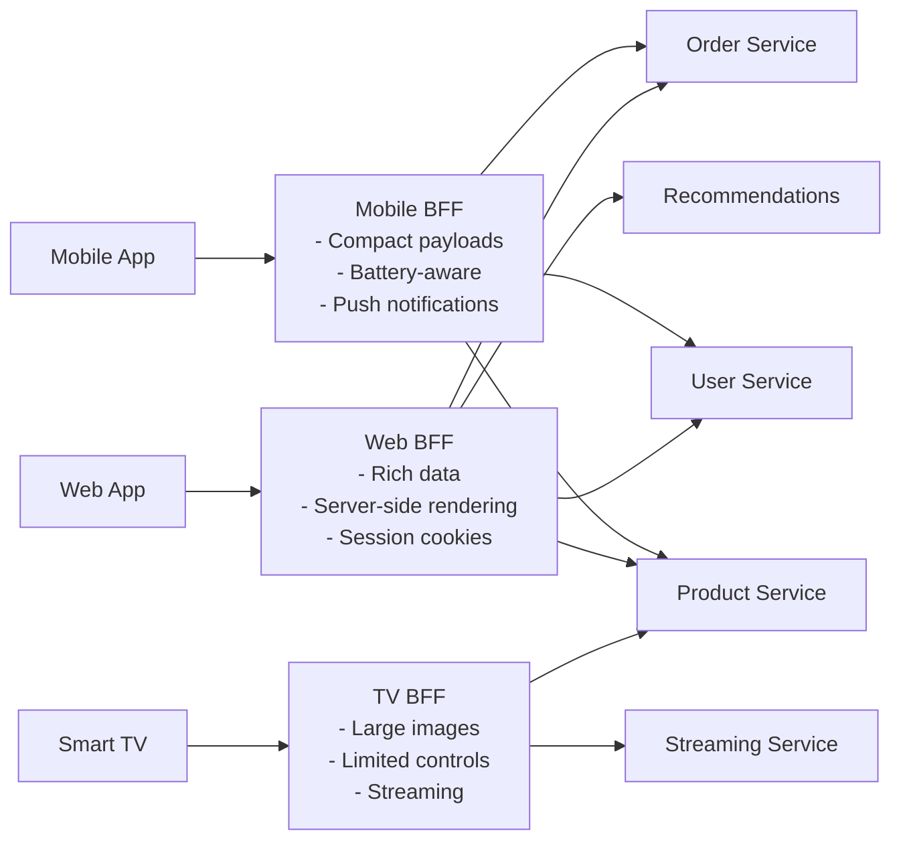

# API Gateway and Backend for Frontend (BFF) Pattern

> **References:** [Sam Newman - BFF Pattern](https://samnewman.io/patterns/architectural/bff/) | [AWS API Gateway](https://aws.amazon.com/api-gateway/) | [Netflix BFF](https://netflixtechblog.com/embracing-the-differences-inside-the-netflix-api-redesign-15fd8b3dc49d)

---

## API Gateway

A single entry point for all API clients that handles cross-cutting concerns.

### API Gateway Responsibilities

| Responsibility | Description |
|---------------|-------------|
| **Routing** | Route requests to correct microservice |
| **Auth/AuthZ** | JWT validation, API key check, OAuth2 |
| **Rate Limiting** | Throttle per user/IP/API key |
| **SSL Termination** | TLS at gateway, plain HTTP internally |
| **Request Transformation** | Header manipulation, payload transform |
| **Load Balancing** | Round-robin/weighted to service instances |
| **Circuit Breaking** | Fail fast when downstream is unhealthy |
| **Caching** | Cache GET responses |
| **Monitoring** | Access logs, metrics, tracing |

---

## BFF (Backend for Frontend) Pattern

One BFF per client type, each optimized for that client's data needs.



---

## Why BFF?

**Problem without BFF:** A single generic API must satisfy all clients. Mobile gets too much data; web doesn't get enough; TV needs a completely different format.

**With BFF:** Each client has its own API layer that:
- Aggregates multiple microservice calls into one response
- Transforms data to the client's preferred shape
- Handles client-specific auth (mobile: push tokens, web: cookies)
- Can be owned by the frontend team

---

## Java: BFF Implementation

```java
@RestController
@RequestMapping("/mobile/v1")
public class MobileBffController {

    private final ProductServiceClient productClient;
    private final UserServiceClient userClient;
    private final OrderServiceClient orderClient;
    private final InventoryServiceClient inventoryClient;

    // Single endpoint that aggregates 4 service calls for the home screen
    @GetMapping("/home")
    public MobileHomeResponse getHomePage(@RequestHeader("X-User-Id") String userId) {
        // Execute all in parallel
        CompletableFuture<UserProfile> userFuture = 
            CompletableFuture.supplyAsync(() -> userClient.getProfile(userId));
        
        CompletableFuture<List<Product>> featuredFuture = 
            CompletableFuture.supplyAsync(() -> productClient.getFeatured(10));
        
        CompletableFuture<List<Order>> recentOrdersFuture = 
            CompletableFuture.supplyAsync(() -> orderClient.getRecent(userId, 3));
        
        CompletableFuture<CartSummary> cartFuture = 
            CompletableFuture.supplyAsync(() -> orderClient.getCartSummary(userId));
        
        // Combine results
        CompletableFuture.allOf(userFuture, featuredFuture, recentOrdersFuture, cartFuture).join();
        
        // Transform to mobile-optimized response (compact, no unnecessary fields)
        return MobileHomeResponse.builder()
            .userName(userFuture.join().getFirstName()) // Just first name for mobile
            .featuredProducts(featuredFuture.join().stream()
                .map(p -> new MobileProductCard(p.getId(), p.getName(), 
                    p.getThumbnailUrl(), p.getPrice())) // Compact card, not full product
                .toList())
            .recentOrders(recentOrdersFuture.join().stream()
                .map(o -> new MobileOrderCard(o.getId(), o.getStatus()))
                .toList())
            .cartItemCount(cartFuture.join().getItemCount())
            .build();
    }
}

// Web BFF — richer data, server-side rendering support
@RestController
@RequestMapping("/web/v1")
public class WebBffController {

    @GetMapping("/home")
    public WebHomeResponse getHomePage(HttpServletRequest request) {
        // Web gets full data including recommendations, metadata, pagination
        // Different auth: session cookie vs JWT
        String userId = sessionService.extractUserId(request);
        
        // More fields, different pagination, richer product data
        return WebHomeResponse.builder()
            // ... full product objects, not just cards
            .build();
    }
}
```

---

## AWS API Gateway Setup

```yaml
# AWS API Gateway with Lambda Authorizer for JWT validation
Resources:
  ApiGateway:
    Type: AWS::ApiGateway::RestApi
    Properties:
      Name: MyServiceGateway
  
  JwtAuthorizer:
    Type: AWS::ApiGateway::Authorizer
    Properties:
      RestApiId: !Ref ApiGateway
      Name: JwtAuthorizer
      Type: TOKEN
      IdentitySource: method.request.header.Authorization
      AuthorizerUri: !Sub arn:aws:apigateway:${AWS::Region}:lambda:path/...
      AuthorizerResultTtlInSeconds: 300  # Cache auth result 5 min
  
  # Usage plan for rate limiting
  ApiUsagePlan:
    Type: AWS::ApiGateway::UsagePlan
    Properties:
      ApiStages:
        - ApiId: !Ref ApiGateway
          Stage: prod
      Throttle:
        RateLimit: 1000      # 1000 RPS
        BurstLimit: 5000     # Burst to 5000
      Quota:
        Limit: 1000000       # 1M requests/day
        Period: DAY
```

---

## Java: Lambda Authorizer (JWT Validation)

```java
// Lambda function deployed as API Gateway authorizer
public class JwtAuthorizerHandler implements RequestHandler<TokenAuthorizerContext, AuthPolicy> {

    private final JwtVerifier jwtVerifier = JwtVerifier.create(
        JwksRetriever.create("https://cognito.amazonaws.com/.well-known/jwks.json")
    );

    @Override
    public AuthPolicy handleRequest(TokenAuthorizerContext input, Context context) {
        String token = input.getAuthorizationToken().replace("Bearer ", "");
        
        try {
            JwtClaims claims = jwtVerifier.verify(token);
            String userId = claims.getSubject();
            String[] roles = ((List<String>) claims.getClaimValue("roles"))
                .toArray(new String[0]);
            
            return AuthPolicy.builder()
                .principalId(userId)
                .allowMethod(HttpMethod.ALL, input.getMethodArn())
                .context(Map.of("userId", userId, "roles", String.join(",", roles)))
                .build();
                
        } catch (JwtException e) {
            throw new RuntimeException("Unauthorized"); // API Gateway returns 401
        }
    }
}
```

---

## AWS Service Comparison

| Use Case | Service |
|---------|---------|
| REST API at scale | API Gateway (REST) |
| HTTP API (simpler, cheaper) | API Gateway (HTTP API) |
| WebSocket | API Gateway (WebSocket) |
| GraphQL BFF | AWS AppSync |
| Internal microservice routing | ALB + ECS service discovery |
| Custom BFF logic | Lambda or ECS |

---

## Interview Q&A

**Q1: What is the difference between API Gateway and a Load Balancer?**
> ALB/NLB: Layer 4/7 load balancing within a service tier; no business logic, just routing. API Gateway: Layer 7 with cross-cutting concerns — auth, rate limiting, request transformation, monitoring. API Gateway is for external-facing APIs; ALB is for internal service routing. For microservices: API Gateway at the edge, ALB between internal services.

**Q2: When would you create a separate BFF vs a single API Gateway?**
> Single gateway: if all clients need similar data, or early-stage. BFF: when clients have very different needs (mobile vs web vs IoT), when frontend teams want to own their API shape, or when performance requirements differ (mobile needs compact payloads, web needs rich data). BFF also allows different release cadences per client.

**Q3: How do you handle authentication at the API Gateway level?**
> JWT-based: API Gateway validates JWT signature using JWKs (public keys from Cognito or Auth0). Caches the auth decision for 5 minutes per token to avoid re-validation overhead. Passes userId and roles as request context headers to downstream services — services don't re-validate JWT. For service-to-service: mTLS or IAM roles (no JWT needed).
