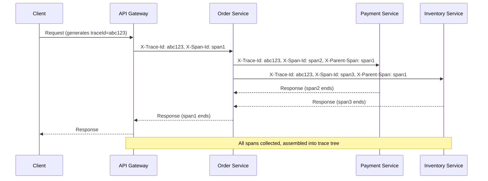

# Distributed Tracing

> **References:** [OpenTelemetry](https://opentelemetry.io/) | [AWS X-Ray](https://aws.amazon.com/xray/) | [Dapper Paper (Google)](https://research.google/pubs/pub36356/)

---

## How Distributed Tracing Works



---

## Trace Context Propagation (W3C Standard)

```
traceparent header: version-traceId-parentSpanId-flags
Example: 00-4bf92f3577b34da6a3ce929d0e0e4736-00f067aa0ba902b7-01

- 00: version
- 4bf92f3577b34da6a3ce929d0e0e4736: 128-bit trace ID (hex)
- 00f067aa0ba902b7: 64-bit parent span ID (hex)
- 01: flags (01 = sampled)
```

---

## Java: Spring Boot Auto-Instrumentation

```xml
<!-- Add OpenTelemetry Java agent — zero code change! -->
<!-- Dockerfile: JAVA_TOOL_OPTIONS="-javaagent:/otel-javaagent.jar" -->
<dependency>
    <groupId>io.micrometer</groupId>
    <artifactId>micrometer-tracing-bridge-otel</artifactId>
</dependency>
<dependency>
    <groupId>io.opentelemetry</groupId>
    <artifactId>opentelemetry-exporter-otlp</artifactId>
</dependency>
```

```yaml
# application.yml
management:
  tracing:
    sampling:
      probability: 0.1  # Sample 10% in production

otel:
  exporter:
    otlp:
      endpoint: http://otel-collector:4317
  resource:
    attributes:
      service.name: order-service
      service.version: 2.3.1
      deployment.environment: production
```

---

## Manual Instrumentation for Custom Operations

```java
@Service
public class OrderService {

    private final Tracer tracer;
    private final SpanCustomizer spanCustomizer;

    // Auto-traced by Spring Boot auto-instrumentation
    @Observed(name = "order.create", contextualName = "createOrder")
    public Order createOrder(CreateOrderRequest request) {
        // Add custom attributes to current span
        spanCustomizer.tag("userId", request.getUserId());
        spanCustomizer.tag("itemCount", String.valueOf(request.getItems().size()));
        
        Order order = processOrderInternal(request);
        
        spanCustomizer.tag("orderId", order.getId());
        return order;
    }

    // Custom child span for a specific operation
    public void enrichOrderWithFraudScore(Order order) {
        Span fraudSpan = tracer.nextSpan()
            .name("fraud.score.check")
            .tag("orderId", order.getId())
            .start();
        
        try (Tracer.SpanInScope ws = tracer.withSpan(fraudSpan)) {
            double score = fraudService.getScore(order);
            fraudSpan.tag("fraudScore", String.valueOf(score));
            fraudSpan.tag("highRisk", String.valueOf(score > 0.8));
        } finally {
            fraudSpan.end();
        }
    }
}
```

---

## AWS X-Ray Integration

```java
@Configuration
public class XRayConfig {
    
    @Bean
    public AWSXRayRecorder xRayRecorder() {
        return AWSXRayRecorderBuilder.standard()
            .withPlugin(new ECSPlugin())        // ECS task metadata
            .withPlugin(new EC2Plugin())         // EC2 instance metadata
            .withContextMissingStrategy(         // Don't throw on missing context
                ContextMissingStrategy.LOG_ERROR)
            .build();
    }
}

// Filter to create segment for each HTTP request
@Bean
public AWSXRayServletFilter xRayFilter() {
    return new AWSXRayServletFilter("order-service");
}

// Instrument DynamoDB calls
DynamoDbClient dynamoDb = DynamoDbClient.builder()
    .overrideConfiguration(c -> c.addExecutionInterceptor(
        TracingInterceptor.builder().build())) // X-Ray traces all DynamoDB calls
    .build();
```

---

## Sampling Strategies

| Strategy | How | Use Case |
|---------|-----|---------|
| **Head-based (fixed rate)** | Decide at trace start, propagate decision | Simple, predictable cost |
| **Tail-based** | Collect all, decide at end (keep errors/slow) | Best signal quality |
| **Rate-limited** | Max N traces/second regardless of traffic | Stable cost at any RPS |
| **Adaptive** | Adjust rate based on traffic volume | Balanced |

```java
// Tail-based sampling: always keep error traces
@Component
public class TailBasedSampler implements SamplerProvider {
    
    @Override
    public Sampler getSampler() {
        return new Sampler() {
            @Override
            public SamplingResult shouldSample(Context parentContext, String traceId,
                    String name, SpanKind kind, Attributes attributes, 
                    List<LinkData> parentLinks) {
                // Always sample if parent has error
                if (Span.fromContext(parentContext).getSpanContext().isValid()) {
                    // Check if trace has errors (tail-based via collector)
                }
                // Otherwise 1% random sample
                return Math.random() < 0.01 
                    ? SamplingResult.recordAndSample()
                    : SamplingResult.drop();
            }
        };
    }
}
```

---

## Service Map Interpretation

```
X-Ray Service Map:
Order Service [p99: 120ms] → Payment Service [p99: 85ms, Error: 0.1%]
                            → Inventory Service [p99: 25ms]
                            → DynamoDB [p99: 8ms]

Insight: Payment Service is the bottleneck.
          0.1% error rate on Payment → investigate gateway timeouts.
```

---

## Interview Q&A

**Q1: How does trace context propagate across service boundaries?**
> The W3C `traceparent` header carries `traceId + spanId + flags`. When Service A calls Service B via HTTP, it injects the current span's context into the request headers. Service B extracts the context, creates a child span with A's span as the parent. For async (Kafka): context is injected into message headers. OpenTelemetry auto-instruments RestTemplate, Feign, Kafka, gRPC clients to do this automatically.

**Q2: What is the difference between a Trace and a Span?**
> A Trace is the entire journey of one request across all services — identified by a unique `traceId`. A Span is one unit of work within a trace — a single operation in a single service (e.g., "DynamoDB query"). Spans have a start time, end time, attributes, and events. Spans are linked by parent-child relationships (child span has parent's spanId). Multiple spans with the same traceId form a trace.

**Q3: How do you trace asynchronous operations (Kafka messages)?**
> Inject trace context into Kafka message headers: `traceparent: 00-traceId-spanId-01`. When the consumer picks up the message, extract the context and create a child span linked to the producer's span. OpenTelemetry Kafka instrumentation handles this automatically. For SQS: use message attributes to carry trace context. This creates a trace that spans both the producer and consumer, even if they run at different times.
