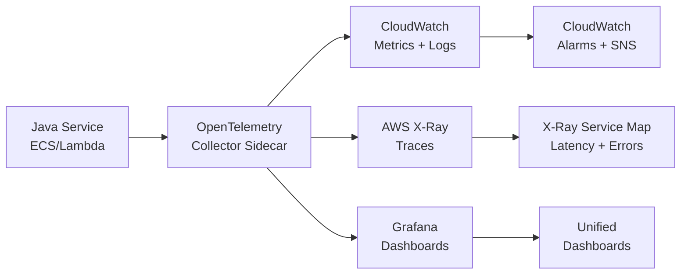

# Metrics vs Traces vs Logs — The Three Pillars of Observability

> **References:** [OpenTelemetry Docs](https://opentelemetry.io/docs/) | [Distributed Systems Observability - O'Reilly](https://www.oreilly.com/library/view/distributed-systems-observability/9781492033431/) | [Google SRE Book](https://sre.google/sre-book/monitoring-distributed-systems/)

---

## The Three Pillars

| Pillar | What it answers | Format | Cardinality | Cost |
|--------|----------------|--------|-------------|------|
| **Metrics** | "How is my system doing in aggregate?" | Numbers, time series | Low | Low |
| **Traces** | "What happened for this specific request?" | Span tree | High (per-request) | Medium |
| **Logs** | "What did my code say?" | Text/JSON events | Very high | High |

---

## Metrics

Time-series numeric measurements aggregated over time.

```
Types:
- Counter: monotonically increasing (total_requests, errors_total)
- Gauge: current value (memory_usage_bytes, active_connections)
- Histogram: distribution of values (request_duration_ms - p50, p95, p99)
- Summary: pre-computed quantiles client-side
```

### Java: Micrometer + CloudWatch

```java
@Configuration
public class MetricsConfig {
    
    @Bean
    public MeterRegistry meterRegistry() {
        // Sends metrics to CloudWatch every 60 seconds
        return CloudWatchMeterRegistry.builder(
            CloudWatchConfig.DEFAULT,
            Clock.SYSTEM,
            CloudWatchAsyncClient.create()
        ).build();
    }
}

@Service
public class OrderService {

    private final Counter ordersCreated;
    private final Counter ordersFailed;
    private final Timer orderProcessingTimer;
    private final Gauge activeOrders;
    private final AtomicInteger activeOrderCount = new AtomicInteger(0);

    public OrderService(MeterRegistry registry) {
        ordersCreated = Counter.builder("orders.created")
            .description("Total orders successfully created")
            .tag("service", "order-service")
            .register(registry);
        
        ordersFailed = Counter.builder("orders.failed")
            .description("Total orders that failed")
            .register(registry);
        
        orderProcessingTimer = Timer.builder("orders.processing.duration")
            .description("Time to process an order")
            .publishPercentiles(0.5, 0.95, 0.99)
            .register(registry);
        
        activeOrders = Gauge.builder("orders.active", activeOrderCount, AtomicInteger::get)
            .description("Currently active orders")
            .register(registry);
    }

    public Order createOrder(CreateOrderRequest request) {
        activeOrderCount.incrementAndGet();
        try {
            return orderProcessingTimer.record(() -> {
                Order order = processOrder(request);
                ordersCreated.increment();
                return order;
            });
        } catch (Exception e) {
            ordersFailed.increment(Tags.of("errorType", e.getClass().getSimpleName()));
            throw e;
        } finally {
            activeOrderCount.decrementAndGet();
        }
    }
}
```

---

## Distributed Traces

Trace the journey of a single request across multiple services.

```
Trace: 4bf92f3577b34da6
├── Span: API Gateway (5ms)
├── Span: Order Service (120ms)
│   ├── Span: Fraud Check (45ms)
│   ├── Span: DynamoDB Write (15ms)
│   └── Span: SNS Publish (8ms)
│── Span: Payment Service (60ms)
│   ├── Span: Idempotency Check (3ms)
│   └── Span: Stripe API (50ms)
└── Span: Inventory Service (25ms)
    └── Span: Aurora UPDATE (20ms)
```

### Java: OpenTelemetry Tracing

```java
@Configuration
public class TracingConfig {
    
    @Bean
    public OpenTelemetry openTelemetry() {
        Resource resource = Resource.getDefault()
            .merge(Resource.create(Attributes.of(
                ResourceAttributes.SERVICE_NAME, "order-service",
                ResourceAttributes.SERVICE_VERSION, "2.3.1"
            )));
        
        // Export to AWS X-Ray via OTLP
        OtlpGrpcSpanExporter exporter = OtlpGrpcSpanExporter.builder()
            .setEndpoint("http://localhost:4317") // OpenTelemetry Collector sidecar
            .build();
        
        SdkTracerProvider tracerProvider = SdkTracerProvider.builder()
            .setResource(resource)
            .addSpanProcessor(BatchSpanProcessor.builder(exporter).build())
            .setSampler(Sampler.traceIdRatioBased(0.1)) // Sample 10%
            .build();
        
        return OpenTelemetrySdk.builder()
            .setTracerProvider(tracerProvider)
            .build();
    }
}

@Service
public class OrderService {
    
    private final Tracer tracer;
    
    public Order createOrder(CreateOrderRequest request) {
        Span span = tracer.spanBuilder("createOrder")
            .setAttribute("userId", request.getUserId())
            .setAttribute("itemCount", request.getItems().size())
            .startSpan();
        
        try (Scope scope = span.makeCurrent()) {
            span.addEvent("validationStarted");
            validateOrder(request);
            span.addEvent("validationCompleted");
            
            span.addEvent("persistenceStarted");
            Order order = orderRepository.save(request);
            span.addEvent("persistenceCompleted");
            
            span.setAttribute("orderId", order.getId());
            return order;
        } catch (Exception e) {
            span.recordException(e);
            span.setStatus(StatusCode.ERROR, e.getMessage());
            throw e;
        } finally {
            span.end();
        }
    }
}
```

---

## Logs

Timestamped events with context. See [Design-Large-Scale-Log-System.md](../05-High-Level-Design/Design-Large-Scale-Log-System.md) for the full logging pipeline.

### Correlation: Linking All Three Pillars

```java
// Inject trace ID into logs automatically
@Configuration
public class LoggingConfig {
    
    @Bean
    public Filter traceIdFilter() {
        return (request, response, chain) -> {
            String traceId = MDC.get("traceId");
            if (traceId == null) {
                // Get from OpenTelemetry current span
                Span span = Span.current();
                traceId = span.getSpanContext().getTraceId();
                MDC.put("traceId", traceId);
                MDC.put("spanId", span.getSpanContext().getSpanId());
            }
            try {
                chain.doFilter(request, response);
            } finally {
                MDC.clear();
            }
        };
    }
}

// logback pattern includes trace/span IDs
// %d{ISO8601} [%thread] %-5level traceId=%X{traceId} spanId=%X{spanId} %logger{36} - %msg%n
```

---

## AWS Observability Stack



| Pillar | AWS Service | Open-Source |
|--------|------------|-------------|
| Metrics | CloudWatch Metrics | Prometheus + Grafana |
| Traces | AWS X-Ray | Jaeger, Zipkin |
| Logs | CloudWatch Logs | ELK Stack |
| Unified | CloudWatch Container Insights | OpenTelemetry |

---

## Interview Q&A

**Q1: What is the difference between a metric and a log?**
> Metrics: aggregated numerical measurements over time windows (e.g., 99th percentile latency over 5 minutes). Low cost, high cardinality of time but low cardinality of values. Logs: individual event records with full context (each request, each error). High storage cost, but allows debugging specific incidents. Use metrics for dashboards/alerting; use logs for root cause analysis.

**Q2: Why is distributed tracing necessary in microservices?**
> A single user request touches 5-10 services. Without tracing, if a request is slow, you can't tell which service caused the slowdown. Distributed tracing propagates a trace ID through all services via HTTP headers (`traceparent`). You can visualize the entire call tree — seeing that the payment service spent 80% of the total time on a Stripe API call.

**Q3: What is sampling in distributed tracing and why do you need it?**
> At 10K RPS, tracing every request would generate terabytes of trace data. Sampling only records a fraction: head-based sampling (decide at trace start, e.g., 1%), tail-based sampling (collect all spans, only persist traces with errors or high latency). AWS X-Ray default: sample 5% or 1 per second for low-traffic. For production: tail-based sampling keeps 100% of errors, 1-5% of successful traces.
