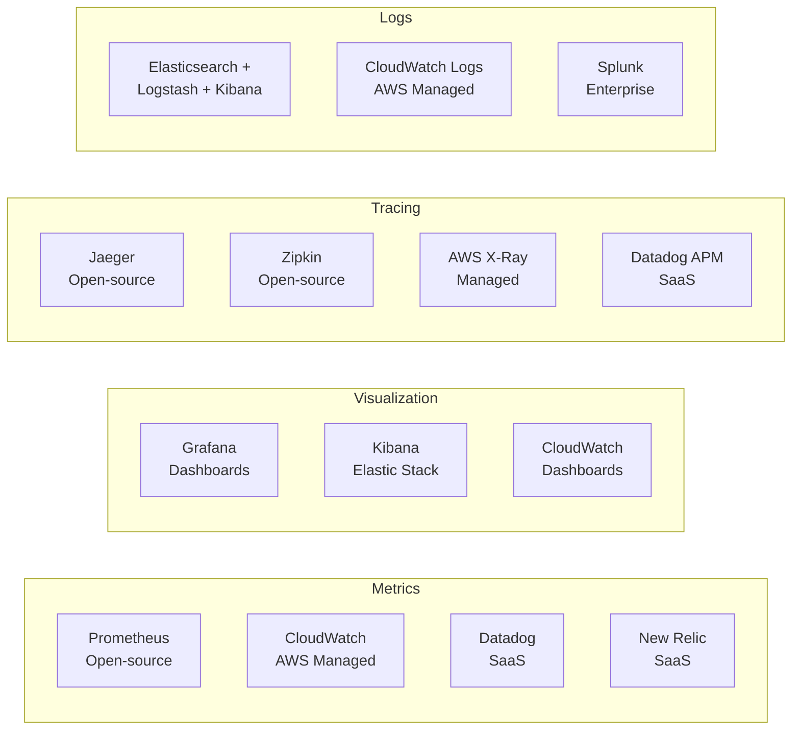
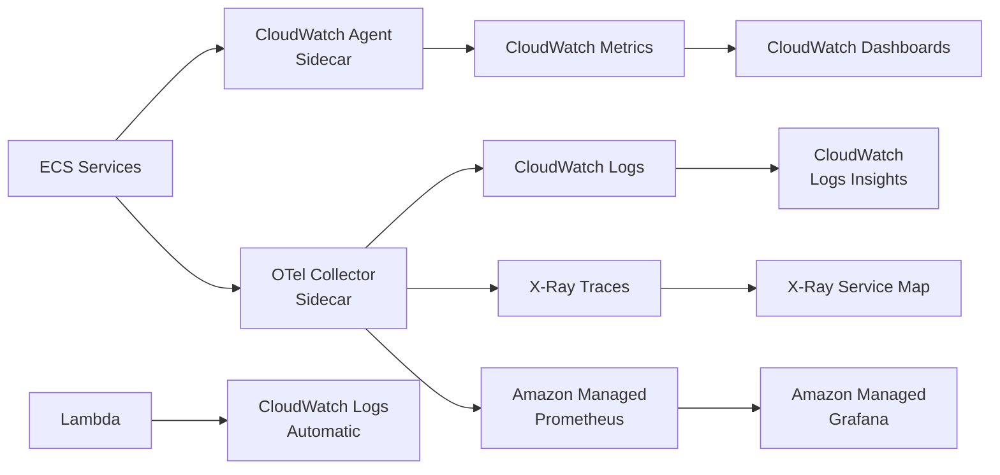

# Observability Tool Comparison

> **References:** [Prometheus vs Datadog](https://signoz.io/blog/prometheus-vs-datadog/) | [AWS CloudWatch](https://aws.amazon.com/cloudwatch/) | [Grafana vs Kibana](https://grafana.com/docs/)

---

## Tool Landscape



---

## Metrics Tools

| Tool | Type | Pros | Cons | AWS Fit |
|------|------|------|------|---------|
| **Prometheus** | Open-source | Free, powerful PromQL, scrape-based | Self-managed, storage scaling | Use with Amazon Managed Prometheus |
| **CloudWatch** | AWS Managed | Zero setup, native AWS integration | Expensive at scale, limited PromQL | Best for AWS-native |
| **Datadog** | SaaS | Unified (metrics+traces+logs), ML anomaly | Expensive, vendor lock-in | Good alongside AWS |
| **Grafana Cloud** | SaaS/OSS | Best visualization, OSS, multi-source | Complex setup | Use with Prometheus/CloudWatch |

---

## Logging Tools

| Tool | Type | Pros | Cons |
|------|------|------|------|
| **ELK Stack** | Open-source | Full text search, Kibana UI | Self-managed complexity, cost |
| **CloudWatch Logs** | AWS Managed | Native AWS, CloudWatch Insights | Limited retention, query speed |
| **Loki + Grafana** | Open-source | Label-based (like Prometheus), cheap | Less powerful full-text search |
| **Splunk** | Enterprise | Powerful SPL query, enterprise features | Very expensive |
| **Datadog Logs** | SaaS | Unified with metrics/traces | Expensive at volume |

---

## Tracing Tools

| Tool | Type | Backend | AWS Integration |
|------|------|---------|----------------|
| **Jaeger** | Open-source | Cassandra/ElasticSearch | Deploy on EKS |
| **Zipkin** | Open-source | In-memory/Cassandra | Deploy on EKS |
| **AWS X-Ray** | Managed | Managed | Native Lambda, ECS, API GW |
| **Datadog APM** | SaaS | SaaS | Agent-based |
| **Honeycomb** | SaaS | SaaS | Best tail-based sampling |

---

## AWS-Native Observability Stack



---

## Prometheus + Grafana on AWS

```java
// application.yml — expose Prometheus metrics endpoint
management:
  endpoints:
    web:
      exposure:
        include: prometheus, health, info
  metrics:
    export:
      prometheus:
        enabled: true
    tags:
      application: order-service
      environment: production
      region: us-east-1
```

```yaml
# Amazon Managed Prometheus scrape config
global:
  scrape_interval: 15s

scrape_configs:
  - job_name: 'order-service'
    ec2_sd_configs:
      - region: us-east-1
        port: 8080
    relabel_configs:
      - source_labels: [__meta_ec2_tag_Service]
        target_label: service
      - source_labels: [__meta_ec2_instance_id]
        target_label: instance
    metrics_path: /actuator/prometheus
```

---

## Cost Comparison at Scale

```
Assumptions: 100 services, 1000 metrics each, 10K logs/sec

CloudWatch:
- Metrics: $0.30/metric/month × 100K metrics = $30K/month
- Logs ingest: $0.50/GB × 864GB/day × 30 = $13K/month
- Total: ~$43K/month

Prometheus + Loki + Grafana (self-managed on EKS):
- EKS nodes: ~$2K/month
- S3 storage for Thanos: ~$500/month
- Engineering time: 0.5 FTE
- Total: ~$3K/month + hidden engineering cost

Datadog:
- Infra (100 hosts): $15/host = $1,500/month
- APM (50 services): $31/host = $1,550/month
- Logs (864GB/day): ~$25K/month
- Total: ~$28K/month + full platform
```

---

## Interview Q&A

**Q1: Would you choose Prometheus or CloudWatch for a new AWS-native service?**
> Start with CloudWatch for AWS-native: zero setup, native Lambda/ECS integration, CloudWatch Insights for log queries. As you scale and need more control, add Prometheus for custom metrics (Amazon Managed Prometheus removes the ops burden). Use Grafana (Amazon Managed Grafana) for dashboards that combine both. Avoid Datadog unless your organization already uses it — cost is significant.

**Q2: How do you set up distributed tracing in a Java microservices environment?**
> Add OpenTelemetry Java agent (zero code change): set `JAVA_TOOL_OPTIONS=-javaagent:/otel-javaagent.jar`. Configure OTLP exporter to point to a collector sidecar. Use AWS X-Ray as the backend (Amazon Distro for OpenTelemetry). Auto-instrumentation covers: Spring MVC, RestTemplate, Feign, JDBC, Kafka, DynamoDB, S3. For custom spans, use the OpenTelemetry API.

**Q3: How do you do cost-effective log management for a high-volume service?**
> (1) Log only at WARN+ in production by default; enable DEBUG on-demand via feature flag. (2) Use CloudWatch Logs with 30-day retention; export to S3 Glacier after 7 days for compliance. (3) Sample high-volume INFO logs (log 10% with random sampling). (4) Use Kinesis Firehose to batch-deliver to S3, query with Athena (pay per query vs CloudWatch Insights pricing). (5) Structured JSON logs enable filtering, reducing storage.
