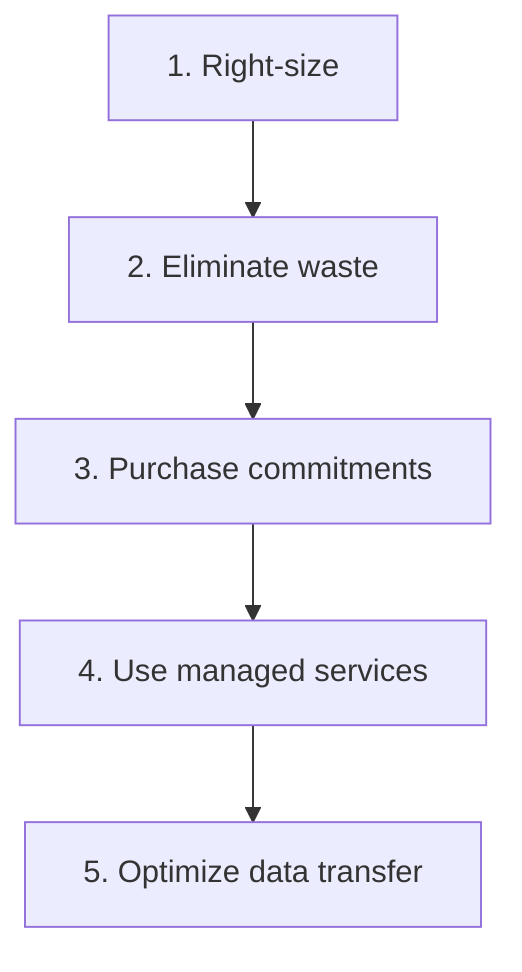

# Cost Optimization on AWS

> **References:** [AWS Cost Optimization Pillar](https://docs.aws.amazon.com/wellarchitected/latest/cost-optimization-pillar/welcome.html) | [AWS Cost Explorer](https://aws.amazon.com/aws-cost-management/aws-cost-explorer/) | [AWS Savings Plans](https://aws.amazon.com/savingsplans/)

---

## Cost Optimization Framework



---

## Compute Cost Optimization

### Purchase Options Comparison

| Option | Discount | Flexibility | Use Case |
|--------|---------|------------|---------|
| On-Demand | 0% | Full | Dev/test, unpredictable |
| Savings Plans (Compute) | Up to 66% | Any EC2/Lambda/Fargate | Baseline steady workload |
| Savings Plans (EC2) | Up to 72% | Specific family/region | Committed single workload |
| Reserved Instance | Up to 72% | Fixed instance type | Legacy, predictable |
| Spot | Up to 90% | Subject to interruption | Batch, stateless, fault-tolerant |

### Spot Instance for Batch Processing

```java
@Configuration
public class BatchJobConfig {

    @Bean
    public JobLauncher batchJobLauncher() {
        // ECS cluster with mixed Spot + On-Demand
        // Spot for 80% of batch capacity, On-Demand for 20% baseline
        return configureBatchJobLauncher();
    }
}

// Spot interruption handling
@Service
public class SpotInterruptionHandler {

    @EventListener
    public void onSpotInterruption(EC2SpotInterruptionEvent event) {
        log.warn("Spot instance termination in 2 minutes: {}", event.getInstanceId());
        
        // Graceful shutdown: checkpoint current work
        checkpointCurrentWork();
        
        // Drain ECS tasks
        ecsClient.updateContainerInstances(UpdateContainerInstancesStateRequest.builder()
            .cluster("batch-cluster")
            .containerInstances(List.of(event.getContainerInstanceArn()))
            .status(ContainerInstanceStatus.DRAINING)
            .build());
    }
    
    private void checkpointCurrentWork() {
        // Save job progress to S3 so the job can resume on a new instance
        checkpointService.save(currentJobState);
    }
}
```

---

## Database Cost Optimization

### DynamoDB: On-Demand vs Provisioned

```
On-Demand: Pay per request
- $1.25 per million read requests
- $6.25 per million write requests
- Use for: unpredictable or spiky workloads, dev/test

Provisioned + Auto-scaling: Pay per capacity unit reserved
- 1 RCU = $0.00013/hour = ~$0.094/month
- 1 WCU = $0.00065/hour = ~$0.47/month
- Use for: predictable workloads with > 40% utilization

Break-even: ~$5K/month of DynamoDB spend → evaluate provisioned
```

### S3 Storage Tiers

```java
// S3 Lifecycle policy: automated tiering saves 60-80% on storage

// Cost comparison (per GB/month):
// S3 Standard:       $0.023
// S3 IA:             $0.0125 (49% cheaper, 30-day min)
// S3 Glacier Instant: $0.004 (83% cheaper, 90-day min)
// S3 Glacier:        $0.0036 (84% cheaper, 90-day min)
// S3 Glacier Deep:   $0.00099 (96% cheaper, 180-day min)

@Bean
public BucketLifecycleConfiguration logsLifecycle() {
    return BucketLifecycleConfiguration.builder()
        .rules(List.of(
            LifecycleRule.builder()
                .id("logs-tiering")
                .status(ExpirationStatus.ENABLED)
                .transitions(List.of(
                    Transition.builder()
                        .days(30)
                        .storageClass(TransitionStorageClass.STANDARD_IA)
                        .build(),
                    Transition.builder()
                        .days(90)
                        .storageClass(TransitionStorageClass.GLACIER)
                        .build(),
                    Transition.builder()
                        .days(365)
                        .storageClass(TransitionStorageClass.DEEP_ARCHIVE)
                        .build()
                ))
                .expiration(LifecycleExpiration.builder().days(2555).build()) // 7 years
                .build()
        ))
        .build();
}
```

---

## Data Transfer Cost Optimization

```
Data transfer costs (biggest hidden cost):
- Inbound to AWS: FREE
- Within same AZ: FREE
- Between AZs (same region): $0.01/GB each way
- Between regions: $0.02-0.08/GB
- Internet egress: $0.08-0.09/GB

Optimization strategies:
1. Keep services in same AZ when possible (co-locate)
2. Use VPC endpoints for S3/DynamoDB (free, no internet gateway)
3. CloudFront for egress (CloudFront egress cheaper than EC2 internet)
4. Compress payloads (gzip reduces transfer by 60-80%)
```

```java
// VPC Endpoint for DynamoDB (free data transfer within VPC)
@Configuration
public class DynamoDbConfig {
    @Bean
    public DynamoDbClient dynamoDbClient() {
        // Traffic routes through VPC endpoint, not internet
        // No data transfer charges between ECS and DynamoDB in same region
        return DynamoDbClient.builder()
            .endpointOverride(URI.create("https://dynamodb.us-east-1.amazonaws.com"))
            // VPC endpoint handles routing internally
            .build();
    }
}
```

---

## Cost Monitoring

```java
// Lambda: Check costs daily and alert on anomalies
@Service
public class CostAlertService {

    private final CostExplorerClient costExplorer;
    private final SnsClient sns;

    @Scheduled(cron = "0 8 * * * *") // Daily at 8am
    public void checkDailyCosts() {
        GetCostAndUsageResponse response = costExplorer.getCostAndUsage(
            GetCostAndUsageRequest.builder()
                .timePeriod(DateInterval.builder()
                    .start(LocalDate.now().minusDays(1).toString())
                    .end(LocalDate.now().toString())
                    .build())
                .granularity(Granularity.DAILY)
                .metrics(List.of("UnblendedCost"))
                .groupBy(GroupDefinition.builder()
                    .type(GroupDefinitionType.DIMENSION)
                    .key("SERVICE")
                    .build())
                .build()
        );
        
        // Alert if cost is 20% above 7-day average
        response.resultsByTime().forEach(result -> {
            result.groups().forEach(group -> {
                double cost = Double.parseDouble(
                    group.metrics().get("UnblendedCost").amount());
                String service = group.keys().get(0);
                
                if (isAnomalous(service, cost)) {
                    sendCostAlert(service, cost);
                }
            });
        });
    }
}
```

---

## AWS Cost Optimization Quick Wins

| Action | Typical Savings | Effort |
|--------|----------------|--------|
| Delete unused EBS volumes | $5-50/mo per volume | Low |
| Delete unused Elastic IPs | $3.65/mo per IP | Low |
| Rightsize oversized EC2 | 20-50% | Medium |
| Switch to Graviton (ARM) | 20-40% | Medium |
| Add S3 lifecycle policies | 60-80% storage | Low |
| Use Spot for batch jobs | 70-90% | Medium |
| Commit Savings Plans (1yr) | 30-40% | Low |
| Use Lambda for infrequent jobs | 90%+ | High |
| Enable S3 Intelligent-Tiering | 20-40% | Low |
| Terminate idle dev environments | 100% | Low |

---

## Interview Q&A

**Q1: How do you reduce AWS costs without impacting performance?**
> (1) AWS Compute Optimizer: right-size EC2/Lambda automatically — free tool, average 20% savings. (2) Savings Plans: commit 1-year compute spend for 30-40% discount. (3) Spot Instances for stateless/fault-tolerant workloads (batch, CI/CD) — 70-90% off. (4) S3 lifecycle policies: move to IA/Glacier automatically. (5) Reserved capacity for DynamoDB if traffic is predictable. (6) Use CloudFront to reduce egress costs.

**Q2: What is the biggest hidden cost in AWS architectures?**
> Data transfer. Developers often forget: (1) Cross-AZ traffic: $0.01/GB each way — if services in different AZs exchange 10TB/day, that's $3K/month. (2) NAT Gateway: $0.045/GB processed — if Lambda/ECS traffic goes through NAT, optimize with VPC endpoints. (3) Inter-region traffic: $0.02-0.08/GB. Use AWS Cost Explorer → "Data Transfer" to diagnose.

**Q3: How would you build a cost-aware architecture for a startup?**
> (1) Serverless-first: Lambda + DynamoDB OnDemand + S3 → pay only what you use, zero minimum. (2) Single-region, single-AZ for dev (save 50% vs multi-AZ). (3) Use Fargate Spot for non-critical workloads. (4) S3 Intelligent-Tiering for all object storage. (5) CloudFront in front of everything. (6) Set up billing alerts at $100/$500/$1000. (7) AWS Free Tier maximization for first 12 months. Budget: $500/month can run a production-grade startup at early scale.
