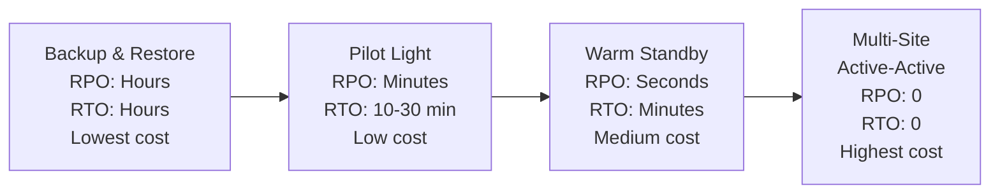
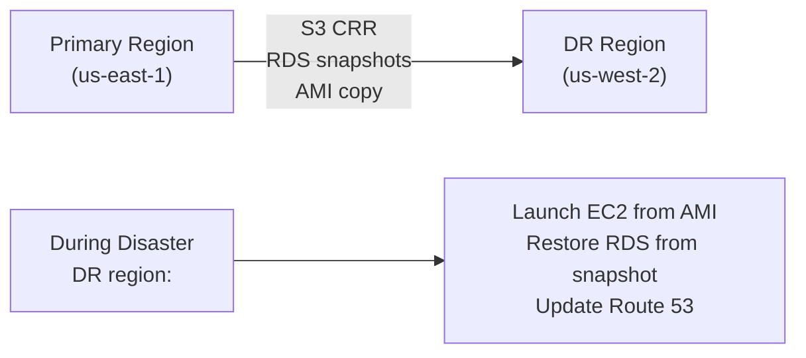
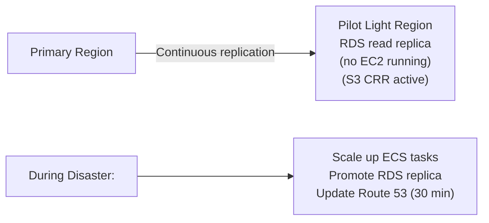
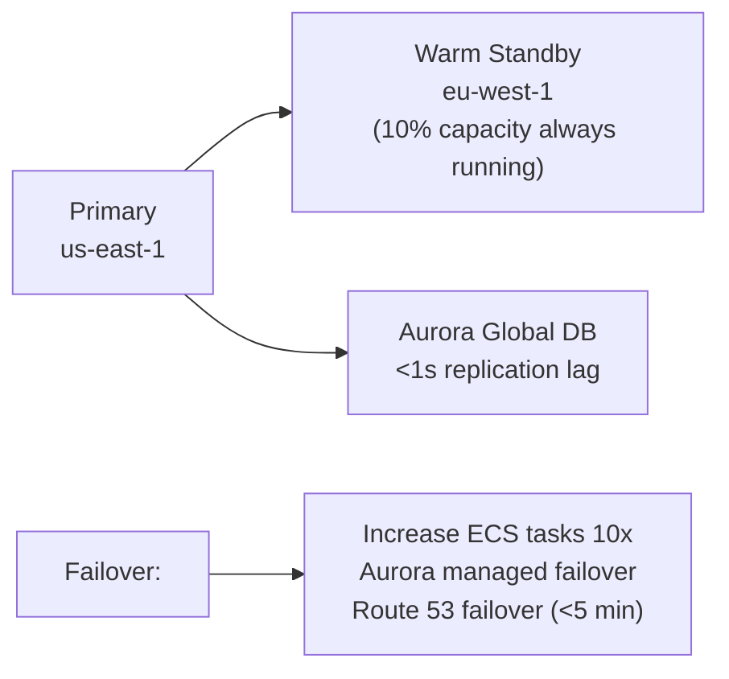

# Disaster Recovery on AWS

> **References:** [AWS DR Whitepaper](https://docs.aws.amazon.com/whitepapers/latest/disaster-recovery-workloads-on-aws/disaster-recovery-workloads-on-aws.html) | [AWS Well-Architected Reliability](https://docs.aws.amazon.com/wellarchitected/latest/reliability-pillar/welcome.html)

---

## DR Strategies: Cost vs Recovery Time



| Strategy | RPO | RTO | Cost Multiplier | Use Case |
|---------|-----|-----|----------------|---------|
| **Backup & Restore** | Hours | Hours | 1× | Dev/test, low criticality |
| **Pilot Light** | Minutes | 10-30 min | 2× | Mid-criticality, cost-sensitive |
| **Warm Standby** | Seconds | Minutes | 3-4× | High-criticality production |
| **Multi-Site (Active-Active)** | 0 | 0 | 6-8× | Mission-critical, 24/7 revenue |

---

## Strategy 1: Backup and Restore



**Implementation:**
- RDS automated backups (daily) → copied to DR region via AWS Backup
- S3 Cross-Region Replication (CRR)
- EC2 AMI copy to DR region
- Route 53 DNS updated manually on declaration of disaster

---

## Strategy 2: Pilot Light



---

## Strategy 3: Warm Standby



**Implementation:**
```yaml
# Route 53 Failover Records
PrimaryRecord:
  Type: A
  SetIdentifier: primary
  FailoverRoutingPolicy: PRIMARY
  HealthCheckId: !Ref PrimaryHealthCheck
  AliasTarget: !Ref PrimaryLoadBalancer

StandbyRecord:
  Type: A
  SetIdentifier: standby
  FailoverRoutingPolicy: SECONDARY
  AliasTarget: !Ref StandbyLoadBalancer
  # Traffic only hits standby when primary health check fails
```

---

## Strategy 4: Multi-Site Active-Active

See [MultiRegion-Architecture.md](./MultiRegion-Architecture.md) for full implementation.

---

## AWS Services for DR

| Concern | AWS Service | Notes |
|---------|------------|-------|
| Automated backups | AWS Backup | Cross-region vault |
| Database replication | Aurora Global DB | <1s lag |
| Data replication | DynamoDB Global Tables | Active-active |
| Object replication | S3 Cross-Region Replication | Near-real-time |
| AMI copy | EC2 Image Builder + AMI copy | Automate via Lambda |
| DNS failover | Route 53 + health checks | ~90s detection |
| Traffic routing | Global Accelerator | Instant rerouting |
| Backup testing | AWS Resilience Hub | Automated DR drills |

---

## DR Runbook: Aurora Global Database Failover

```bash
# Step 1: Confirm primary region failure
aws rds describe-global-clusters --global-cluster-identifier my-global-cluster

# Step 2: Initiate managed failover to DR region
aws rds failover-global-cluster \
  --global-cluster-identifier my-global-cluster \
  --target-db-cluster-identifier arn:aws:rds:eu-west-1:...:cluster:my-cluster-eu

# Step 3: Wait for promotion (typically < 1 minute)
aws rds describe-global-clusters --global-cluster-identifier my-global-cluster \
  --query 'GlobalClusters[0].GlobalClusterMembers[?IsWriter==`true`]'

# Step 4: Update application configuration
# (If using Route 53 health checks, this may be automatic)
aws route53 change-resource-record-sets --hosted-zone-id Z123 --change-batch '{
  "Changes": [{
    "Action": "UPSERT",
    "ResourceRecordSet": {
      "Name": "db.example.com",
      "Type": "CNAME",
      "TTL": 60,
      "ResourceRecords": [{"Value": "my-cluster-eu.cluster-xyz.eu-west-1.rds.amazonaws.com"}]
    }
  }]
}'
```

---

## Chaos Engineering & DR Testing

```java
// AWS Fault Injection Simulator (FIS) experiment template
@Component
public class DRTestOrchestrator {

    private final FisClient fisClient;
    private final CloudWatchClient cloudWatch;

    // Monthly DR drill: inject AZ failure, verify failover
    @Scheduled(cron = "0 0 2 1 * *") // First day of month at 2am
    public void monthlyDRDrill() {
        log.info("Starting monthly DR drill");
        
        // Start FIS experiment: terminate all tasks in one AZ
        StartExperimentResponse experiment = fisClient.startExperiment(
            StartExperimentRequest.builder()
                .experimentTemplateId("EXP-AZ-FAILURE-TEMPLATE")
                .tags(Map.of("purpose", "monthly-dr-drill"))
                .build()
        );
        
        // Monitor recovery
        monitorRecovery(experiment.experiment().id());
    }

    private void monitorRecovery(String experimentId) {
        // Check if RTO target met
        // Alert if recovery takes > 5 minutes
    }
}
```

---

## RTO/RPO Calculator

```
Warm Standby example:

RPO calculation:
- Aurora Global DB replication lag: <1s
- RPO = 1 second (last write before failover)

RTO calculation:
- Aurora managed failover: 60s
- ECS task scale-out (10% → 100%): 120s
- Route 53 DNS propagation: 60s (with 60s TTL)
- Total RTO: ~4 minutes

To achieve 1-minute RTO:
- Pre-scaled ECS tasks in DR (100% capacity, Active-Active)
- Route 53 TTL: 10s
- Global Accelerator (instant rerouting)
- → RTO: ~30 seconds
```

---

## Interview Q&A

**Q1: What is the difference between RTO and RPO? Give concrete AWS examples.**
> RPO: how much data can you lose? Aurora Global DB replication lag is <1s → RPO ~1s. S3 CRR is near-real-time → RPO minutes. Daily backup → RPO 24 hours. RTO: how long until restored? Active-active: RTO ~0. Warm standby with Aurora failover: ~4 minutes. Pilot light: ~30 minutes. Backup/restore: hours. The AWS service you choose directly determines achievable RPO/RTO.

**Q2: How would you test your DR plan?**
> (1) AWS Resilience Hub: automated assessment of RTO/RPO achievability. (2) AWS FIS (Fault Injection Simulator): inject real failures (AZ failure, EC2 termination, RDS failover) in production or staging. (3) Game days: scheduled chaos experiments with team on standby. (4) Monthly DR drills: actually run through the failover runbook. (5) Tabletop exercises: walk through disaster scenarios. Never test DR for the first time during a real disaster.

**Q3: When would you choose Warm Standby over Active-Active?**
> Warm Standby: when RTO of 5-15 minutes is acceptable, cost is constrained (3× vs 6-8× of single region), and write conflicts would be complex to handle (strong consistency needed). Active-Active: when RTO < 1 minute required, users globally need low latency, or revenue loss during 5-minute outage exceeds cost of extra infrastructure. Example: a payment processor needs Active-Active; an internal tool can use Warm Standby.
