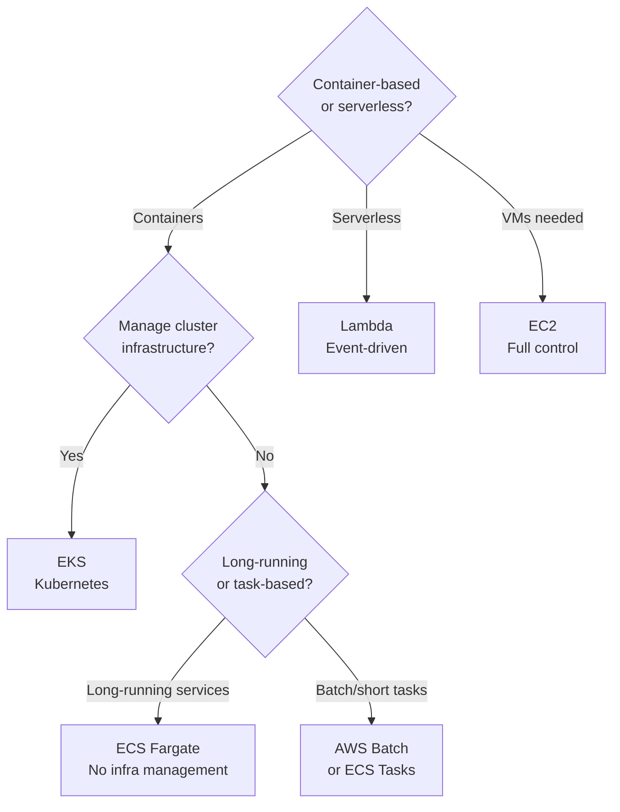

# Mapping Compute to AWS

> **References:** [AWS Compute Services Overview](https://aws.amazon.com/products/compute/) | [Choosing Compute](https://aws.amazon.com/getting-started/decision-guides/serverless-or-kubernetes-on-aws-how-to-choose/)

---

## AWS Compute Options



---

## Compute Services Comparison

| Service | Unit | Infra Mgmt | Max Runtime | Cold Start | Use Case |
|---------|------|-----------|------------|------------|---------|
| **EC2** | Virtual Machine | Full | Unlimited | None (always on) | Full control, Windows, licensed software |
| **ECS EC2** | Container | Partial (manage EC2) | Unlimited | None | Container on managed EC2 fleet |
| **ECS Fargate** | Container | None | Unlimited | ~10s | Containerized microservices |
| **EKS** | Container (K8s) | Cluster admin | Unlimited | Seconds | Kubernetes workloads, complex orchestration |
| **Lambda** | Function | None | 15 minutes | 0-500ms | Event-driven, infrequent invocations |
| **App Runner** | Container | None | Unlimited | Fast | Simple web apps |
| **Elastic Beanstalk** | App | Auto-managed | Unlimited | N/A | Legacy, quick deploy |
| **Batch** | Job | None | Hours | N/A | Batch processing |

---

## Lambda Best Practices

```java
// Lambda handler — keep init code outside handler (warm start optimization)
public class OrderHandler implements RequestHandler<APIGatewayProxyRequestEvent, APIGatewayProxyResponseEvent> {

    // ✅ Initialize once per container (reused on warm starts)
    private static final DynamoDbClient dynamoDb = DynamoDbClient.builder()
        .httpClientBuilder(UrlConnectionHttpClient.builder())
        .build();
    private static final ObjectMapper objectMapper = new ObjectMapper();
    private static final OrderService orderService = new OrderService(dynamoDb);
    
    @Override
    public APIGatewayProxyResponseEvent handleRequest(
            APIGatewayProxyRequestEvent event, Context context) {
        
        // ❌ Don't initialize heavy clients here — recreated every invocation
        
        try {
            CreateOrderRequest request = objectMapper.readValue(
                event.getBody(), CreateOrderRequest.class);
            
            Order order = orderService.createOrder(request);
            
            return APIGatewayProxyResponseEvent.builder()
                .statusCode(201)
                .body(objectMapper.writeValueAsString(order))
                .headers(Map.of("Content-Type", "application/json"))
                .build();
                
        } catch (ValidationException e) {
            return errorResponse(400, e.getMessage());
        } catch (Exception e) {
            context.getLogger().log("Error: " + e.getMessage());
            return errorResponse(500, "Internal Server Error");
        }
    }
}
```

---

## ECS Fargate Task Definition

```json
{
  "family": "order-service",
  "networkMode": "awsvpc",
  "requiresCompatibilities": ["FARGATE"],
  "cpu": "1024",
  "memory": "2048",
  "executionRoleArn": "arn:aws:iam::...:role/ecsTaskExecutionRole",
  "taskRoleArn": "arn:aws:iam::...:role/orderServiceTaskRole",
  "containerDefinitions": [
    {
      "name": "order-service",
      "image": "123456789.dkr.ecr.us-east-1.amazonaws.com/order-service:v2.3.1",
      "essential": true,
      "portMappings": [{"containerPort": 8080, "protocol": "tcp"}],
      "environment": [
        {"name": "SPRING_PROFILES_ACTIVE", "value": "production"},
        {"name": "AWS_REGION", "value": "us-east-1"}
      ],
      "secrets": [
        {"name": "DB_PASSWORD", "valueFrom": "arn:aws:secretsmanager:...:db-password"}
      ],
      "logConfiguration": {
        "logDriver": "awslogs",
        "options": {
          "awslogs-group": "/ecs/order-service",
          "awslogs-region": "us-east-1",
          "awslogs-stream-prefix": "ecs"
        }
      },
      "healthCheck": {
        "command": ["CMD-SHELL", "curl -f http://localhost:8080/actuator/health || exit 1"],
        "interval": 30,
        "timeout": 5,
        "retries": 3,
        "startPeriod": 60
      },
      "linuxParameters": {
        "initProcessEnabled": true
      }
    }
  ]
}
```

---

## Auto Scaling Strategies

| Strategy | Trigger | Use Case |
|----------|---------|---------|
| **Target Tracking** | Keep metric at target (e.g., CPU=50%) | Most services |
| **Step Scaling** | Alarm thresholds with step adjustments | More granular |
| **Scheduled** | Time-based (pre-scale for known peaks) | Batch jobs, business hours |
| **Lambda Provisioned** | Pre-warm Lambda instances | Eliminate cold starts |

```java
// CDK: ECS Auto Scaling
ScalableTarget scalableTarget = application.autoScaleTaskCount(
    EnableScalingProps.builder()
        .minCapacity(2)   // Always at least 2 instances
        .maxCapacity(50)  // Scale up to 50 under load
        .build()
);

// Target tracking: keep CPU at 50%
scalableTarget.scaleOnCpuUtilization("CpuScaling", 
    CpuUtilizationScalingProps.builder()
        .targetUtilizationPercent(50)
        .scaleInCooldown(Duration.seconds(60))
        .scaleOutCooldown(Duration.seconds(30))
        .build()
);

// Target tracking: keep request latency low
scalableTarget.scaleOnRequestCount("RequestScaling",
    RequestCountScalingProps.builder()
        .requestsPerTarget(1000)
        .targetGroup(targetGroup)
        .build()
);
```

---

## Lambda vs ECS Decision Matrix

| Factor | Choose Lambda | Choose ECS Fargate |
|--------|--------------|-------------------|
| Runtime | Event-driven, short | Long-running services |
| Cold start tolerance | Yes (background jobs, async) | No (user-facing APIs) |
| Memory | ≤ 10GB | Up to 120GB |
| Execution time | ≤ 15 minutes | Unlimited |
| Concurrency model | Per-invocation isolation | Shared within task |
| Cost model | Pay per ms used | Pay per task-hour |
| Traffic pattern | Spiky/infrequent | Steady/predictable |
| Container support | Yes (up to 10GB image) | Full container |

---

## AWS Well-Architected Compute Recommendations

1. **Use managed services** over self-managed (ECS > self-managed K8s for most teams)
2. **Right-size instances** — use Compute Optimizer recommendations
3. **Use Savings Plans** for stable workloads (up to 72% discount)
4. **Spot Instances** for fault-tolerant batch workloads (up to 90% off)
5. **ARM (Graviton)** processors — up to 40% better price/performance

---

## Interview Q&A

**Q1: When would you use Lambda vs ECS Fargate for a Java API?**
> Lambda: async event processing (SQS consumers, S3 triggers), low-traffic APIs that don't need warm state. Java cold starts on Lambda = 500ms-2s (JVM init) — unacceptable for synchronous user APIs. ECS Fargate: long-running Java APIs, services that need WebSocket connections, services with > 15-min processing. For Java user-facing APIs → always ECS (or use Lambda with SnapStart to eliminate cold starts).

**Q2: What is Lambda SnapStart and how does it help Java?**
> Lambda SnapStart (Java): Lambda takes a snapshot of the initialized execution environment (after class loading, Spring context init) and restores from that snapshot on cold start. Reduces Java cold start from 1-2s to 200-300ms. Limitation: non-deterministic operations at init time (e.g., current timestamp, random seeds) may have unexpected behavior on restore. Enable with `SnapStart: ApplyOn: PublishedVersions`.

**Q3: How do you implement blue-green deployment on ECS?**
> Using CodeDeploy + ECS: (1) Deploy new task definition as "green" target group. (2) CodeDeploy shifts traffic from blue (current) to green (new). (3) Both versions run simultaneously during shift window. (4) Automatic rollback if health checks fail. (5) After validation period, old (blue) tasks terminated. Zero downtime — traffic shifts gradually (10% → 50% → 100% or canary).
