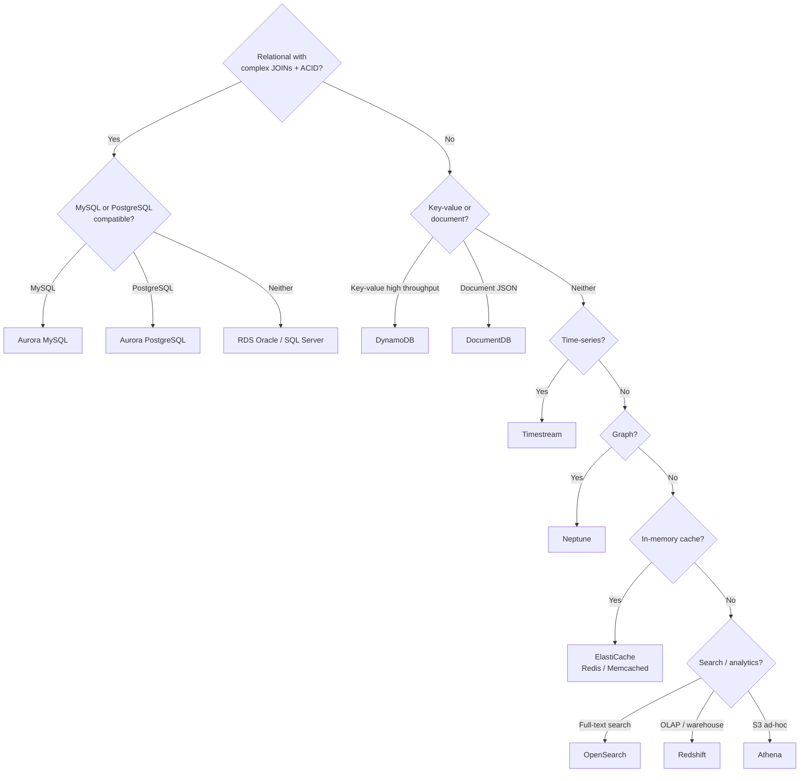

# Mapping Databases to AWS Services

> **References:** [AWS Database Selection Guide](https://aws.amazon.com/products/databases/) | [AWS Well-Architected - Data Management](https://docs.aws.amazon.com/wellarchitected/latest/framework/data-management.html)

---

## Database Selection Flowchart



---

## Complete AWS Database Mapping

| Category | Open-Source / Concept | AWS Managed Service | Notes |
|----------|----------------------|--------------------|----|
| Relational (MySQL) | MySQL | RDS MySQL, Aurora MySQL | Aurora = 5× faster |
| Relational (PostgreSQL) | PostgreSQL | RDS PostgreSQL, Aurora PostgreSQL | Aurora serverless v2 = auto-scale |
| Relational (Oracle) | Oracle | RDS Oracle | License included or BYOL |
| Relational (SQL Server) | SQL Server | RDS SQL Server | Enterprise / Standard / Express |
| Key-Value | Redis, DynamoDB | DynamoDB, ElastiCache Redis | DynamoDB = serverless KV |
| Document | MongoDB | DocumentDB (MongoDB-compatible) | API compatibility |
| Wide-Column | Cassandra | Amazon Keyspaces | Cassandra CQL compatible |
| Graph | Neo4j | Amazon Neptune | Gremlin + SPARQL |
| Time-Series | InfluxDB, TimescaleDB | Amazon Timestream | Serverless, auto-tiering |
| In-Memory Cache | Redis, Memcached | ElastiCache Redis, ElastiCache Memcached | Serverless option available |
| Search | Elasticsearch | Amazon OpenSearch Service | Also for log analytics |
| Data Warehouse | Redshift | Amazon Redshift | Columnar, PB-scale |
| Ledger | QLDB | Amazon QLDB | Cryptographically verifiable |
| Ad-hoc Query | Presto, Athena | Amazon Athena | Query S3 with SQL |
| NewSQL | CockroachDB, Spanner | Not managed; use Aurora + Vitess | Spanner = Cloud Spanner on GCP |

---

## Aurora vs RDS

| Dimension | RDS MySQL/PostgreSQL | Aurora MySQL/PostgreSQL |
|-----------|---------------------|------------------------|
| Storage | Traditional EBS | Distributed storage (6 copies, 3 AZs) |
| Failover | 60–120s (standby promotion) | <30s (shares storage, no data copy) |
| Read replicas | Up to 5 (async replication) | Up to 15, <10ms lag |
| Write throughput | Standard | 3–5× faster |
| Storage limit | 64 TB | 128 TB |
| Serverless | No | Aurora Serverless v2 (ACU-based) |
| Global | Cross-region read replica (manual) | Aurora Global Database (<1s lag) |
| Cost | Lower base cost | ~20% more, but fewer nodes needed |

---

## DynamoDB Design Patterns

```java
// Single-table design: all entities in one table
// PK = entity type + ID, SK = sub-type or relation

// User entity: PK=USER#123, SK=PROFILE
// User orders: PK=USER#123, SK=ORDER#2024-01-15#ord-456

// Access patterns:
// 1. Get user profile: GetItem(PK=USER#123, SK=PROFILE)
// 2. Get all user orders: Query(PK=USER#123, SK begins_with ORDER#)
// 3. Get specific order: GetItem(PK=USER#123, SK=ORDER#2024-01-15#ord-456)

@Service
public class UserRepository {

    // Capacity estimation for DynamoDB
    // 1 RCU = 1 strongly consistent read/sec of 4KB
    // 1 WCU = 1 write/sec of 1KB

    // For 10,000 user profile reads/sec, each 1KB:
    // RCU needed = 10,000 × (1KB/4KB) = 2,500 RCU
    // Cost: 2,500 RCU × $0.00013 = $0.325/hour = $234/month

    // For 1,000 order writes/sec, each 1KB:
    // WCU needed = 1,000 × (1KB/1KB) = 1,000 WCU
    // Cost: 1,000 WCU × $0.000065 = $0.065/hour = $47/month

    public void saveUserWithOrder(User user, Order order) {
        // Transaction: atomically write user + order (2 WCU per item)
        dynamoDb.transactWriteItems(TransactWriteItemsRequest.builder()
            .transactItems(
                TransactWriteItem.builder()
                    .put(Put.builder()
                        .tableName("MainTable")
                        .item(Map.of(
                            "PK", str("USER#" + user.getId()),
                            "SK", str("PROFILE"),
                            "name", str(user.getName())
                        ))
                        .build())
                    .build(),
                TransactWriteItem.builder()
                    .put(Put.builder()
                        .tableName("MainTable")
                        .item(Map.of(
                            "PK", str("USER#" + user.getId()),
                            "SK", str("ORDER#" + order.getCreatedAt() + "#" + order.getId()),
                            "status", str(order.getStatus())
                        ))
                        .build())
                    .build()
            )
            .build());
    }
}
```

---

## ElastiCache Redis vs DynamoDB

| Decision Factor | ElastiCache Redis | DynamoDB |
|----------------|------------------|---------|
| Latency | Sub-millisecond | Single-digit milliseconds |
| Data structures | Rich (sets, sorted sets, geo) | Key-value + nested JSON |
| Persistence | Optional (RDB/AOF) | Fully durable |
| Capacity | Manual (select node size) | Automatic (on-demand mode) |
| Max data size | Node RAM size | Unlimited |
| Cost model | Node-hours | Per-request |
| Use case | Cache, sessions, leaderboards | Primary data store |
| Max item size | No limit (but single-threaded) | 400KB per item |

---

## AWS Database Pricing Cheatsheet

| Service | Pricing Model | Rough Cost |
|---------|--------------|-----------|
| Aurora MySQL | vCPU-hours + storage | $0.10/vCPU-hour |
| DynamoDB On-Demand | Per RCU/WCU consumed | ~$1.25/M reads |
| DynamoDB Provisioned | Per RCU/WCU reserved | Cheaper at steady load |
| ElastiCache | Node-hours | $0.068/hr (cache.t3.small) |
| Redshift | Node-hours | $0.25/hr (dc2.large) |
| Athena | Per query (data scanned) | $5/TB scanned |
| OpenSearch | Node-hours + storage | $0.048/hr + $0.135/GB |

---

## Interview Q&A

**Q1: When would you use DynamoDB vs Aurora PostgreSQL?**
> DynamoDB: well-defined access patterns, massive scale, serverless (no DB administration), schema-less. Aurora: ad-hoc queries with JOINs, complex relationships, strong ACID transactions, existing SQL expertise. Rule of thumb: if you're starting with known query patterns and high write throughput → DynamoDB. If you're building a new product where query patterns will evolve → Aurora first, migrate if needed.

**Q2: What is Aurora Serverless v2 and when should you use it?**
> Aurora Serverless v2 scales Aurora capacity units (ACUs) automatically between a minimum and maximum, responding in milliseconds to load changes. Use when: workload has unpredictable or spiky traffic (dev environments, batch processing, APIs with variable load). Cost: you pay for ACU-seconds consumed. For steady high traffic, provisioned is cheaper; for spiky/low average load, serverless is cheaper.

**Q3: How does Amazon Neptune differ from a relational database for graph queries?**
> Relational requires recursive CTEs or many JOINs for graph traversal, getting exponentially slower with depth. Neptune stores data as vertices (nodes) and edges (relationships) — traversal follows pointer chains, O(1) per hop regardless of total graph size. A 3-hop "friends of friends" query that takes 10+ seconds in PostgreSQL takes milliseconds in Neptune. Neptune supports Gremlin (property graphs) and SPARQL (RDF graphs).
