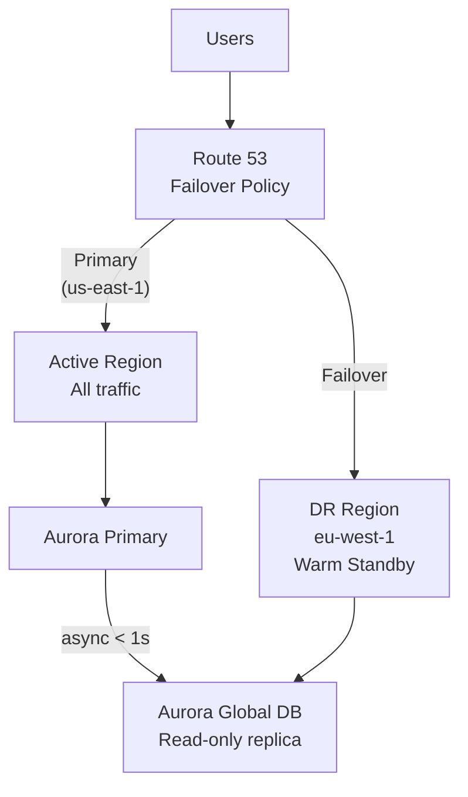
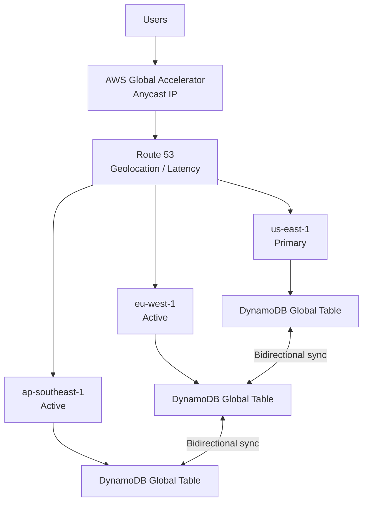
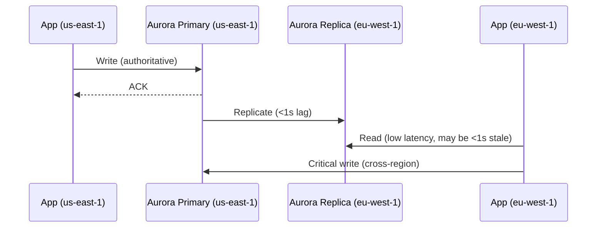
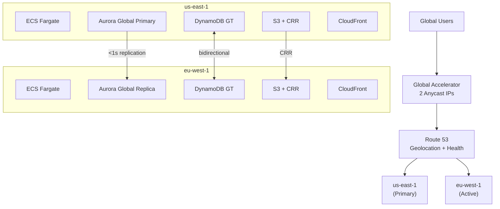

# Multi-Region Architecture on AWS

> **References:** [AWS Multi-Region Architecture](https://aws.amazon.com/solutions/guidance/multi-region-application-data-for-well-architected/) | [Route 53 Routing Policies](https://docs.aws.amazon.com/Route53/latest/DeveloperGuide/routing-policy.html) | [Global Accelerator](https://aws.amazon.com/global-accelerator/)

---

## When to Go Multi-Region

| Driver | Example |
|--------|---------|
| **Disaster recovery** | Regional failure (rare but total) |
| **Data residency** | GDPR: EU data must stay in EU |
| **Latency** | Serve APAC users from Tokyo, not US |
| **Business continuity** | SLA requires < 1 min RTO |
| **Global product** | Users worldwide, consistent UX |

**Cost reality:** Multi-region is 2-3× more expensive. Only go multi-region when you need to.

---

## Architecture Patterns

### Pattern 1: Active-Passive (DR Focused)



### Pattern 2: Active-Active (Latency Focused)



---

## Route 53 Routing Policies

| Policy | Use Case | Description |
|--------|---------|-------------|
| **Simple** | Single resource | Route all traffic to one endpoint |
| **Failover** | Active-passive DR | Primary/secondary with health checks |
| **Geolocation** | Data residency | EU users → EU region |
| **Geoproximity** | Latency + compliance | Route based on geographic proximity |
| **Latency-based** | Best user experience | Route to lowest-latency region |
| **Weighted** | Canary / gradual rollout | 10% to new region, 90% to old |
| **Multi-value** | Simple load balancing | Return up to 8 healthy endpoints |

---

## Aurora Global Database



**Managed failover (if us-east-1 goes down):**
1. AWS detects failure
2. Promotes eu-west-1 Aurora cluster to primary
3. Takes < 1 minute
4. Update application connection string (Route 53 health check)

---

## DynamoDB Global Tables

```java
// DynamoDB Global Tables: Active-Active, bidirectional sync
// Writes accepted in ANY region; last-write-wins conflict resolution

@Service
public class GlobalOrderRepository {

    private final DynamoDbClient dynamoDb;

    public void saveOrder(Order order) {
        // Write to local region — DynamoDB replicates to all other regions
        dynamoDb.putItem(PutItemRequest.builder()
            .tableName("Orders")  // Same table name in all regions
            .item(Map.of(
                "orderId", str(order.getId()),
                "userId", str(order.getUserId()),
                "status", str(order.getStatus().name()),
                "updatedAt", str(Instant.now().toString()), // LWW timestamp
                "region", str(System.getenv("AWS_REGION")) // For debugging
            ))
            .build());
    }

    // Route reads to local region (fast) vs global (always consistent)
    public Order getOrder(String orderId, boolean requireGlobalConsistency) {
        if (requireGlobalConsistency) {
            // Read from all regions, return latest by updatedAt
            // Expensive — only for critical operations
            return getFromMostRecentRegion(orderId);
        }
        // Fast local read (may be <1s stale for cross-region writes)
        return getFromLocalRegion(orderId);
    }
}
```

---

## Data Residency Implementation

```java
@Service
public class DataResidencyRouter {

    private static final Map<String, String> COUNTRY_TO_REGION = Map.of(
        "DE", "eu-central-1",
        "FR", "eu-west-3",
        "GB", "eu-west-2",
        "US", "us-east-1",
        "CA", "ca-central-1",
        "AU", "ap-southeast-2",
        "SG", "ap-southeast-1",
        "JP", "ap-northeast-1"
    );

    private final Map<String, DynamoDbClient> regionClients;

    public DynamoDbClient getClientForUser(String countryCode) {
        String region = COUNTRY_TO_REGION.getOrDefault(countryCode, "us-east-1");
        return regionClients.get(region);
    }

    // GDPR: user data must be stored and processed in EU
    public boolean requiresEUStorage(String countryCode) {
        return Set.of("DE", "FR", "GB", "IT", "ES", "NL", "SE", "DK", "FI", "AT")
            .contains(countryCode);
    }
}
```

---

## AWS Architecture for Multi-Region



---

## Interview Q&A

**Q1: How would you design a zero-downtime database migration across regions?**
> (1) Enable Aurora Global Database — set up replica in new region. (2) Wait for replication to catch up (< 1s lag). (3) Use Route 53 weighted routing to gradually shift read traffic to new region (10% → 50% → 100%). (4) For writes: run managed failover to promote new region as primary. (5) Update application connection strings via Route 53 health check failover. Total downtime: ~1 minute during Aurora failover.

**Q2: How does Route 53 health check + failover work?**
> Route 53 pings your health check endpoint (e.g., /health) every 10 seconds from 3 regions. If 3 consecutive checks fail, the record is marked unhealthy. For failover policy: traffic automatically routes to the secondary record when primary is unhealthy. Failover time = health check failure detection (30s) + DNS TTL propagation (60s) = ~90 seconds end-to-end.

**Q3: What is the difference between Global Accelerator and CloudFront for multi-region?**
> CloudFront: CDN for static content and cacheable API responses. Caches at 450+ edge locations. Best for read-heavy, cacheable traffic. Global Accelerator: anycast IP routing that directs traffic over AWS backbone to the nearest healthy endpoint. No caching. Best for dynamic API traffic, TCP/UDP, gaming, IoT. Both improve latency; CloudFront via caching, Global Accelerator via routing optimization.
